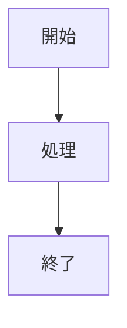

# Java入門書 図解推奨箇所一覧

このドキュメントは、書籍「Java入門」において図解を追加することで理解が深まる箇所をまとめたものです。
各図はMermaid記法で作成し、Vivliostyleで書籍に埋め込むことを前提としています。

## 図の優先度

### 高優先度（理解に必須）
- 第3-5章：継承階層図、クラス関係図、ポリモーフィズム
- 第9-10章：コレクション階層図、データ構造内部図
- 第14章：スレッド状態遷移図、同期制御図
- 第16章：GUIコンポーネント階層、イベント処理フロー

### 中優先度（理解を深める）
- 第1-2章：JVMアーキテクチャ、メモリ管理
- 第11章：ラムダ式変換図、Stream処理パイプライン
- 第15章：ネットワーク通信図、プロトコルスタック

### 低優先度（発展的理解）
- 第20-23章：ビルドプロセス、デプロイメント環境
- 付録トピック：JVMチューニング、高度なGC

## 章別図解推奨箇所

### 第1章：Java入門と開発環境構築

#### 1-1. データと処理の分離問題（C言語との比較）
- **ファイル**: `chapter01-data-process-separation.mmd`
- **推奨図**：概念図・フロー図
- **説明**：C言語でのデータ（グローバル変数）と処理（関数）の分離による複雑さを示す図

#### 1-2. Javaのオブジェクト指向アプローチ
- **ファイル**: `chapter01-oop-approach.mmd`
- **推奨図**：概念図・構造図
- **説明**：Productクラスの例で、データと処理が一体化している様子を示すクラス図

#### 1-3. JVMアーキテクチャ
- **ファイル**: `chapter01-jvm-architecture.mmd`
- **推奨図**：システム構成図
- **説明**：Java→バイトコード→JVM→各OSの変換・実行プロセスを示すフロー図

### 第2章：Java基本文法

#### 2-1. JVMの動作原理
- **ファイル**: `chapter02-jvm-process.mmd`
- **推奨図**：システム構成図・フロー図
- **説明**：ソースコード→バイトコード→JITコンパイラ→機械語の変換プロセス

#### 2-2. データ型の使い分け
- **ファイル**: `chapter02-data-types.mmd`
- **推奨図**：分類図・比較表
- **説明**：8つのプリミティブ型のサイズ、範囲、用途を整理した比較図

#### 2-3. ガベージコレクション
- **ファイル**: `chapter02-garbage-collection.mmd`
- **推奨図**：メモリ構造図・動作フロー図
- **説明**：Young世代、Old世代のメモリ構造とオブジェクトの移動過程

### 第3章：オブジェクト指向の考え方

#### 3-1. 手続き型vs.オブジェクト指向の比較
- **ファイル**: `chapter03-paradigm-comparison.mmd`
- **推奨図**：概念図・対比図
- **説明**：学生管理システムの例で、C言語とJavaの設計の違いを並列表示

#### 3-2. カプセル化の概念
- **ファイル**: `chapter03-encapsulation.mmd`
- **推奨図**：概念図・アクセス制御図
- **説明**：クラス内部のprivateフィールドとpublicメソッドの境界を示す図

### 第4章：クラスとインスタンス

#### 4-1. アクセス修飾子の可視性
- **ファイル**: `chapter04-access-modifiers.mmd`
- **推奨図**：マトリックス図・スコープ図
- **説明**：各アクセス修飾子の可視性範囲を整理した表形式の図

#### 4-2. コンストラクタ連鎖
- **ファイル**: `chapter04-constructor-chain.mmd`
- **推奨図**：フロー図・シーケンス図
- **説明**：コンストラクタのthis()呼び出し順序と初期化プロセス

#### 4-3. パッケージ構造とimport
- **ファイル**: `chapter04-package-structure.mmd`
- **推奨図**：ディレクトリ構造図・依存関係図
- **説明**：パッケージの階層構造とクラス間のimport関係

### 第5章：継承とポリモーフィズム

#### 5-1. 継承階層
- **ファイル**: `chapter05-inheritance-hierarchy.mmd`
- **推奨図**：クラス階層図・継承ツリー
- **説明**：決済システムの例での継承関係を示すUML形式の図

#### 5-2. メソッドオーバーライドとポリモーフィズム
- **ファイル**: `chapter05-polymorphism.mmd`
- **推奨図**：動的バインディング図・実行時解決図
- **説明**：実行時に適切なメソッドが選択される仕組み

#### 5-3. 型変換（アップキャスト・ダウンキャスト）
- **ファイル**: `chapter05-type-casting.mmd`
- **推奨図**：型階層図・変換フロー図
- **説明**：継承階層における型の変換方向とinstanceofによる型判定

### 第6章：不変性とfinalキーワード

#### 6-1. 可変vs.不変オブジェクトの状態変化
- **ファイル**: `chapter06-immutability.mmd`
- **推奨図**：状態遷移図・メモリ状態図
- **説明**：可変と不変オブジェクトの状態変化を対比

#### 6-2. マルチスレッド環境での競合状態
- **ファイル**: `chapter06-thread-safety.mmd`
- **推奨図**：タイムライン図・並行実行図
- **説明**：複数スレッドのアクセス時の競合状態

### 第7章：抽象クラスとインターフェイス

#### 7-1. 抽象クラスとインターフェイスの比較
- **ファイル**: `chapter07-abstract-interface.mmd`
- **推奨図**：比較表・設計選択フロー図
- **説明**：is-a関係とcan-do関係の使い分け基準

#### 7-2. インターフェイスの多重実装
- **ファイル**: `chapter07-multiple-inheritance.mmd`
- **推奨図**：クラス関係図・実装図
- **説明**：1つのクラスが複数のインターフェイスを実装する構造

#### 7-3. デザインパターンの構造
- **ファイル**: `chapter07-design-patterns.mmd`
- **推奨図**：UML図・相互作用図
- **説明**：Factory、Strategy、Template Methodパターン

### 第8章：Javaの特殊なクラス形式

#### 8-1. Enum内部構造
- **ファイル**: `chapter08-enum-structure.mmd`
- **推奨図**：内部実装図・メモリ配置図
- **説明**：enumの各定数がstatic finalインスタンスとして生成される仕組み

#### 8-2. Recordクラスの自動生成機能
- **ファイル**: `chapter08-record-features.mmd`
- **推奨図**：コード生成図・機能比較図
- **説明**：Recordから自動生成されるメソッドの実装内容

### 第9章：コレクションフレームワーク

#### 9-1. コレクション階層
- **ファイル**: `chapter09-collection-hierarchy.mmd`
- **推奨図**：インターフェイス階層図・実装クラス図
- **説明**：Collection、List、Set、Mapインターフェイスと具象クラスの関係

#### 9-2. データ構造の内部実装
- **ファイル**: `chapter09-data-structures.mmd`
- **推奨図**：データ構造図・アルゴリズム図
- **説明**：ArrayList、LinkedList、HashMapの内部構造

#### 9-3. 時間計算量の比較
- **ファイル**: `chapter09-performance.mmd`
- **推奨図**：パフォーマンス比較表・グラフ
- **説明**：各コレクションの基本操作における時間計算量

### 第10章：ジェネリクス

#### 10-1. 型消去（Type Erasure）
- **ファイル**: `chapter10-type-erasure.mmd`
- **推奨図**：コンパイル時変換図
- **説明**：ジェネリクス付きソースコード→型消去後バイトコード

#### 10-2. 境界ワイルドカード
- **ファイル**: `chapter10-wildcards.mmd`
- **推奨図**：型関係図・変性図
- **説明**：? extendsと? superにおける型の許可範囲

#### 10-3. 型推論のメカニズム
- **ファイル**: `chapter10-type-inference.mmd`
- **推奨図**：推論プロセス図
- **説明**：コンパイラがジェネリクス型を推論する過程

### 第11章：ラムダ式と関数インターフェイス

#### 11-1. 匿名クラスからラムダ式への変換
- **ファイル**: `chapter11-lambda-conversion.mmd`
- **推奨図**：構文変換図・簡潔化プロセス
- **説明**：匿名クラスがラムダ式でどのように簡潔になるか

#### 11-2. 関数型インターフェイス関係図
- **ファイル**: `chapter11-functional-interfaces.mmd`
- **推奨図**：機能分類図・用途マップ
- **説明**：Function、Predicate、Consumer、Supplierの機能と用途

#### 11-3. Stream処理パイプライン
- **ファイル**: `chapter11-stream-pipeline.mmd`
- **推奨図**：データフロー図・パイプライン図
- **説明**：データソース→中間操作→終端操作の処理の流れ

### 第12章：例外処理

#### 12-1. 例外階層
- **ファイル**: `chapter12-exception-hierarchy.mmd`
- **推奨図**：例外クラス階層図
- **説明**：Throwable→Error/Exception→RuntimeExceptionの継承関係

#### 12-2. try-with-resources動作
- **ファイル**: `chapter12-try-with-resources.mmd`
- **推奨図**：リソース管理フロー図
- **説明**：AutoCloseableリソースの自動クローズタイミング

#### 12-3. 例外伝播メカニズム
- **ファイル**: `chapter12-exception-propagation.mmd`
- **推奨図**：コールスタック図・例外伝播図
- **説明**：メソッド呼び出し階層での例外発生と伝播過程

### 第13章：ファイルI/O

#### 13-1. ストリーム階層
- **ファイル**: `chapter13-stream-hierarchy.mmd`
- **推奨図**：ストリームクラス階層図
- **説明**：InputStream/OutputStream、Reader/Writerの継承関係

#### 13-2. NIO.2のPath操作
- **ファイル**: `chapter13-nio-path.mmd`
- **推奨図**：ファイルシステム構造図・Path解決図
- **説明**：相対パス・絶対パスの解決プロセス

#### 13-3. バッファリングメカニズム
- **ファイル**: `chapter13-buffering.mmd`
- **推奨図**：バッファ動作図・I/O効率図
- **説明**：BufferedReader/Writerによるバッファリング効果

### 第14章：マルチスレッドプログラミング

#### 14-1. スレッドライフサイクル
- **ファイル**: `chapter14-thread-lifecycle.mmd`
- **推奨図**：状態遷移図
- **説明**：NEW→RUNNABLE→BLOCKED/WAITING→TERMINATEDの状態遷移

#### 14-2. 同期制御メカニズム
- **ファイル**: `chapter14-synchronization.mmd`
- **推奨図**：ロック取得図・待機キュー図
- **説明**：synchronizedブロックでのモニターロック取得・解放

#### 14-3. デッドロック発生パターン
- **ファイル**: `chapter14-deadlock.mmd`
- **推奨図**：循環待機図・リソース依存図
- **説明**：2つのスレッドが互いのロックを待つ循環依存状態

#### 14-4. スレッドプール動作
- **ファイル**: `chapter14-thread-pool.mmd`
- **推奨図**：ワーカースレッド図・タスクキュー図
- **説明**：ExecutorServiceによるスレッドプール管理

### 第15章：ネットワークプログラミング

#### 15-1. TCP/IPプロトコルスタック
- **ファイル**: `chapter15-tcp-ip-stack.mmd`
- **推奨図**：ネットワーク階層図・プロトコル対応図
- **説明**：各層の役割とJavaクラスの対応関係

#### 15-2. ソケット通信
- **ファイル**: `chapter15-socket-communication.mmd`
- **推奨図**：クライアント・サーバー通信図
- **説明**：ServerSocketでのリスニングとSocket接続

#### 15-3. マルチスレッドサーバー
- **ファイル**: `chapter15-multithread-server.mmd`
- **推奨図**：並行処理図・スレッド管理図
- **説明**：メインスレッドとワーカースレッドの協調動作

### 第16章：GUIプログラミング

#### 16-1. Swingコンポーネント階層
- **ファイル**: `chapter16-swing-hierarchy.mmd`
- **推奨図**：コンポーネント継承図・包含関係図
- **説明**：JComponent→各種UIコンポーネントの継承関係

#### 16-2. イベント処理モデル
- **ファイル**: `chapter16-event-model.mmd`
- **推奨図**：イベントフロー図・リスナー登録図
- **説明**：ユーザー操作→イベント生成→リスナー通知の流れ

#### 16-3. レイアウトマネージャー
- **ファイル**: `chapter16-layout-managers.mmd`
- **推奨図**：レイアウト配置図・比較図
- **説明**：各レイアウトマネージャーによる配置方式

#### 16-4. カスタムコンポーネント描画
- **ファイル**: `chapter16-custom-painting.mmd`
- **推奨図**：ペイントシステム図・描画ライフサイクル
- **説明**：paintComponent()呼び出しタイミング

### 第17章：高度なGUI・イベント処理

#### 17-1. MVCパターン適用
- **ファイル**: `chapter17-mvc-pattern.mmd`
- **推奨図**：MVC構造図・データフロー図
- **説明**：Model、View、Controllerの分離

#### 17-2. 複合イベント処理
- **ファイル**: `chapter17-complex-events.mmd`
- **推奨図**：イベント階層図・処理順序図
- **説明**：複数リスナーの優先順位とイベント伝搬

### 第18章：ユニットテスト

#### 18-1. テスト構造
- **ファイル**: `chapter18-test-pyramid.mmd`
- **推奨図**：テストピラミッド図
- **説明**：ユニット→統合→システムテストの階層

#### 18-2. JUnitライフサイクル
- **ファイル**: `chapter18-junit-lifecycle.mmd`
- **推奨図**：テスト実行フロー図
- **説明**：各アノテーションの実行順序

#### 18-3. モック・スタブの概念
- **ファイル**: `chapter18-mock-stub.mmd`
- **推奨図**：依存関係図・テスト対象分離図
- **説明**：実際の依存オブジェクトをモックで置換

### 第19章：ドキュメント化とライブラリ

#### 19-1. Javadoc生成プロセス
- **ファイル**: `chapter19-javadoc-process.mmd`
- **推奨図**：ドキュメント生成フロー図
- **説明**：Javadocコメント→HTML文書生成の流れ

#### 19-2. Maven/Gradleによる依存関係管理
- **ファイル**: `chapter19-dependency-management.mmd`
- **推奨図**：依存関係グラフ・ライブラリ解決図
- **説明**：プロジェクトの依存関係と推移的依存

### 第20章：ビルドとデプロイメント

#### 20-1. ビルドプロセス
- **ファイル**: `chapter20-build-process.mmd`
- **推奨図**：ビルドライフサイクル図
- **説明**：コンパイル→テスト→パッケージング→デプロイ

#### 20-2. JARファイル構造
- **ファイル**: `chapter20-jar-structure.mmd`
- **推奨図**：JARファイル内部構造図
- **説明**：classes、lib、META-INFの配置

#### 20-3. デプロイメント環境
- **ファイル**: `chapter20-deployment-env.mmd`
- **推奨図**：環境構成図・ネットワーク図
- **説明**：開発→テスト→本番環境での構成

### 第21-23章：高度なトピック

#### 21-1. ガベージコレクションアルゴリズム
- **ファイル**: `chapter21-gc-algorithms.mmd`
- **推奨図**：GCアルゴリズム比較図・メモリ使用パターン
- **説明**：各GCアルゴリズムの動作特性

#### 22-1. JVMチューニング
- **ファイル**: `chapter22-jvm-tuning.mmd`
- **推奨図**：メモリ領域図・パフォーマンス監視図
- **説明**：ヒープ、メタスペース等の構造

## Mermaid図の書籍への埋め込み方法

各Mermaid図は以下の形式で書籍のMarkdownファイルに埋め込みます：

```markdown
<div class="figure">



<p class="caption">図X-Y: 図のタイトル</p>
</div>
```

## スタイル調整

Vivliostyleでの表示を最適化するため、以下のCSSクラスを使用：

- `.figure`: 図全体のコンテナ
- `.caption`: 図のキャプション
- `.mermaid`: Mermaid図のコンテナ（自動適用）