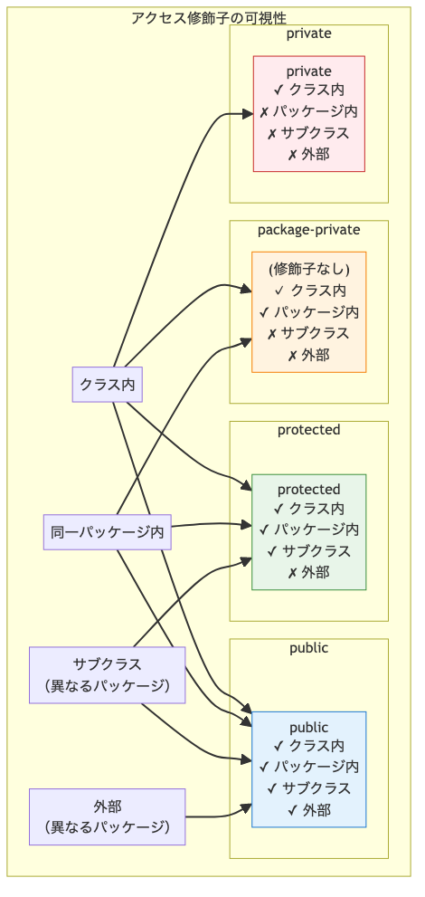

# <b>4章</b> <span>クラスとインスタンス</span> <small>オブジェクトの生成と連携</small>

## 本章の学習目標

### この章で学ぶこと

1. カプセル化の実践
    - アクセス修飾子（public、private、protected）の使い分け
    - getter/setterメソッドによる安全なデータアクセス
    - データ検証とバリデーションの実装
2. コンストラクタの活用
    - デフォルトコンストラクタと引数付きコンストラクタ
    - thisキーワードによるフィールドアクセス
    - コンストラクタのオーバーロード
3. クラス設計のベストプラクティス
    - 単一責任の原則に基づく設計
    - 不変性（イミュータブル）の重要性
    - 責任の明確なメソッド設計
4. パッケージシステム
    - パッケージの概念と命名規則
    - import文の効果的な使い方
    - クラスの組織化とアクセス制御

### この章を始める前に

第3章でクラスとオブジェクトの基本を理解していれば準備完了です。本章では、より実践的で安全なクラス設計の技術を身につけます。

## なぜカプセル化が重要なのか

### 銀行口座クラスの復習と発展

第3章では基本的なクラスの作り方を学習しました。本章では、実践的なカプセル化の技術を、銀行口座クラスの段階的な改善を通じて学んでいきます。

まずは、カプセル化を適用していない問題のあるクラスから始めて、段階的に改善していく過程を見ていきましょう。

以下のコードは、カプセル化を適用していない銀行口座クラスの例です。
このコードは一見動作しますが、実際のシステムでは深刻なセキュリティリスクとデータ整合性の問題を引き起こします。各問題点をコメントで示しています。

<span class="listing-number">**サンプルコード4-1**</span>

```java
// 初期バージョン：カプセル化なし（問題のある設計）
public class BankAccountV0 {
    public String accountNumber;
    public double balance;
    
    public BankAccountV0(String accountNumber, double initialBalance) {
        this.accountNumber = accountNumber;
        this.balance = initialBalance;
    }
}

// 使用例
public class ProblemDemo {
    public static void main(String[] args) {
        BankAccountV0 account = new BankAccountV0("123456", 10000);
        
        // 問題1: 直接残高を変更できてしまう
        account.balance = -1000;  // 不正な値の設定が可能
        
        // 問題2: 口座番号を後から変更できてしまう
        account.accountNumber = "999999";  // 口座番号の改ざん
        
        // 問題3: 取引履歴が残らない
        account.balance += 5000;  // 入金の記録がない
    }
}
```

これはカプセル化を適用していない問題のある設計例です。

#### このコードの問題点
- カプセル化の欠如
    + すべてのフィールドがpublicで、外部から自由にアクセス・変更可能
- データの整合性
    + 不正な値（負の残高など）を防ぐ仕組みがない
- 変更の追跡
    + 誰がいつ値を変更したか記録できない
- ビジネスルールの実装場所
    + 入出金のルールをクラス外部で実装する必要がある

これらの問題を解決するために、カプセル化という技術を使います。本章では、このBankAccountクラスを段階的に改善しながら、実践的なカプセル化の技術を身につけていきます。

## カプセル化とアクセス制御

### カプセル化の基本概念

カプセル化は、関連するデータ（フィールド）と処理（メソッド）を1つのクラスにまとめ、外部から直接アクセスできないよう保護する技術です。これにより、オブジェクトの内部状態を安全に管理できます。

### アクセス修飾子の詳細

Javaのアクセス制御は、カプセル化を実現するうえでもっとも重要な機能の1つです。Javaは4つのアクセス修飾子を提供しており、これらをパッケージ構造や継承関係に応じて使い分けることで、クラスの内部実装を隠蔽しながら必要な機能だけを外部に公開できます。各修飾子は、フィールドとメソッドの可視性を段階的に制御し、オブジェクト指向設計の原則である「必要最小限の公開」を実現します。

#### アクセス修飾子の可視性マトリックス

| 修飾子 | 同じクラス | 同じパッケージ | サブクラス（別パッケージ） | それ以外（別パッケージ） | 説明 |
|--------|-----------|---------------|---------------------------|-------------------------|------|
| `private` | ○ | × | × | × | 同じクラス内からのみアクセス可能 |
| (なし)※ | ○ | ○ | × | × | 同じパッケージ内からのみアクセス可能 |
| `protected` | ○ | ○ | ○ | × | 同じパッケージまたはサブクラスからアクセス可能 |
| `public` | ○ | ○ | ○ | ○ | どこからでもアクセス可能 |

※ 修飾子を記述しない場合（デフォルトアクセス、package-privateとも呼ばれる）

<div class="figure">



</div>

#### アクセス修飾子の使い分け原則

1. `private`を基本とする
    + フィールドは原則として`private`にし、外部からの読み取りが必要な場合はgetter、変更が必要な場合はsetterを提供
2. `public`は慎重に
    + 外部APIとして公開する必要があるメソッドのみ`public`にする
3. `protected`の活用
    + サブクラスからのアクセスが必要なメソッドやフィールドに使用し、継承を前提とした設計であることを明示
4. パッケージプライベートの戦略的使用
    + 関連する複数のクラスが密に連携する必要がある場合（例：データアクセス層の内部処理）に使用

#### 各アクセス修飾子の詳細と使用例

##### `private`の使用例

<span class="listing-number">**サンプルコード4-2**</span>

```java
public class BankAccount {
    private double balance;      // 外部から直接変更不可
    private String accountId;    // 内部管理用ID
    
    public void deposit(double amount) {
        if (amount > 0) {
            balance += amount;   // 同じクラス内からは可視
            logTransaction();    // プライベートメソッドの呼び出し
        }
    }
    
    private void logTransaction() {  // 内部処理専用メソッド
        // トランザクションログの記録
    }
}

// テスト用のクラス
class BankAccountTest {
    public static void main(String[] args) {
        BankAccount account = new BankAccount();
        
        // フィールドは直接アクセスできない
        // account.balance = 1000; // コンパイルエラー
        
        // publicメソッドを通じて操作
        account.deposit(5000);
        // getBalanceメソッドは実装されていないため、残高は表示できません
        System.out.println("入金処理が完了しました");
        
        // privateメソッドは呼び出せない
        // account.logTransaction(); // コンパイルエラー
    }
}
```

実行結果：
```
入金処理が完了しました
```

##### パッケージプライベート（デフォルト）の使用例

<span class="listing-number">**サンプルコード4-3**</span>

```java
package com.example.internal;

public class DataProcessor {
    String processId;     // 同じパッケージ内からアクセス可能
    
    void processInternal() {  // パッケージ内協調用メソッド
        // 内部処理
    }
}

// 同じパッケージ内の別クラス
class ProcessorHelper {
    void assist(DataProcessor processor) {
        processor.processId = "PROC-001";     // OK: 同じパッケージ
        processor.processInternal();           // OK: 同じパッケージ
    }
}
```

これはパッケージプライベート（デフォルトアクセス）の例です。

`protected`の使用例。
<span class="listing-number">**サンプルコード4-4**</span>

```java
package com.example.base;

public class Vehicle {
    protected String engineType;     // サブクラスからアクセス可能
    protected int maxSpeed;
    
    protected void startEngine() {   // サブクラスで利用可能
        System.out.println("Engine started: " + engineType);
    }
}

// 別パッケージのサブクラス
package com.example.cars;
import com.example.base.Vehicle;

public class Car extends Vehicle {
    public void initialize() {
        engineType = "V6";          // OK: protected継承
        maxSpeed = 200;             // OK: protected継承
        startEngine();              // OK: protectedメソッド
    }
}
```

使用例と実行結果：
```java
// VehicleTest.java
public class VehicleTest {
    public static void main(String[] args) {
        Car car = new Car();
        car.initialize();
        
        // protectedメンバーは別パッケージから直接アクセスできない
        // System.out.println(car.engineType); // コンパイルエラー
    }
}
```

実行結果：
```
Engine started: V6
```

##### `public`の使用例

<span class="listing-number">**サンプルコード4-5**</span>

```java
public class MathUtils {
    public static final double PI = 3.14159;  // 公開定数
    
    public static int add(int a, int b) {     // 公開ユーティリティメソッド
        return a + b;
    }
    
    public boolean isPositive(int number) {   // 公開インスタンスメソッド
        return number > 0;
    }
}

class MathUtilsTest {
    public static void main(String[] args) {
        // publicな定数へのアクセス
        System.out.println("PI = " + MathUtils.PI);
        
        // publicなstaticメソッドの呼び出し
        int sum = MathUtils.add(10, 20);
        System.out.println("10 + 20 = " + sum);
        
        // publicなインスタンスメソッドの呼び出し
        MathUtils utils = new MathUtils();
        System.out.println("5は正の数？ " + utils.isPositive(5));
        System.out.println("-3は正の数？ " + utils.isPositive(-3));
    }
}
```

実行結果：
```
PI = 3.14159
10 + 20 = 30
5は正の数？ true
-3は正の数？ false
```

### getter/setterメソッドのベストプラクティス

getter/setterメソッド（アクセサメソッドとも呼ばれます）は、カプセル化の実装において中心的な役割を果たします。
単にフィールドの値を取得・設定するだけでなく、データの整合性を保証し、将来の変更に対する柔軟性を提供します。
以下の例では、プライベートフィールドへの安全なアクセスを提供する標準的なパターンを示します。

<span class="listing-number">**サンプルコード4-6**</span>

```java
public class Product {
    private String name;
    private double price;
    
    // getter：値を取得
    public String getName() {
        return name;
    }
    
    public double getPrice() {
        return price;
    }
    
    // setter：データ検証付きで値を設定
    public void setName(String name) {
        if (name == null || name.trim().isEmpty()) {
            throw new IllegalArgumentException("商品名は必須です");
        }
        this.name = name;
    }
    
    public void setPrice(double price) {
        if (price < 0) {
            throw new IllegalArgumentException("価格は負の値にできません");
        }
        this.price = price;
    }
}

class ProductTest {
    public static void main(String[] args) {
        Product product = new Product();
        
        try {
            // 正常なデータ設定
            product.setName("ノートPC");
            product.setPrice(98000);
            System.out.println("商品名: " + product.getName());
            System.out.println("価格: " + product.getPrice() + "円");
            
            // 不正なデータの検証
            product.setName("");  // 例外が発生
        } catch (IllegalArgumentException e) {
            System.out.println("エラー: " + e.getMessage());
        }
        
        try {
            product.setPrice(-1000);  // 例外が発生
        } catch (IllegalArgumentException e) {
            System.out.println("エラー: " + e.getMessage());
        }
    }
}
```

実行結果：
```
商品名: ノートPC
価格: 98000.0円
エラー: 商品名は必須です
エラー: 価格は負の値にできません
```

### データ検証の重要性

プログラミングにおいて、データの状態を常に有効に保つことはきわめて重要です。オブジェクト指向では、これをカプセル化とsetterメソッドによる検証で実現します。setterメソッドは単なる値の代入ではなく、オブジェクトの不変条件（invariant）を守るゲートキーパーとしての役割を担います。範囲チェック、nullチェック、ビジネスルールの検証を実装することで、バグの早期発見と予防が可能になり、システム全体の信頼性が向上します。以下の例では、実務でよく使用される検証パターンを示します。

<span class="listing-number">**サンプルコード4-7**</span>

```java
public class Employee {
    private String name;
    private int age;
    private double salary;
    
    public void setAge(int age) {
        if (age < 18 || age > 100) {
            throw new IllegalArgumentException("年齢は18歳以上100歳以下で入力してください");
        }
        this.age = age;
    }
    
    public void setSalary(double salary) {
        if (salary < 0) {
            throw new IllegalArgumentException("給与は負の値にできません");
        }
        this.salary = salary;
    }
}
```

これはデータ検証パターンの例です。

## 設計原則とソフトウェアアーキテクチャ

ソフトウェア設計では、SOLID原則と呼ばれる5つの基本原則があります。これらはオブジェクト指向設計の文脈で生まれましたが、単一責任原則（モジュールは1つの責任のみを持つべき）や開放閉鎖原則（拡張に開かれ、修正に閉じているべき）などは、他のプログラミングパラダイムでも応用可能な普遍的な原則です。

カプセル化は単にデータを隠す技術ではなく、変更の影響を局所化し、再利用性とテスト容易性を高める重要な設計技術です。

## 実践的なクラス設計例

### 銀行口座クラスの段階的な改善

先ほどの問題のあるBankAccountV0を、カプセル化の原則にしたがって段階的に改善していきましょう。

#### ステップ1: 基本的なカプセル化（BankAccountV1）

まず、フィールドをprivateにして、publicメソッドを通じてのみアクセスできるようにします。

<span class="listing-number">**サンプルコード4-8**</span>

```java
public class BankAccountV1 {
    private String accountNumber;
    private double balance;
    
    public BankAccountV1(String accountNumber, double initialBalance) {
        this.accountNumber = accountNumber;
        this.balance = initialBalance;
    }
    
    public void deposit(double amount) {
        balance += amount;
    }
    
    public void withdraw(double amount) {
        balance -= amount;
    }
    
    public double getBalance() {
        return balance;
    }
}
```

使用例と実行結果：
```java
// BankAccountV1Test.java
public class BankAccountV1Test {
    public static void main(String[] args) {
        BankAccountV1 account = new BankAccountV1("123456", 10000);
        
        System.out.println("初期残高: " + account.getBalance());
        
        account.deposit(5000);
        System.out.println("5000円入金後: " + account.getBalance());
        
        account.withdraw(3000);
        System.out.println("3000円出金後: " + account.getBalance());
        
        // 問題：負の金額でも処理される
        account.deposit(-1000);
        System.out.println("負の金額入金後: " + account.getBalance());
    }
}
```

実行結果：
```
初期残高: 10000.0
5000円入金後: 15000.0
3000円出金後: 12000.0
負の金額入金後: 11000.0
```

#### 改善点
- フィールドがprivateになり、直接アクセスできない
- メソッドを通じてのみ操作可能

#### 残る問題
- 負の金額でも入金・出金できてしまう
- 残高不足でも出金できてしまう
- 初期残高が負の値でも設定できる

#### ステップ2: 基本的な検証を追加（BankAccountV2）

<span class="listing-number">**サンプルコード4-9**</span>

```java
public class BankAccountV2 {
    private String accountNumber;
    private double balance;
    
    public BankAccountV2(String accountNumber, double initialBalance) {
        if (initialBalance < 0) {
            throw new IllegalArgumentException("初期残高は0以上である必要です");
        }
        this.accountNumber = accountNumber;
        this.balance = initialBalance;
    }
    
    public void deposit(double amount) {
        if (amount <= 0) {
            throw new IllegalArgumentException("入金額は正の値である必要です");
        }
        balance += amount;
    }
    
    public boolean withdraw(double amount) {
        if (amount <= 0) {
            return false;
        }
        if (balance >= amount) {
            balance -= amount;
            return true;
        }
        return false;
    }
    
    public double getBalance() {
        return balance;
    }
}
```

使用例と実行結果：
```java
// BankAccountV2Test.java
public class BankAccountV2Test {
    public static void main(String[] args) {
        try {
            BankAccountV2 account = new BankAccountV2("123456", 10000);
            System.out.println("初期残高: " + account.getBalance());
            
            // 正常な入金
            account.deposit(5000);
            System.out.println("5000円入金後: " + account.getBalance());
            
            // 出金の成功
            if (account.withdraw(3000)) {
                System.out.println("3000円出金成功: " + account.getBalance());
            }
            
            // 残高不足の出金
            if (!account.withdraw(20000)) {
                System.out.println("20000円出金失敗（残高不足）");
            }
            
            // 不正な入金額
            account.deposit(-1000);
        } catch (IllegalArgumentException e) {
            System.out.println("エラー: " + e.getMessage());
        }
    }
}
```

実行結果：
```
初期残高: 10000.0
5000円入金後: 15000.0
3000円出金成功: 12000.0
20000円出金失敗（残高不足）
エラー: 入金額は正の値である必要です
```

#### 改善点
- コンストラクタで初期値を検証
- 入金時に金額を検証
- 出金時に残高と金額を確認

#### 残る問題
- 口座番号が後から変更可能（getterがない）
- 取引履歴が残らない
- 口座番号の検証がない

#### ステップ3: 完全なカプセル化（BankAccountV3）

<span class="listing-number">**サンプルコード4-10**</span>

```java
import java.util.*;

public class BankAccountV3 {
    private final String accountNumber;  // finalで不変にする
    private double balance;
    private List<String> transactionHistory;
    
    public BankAccountV3(String accountNumber, double initialBalance) {
        // 口座番号の検証
        if (accountNumber == null || accountNumber.trim().isEmpty()) {
            throw new IllegalArgumentException("口座番号は必須です");
        }
        if (initialBalance < 0) {
            throw new IllegalArgumentException("初期残高は0以上である必要です");
        }
        
        this.accountNumber = accountNumber;
        this.balance = initialBalance;
        this.transactionHistory = new ArrayList<>();
        this.transactionHistory.add("口座開設: 初期残高 " + initialBalance + "円");
    }
    
    public void deposit(double amount) {
        if (amount <= 0) {
            throw new IllegalArgumentException("入金額は正の値である必要です");
        }
        balance += amount;
        transactionHistory.add("入金: " + amount + "円");
    }
    
    public boolean withdraw(double amount) {
        if (amount <= 0) {
            return false;
        }
        if (balance >= amount) {
            balance -= amount;
            transactionHistory.add("出金: " + amount + "円");
            return true;
        }
        transactionHistory.add("出金失敗（残高不足）: " + amount + "円");
        return false;
    }
    
    public double getBalance() {
        return balance;
    }
    
    public String getAccountNumber() {
        return accountNumber;
    }
    
    // 防御的コピーで履歴を返す
    public List<String> getTransactionHistory() {
        return new ArrayList<>(transactionHistory);
    }
}
```

使用例と実行結果：
```java
// BankAccountV3Test.java
public class BankAccountV3Test {
    public static void main(String[] args) {
        BankAccountV3 account = new BankAccountV3("123456", 10000);
        
        System.out.println("口座番号: " + account.getAccountNumber());
        System.out.println("初期残高: " + account.getBalance());
        
        // 入金
        account.deposit(5000);
        System.out.println("\n5000円入金後の残高: " + account.getBalance());
        
        // 出金成功
        if (account.withdraw(3000)) {
            System.out.println("3000円出金成功後の残高: " + account.getBalance());
        }
        
        // 出金失敗
        if (!account.withdraw(20000)) {
            System.out.println("20000円出金失敗（残高不足）");
        }
        
        // 取引履歴の表示
        System.out.println("\n取引履歴:");
        for (String transaction : account.getTransactionHistory()) {
            System.out.println("  " + transaction);
        }
    }
}
```

実行結果：
```
口座番号: 123456
初期残高: 10000.0

5000円入金後の残高: 15000.0
3000円出金成功後の残高: 12000.0
20000円出金失敗（残高不足）

取引履歴:
  口座開設: 初期残高 10000.0円
  入金: 5000.0円
  出金: 3000.0円
  出金失敗（残高不足）: 20000.0円
```

#### 完成した設計の特徴
- 不変性
-    + 口座番号はfinalで変更不可
- 完全な検証
-    + すべての入力を検証
- 履歴管理
-    + すべての取引を記録
- 防御的コピー: 内部リストの参照を外部に漏らさない

### 銀行口座クラスのさらなる発展

BankAccountV3の設計を基に、本章ではさらに高度な設計パターンを適用した例を見てみましょう。これは、実際のエンタープライズアプリケーションで使用されるレベルの設計です。

<span class="listing-number">**サンプルコード4-11**</span>

```java
import java.time.LocalDateTime;

// BankAccountV3をさらに発展させた設計例
public class EnhancedBankAccount extends BankAccountV3 {
    // 追加のフィールド：口座の状態管理
    private String status;
    private LocalDateTime lastActivityDate;
    private int failedTransactionCount;
    
    // 口座状態を表す定数
    public static final String STATUS_ACTIVE = "ACTIVE";      // アクティブ
    public static final String STATUS_SUSPENDED = "SUSPENDED"; // 一時停止
    public static final String STATUS_CLOSED = "CLOSED";       // 閉鎖
    
    // 拡張されたコンストラクタ
    public EnhancedBankAccount(String accountNumber, String accountHolder, double initialBalance) {
        super(accountNumber, initialBalance);  // 親クラスのコンストラクタを呼び出し
        this.status = STATUS_ACTIVE;
        this.lastActivityDate = LocalDateTime.now();
        this.failedTransactionCount = 0;
    }
    
    // オーバーライドされた入金メソッド：状態チェックを追加
    @Override
    public void deposit(double amount) {
        validateAccountStatus();
        super.deposit(amount);
        updateLastActivity();
    }
    
    // オーバーライドされた出金メソッド：失敗回数の追跡
    @Override
    public boolean withdraw(double amount) {
        validateAccountStatus();
        boolean success = super.withdraw(amount);
        if (!success) {
            failedTransactionCount++;
            if (failedTransactionCount >= 3) {
                status = STATUS_SUSPENDED;
                System.out.println("連続した取引失敗により、口座が一時停止されました。");
            }
        } else {
            failedTransactionCount = 0;  // 成功したらリセット
        }
        updateLastActivity();
        return success;
    }
    
    // プライベートメソッド：内部ロジック
    private void validateAccountStatus() {
        if (!STATUS_ACTIVE.equals(status)) {
            throw new IllegalStateException("口座がアクティブではありません: " + status);
        }
    }
    
    private void updateLastActivity() {
        this.lastActivityDate = LocalDateTime.now();
    }
    
    // 口座の再アクティブ化
    public void reactivateAccount() {
        if (STATUS_SUSPENDED.equals(status)) {
            status = STATUS_ACTIVE;
            failedTransactionCount = 0;
            System.out.println("口座が再アクティブ化されました。");
        }
    }
}
```

この設計の要点。
- 継承の活用
-    + 第3章のBankAccountV3を基に機能を拡張
- 定数による状態管理
-    + 口座状態を文字列定数で管理
- 状態管理
-    + 失敗回数の追跡と自動停止機能
- テンプレートメソッドパターン
-    + 基本動作を保持しつつ拡張

### クラス設計のベストプラクティス

クラス設計は、ソフトウェアの品質向上に寄与する要素の1つです。オブジェクト指向設計の実践から生まれたベストプラクティスは、保守性、拡張性、信頼性の高いソフトウェアを構築するための指針を提供します。ただし、これらは唯一の解決策ではなく、バッチ処理やデータ変換処理では関数型プログラミングのイミュータブルなデータ構造、シンプルなスクリプトでは手続き型プログラミングの直接的な関数呼び出しが適している場合もあります。

もっとも基本的な原則は単一責任の原則です。1つのクラスは1つの明確な責任のみを持つべきであり、これにより変更の理由が限定され、クラスの理解と保守が容易になります。次に重要なのはデータの隠蔽で、クラスの内部状態をprivateで保護し、必要な操作のみをパブリックメソッドとして公開します。これにより、実装の詳細を変更してもクライアントコードに影響を与えません。

入力検証も欠かせない要素です。すべての外部入力は、setterメソッドやコンストラクタで厳密に検証し、不正なデータがオブジェクトの状態を破壊することを防ぎます。また、意味のある名前を使用することで、コードの可読性と保守性が向上します。クラス名は名詞、メソッド名は動詞で始まるという慣習に従い、その役割を明確に表現する名前を選びます。

最後に、不変条件の維持は、オブジェクトの整合性を保証するうえできわめて重要です。オブジェクトの生成から破棄まで、常に満たされるべき条件（不変条件）を明確に定義し、すべての操作でこれを維持するよう設計します。

これらの原則に従うことで、保守性が高く、バグの少ないJavaプログラムを作成できます。

## パッケージシステムとクラスの組織化

### パッケージの概念と必要性

Javaにおけるパッケージは、関連するクラスやインターフェイスをグループ化するための仕組みです。大規模なプロジェクトでは数百から数千のクラスが存在することがあり、フラットな構造ではクラス名の衝突や依存関係の把握が困難になります。パッケージは以下の重要な役割を果たします。

1. 名前空間の提供
    + 異なるパッケージに同じ名前のクラスを作成可能
2. アクセス制御
    + パッケージレベルでのアクセス制限を実現
3. 論理的な構造化
    + 機能や責任に基づいてクラスを整理
4. クラスの再利用
    + パッケージ単位での配布と利用

### パッケージの命名規則

Javaの言語仕様では、パッケージ名の衝突を避けるため、インターネットドメイン名を逆順にした命名規則が推奨されています。

<span class="listing-number">**サンプルコード4-12**</span>

```java
// ドメイン名: example.com
// パッケージ名: com.example.プロジェクト名.モジュール名
package com.example.myapp.service;

// ドメイン名: ac.jp（教育機関）
// パッケージ名: jp.ac.大学名.プロジェクト名
package jp.ac.university.research;
```

これはパッケージ名の命名規則の例です。

#### 命名規則のポイント
- すべて小文字を使用
- ドメイン名を逆順に記述
- 意味のある階層構造を作成
- Javaの予約語は使用しない

### パッケージとディレクトリ構造

パッケージ名はファイルシステムのディレクトリ構造と対応している必要があります。

```
src/
└── com/
    └── example/
        └── myapp/
            ├── model/
            │   ├── User.java
            │   └── Product.java
            ├── service/
            │   ├── UserService.java
            │   └── ProductService.java
            └── util/
                └── DateUtils.java
```

### import文の使い方

パッケージに含まれるクラスを使用する際は、完全限定名かimport文を使用します。

<span class="listing-number">**サンプルコード4-13**</span>

```java
// 完全限定名での使用
java.util.List<String> names = new java.util.ArrayList<>();

// import文を使用した場合
import java.util.List;
import java.util.ArrayList;

List<String> names = new ArrayList<>();
```

これはimport文の使用例です。

import文の種類。

1. 単一型インポート。
<span class="listing-number">**サンプルコード4-24**</span>

```java
import java.util.Scanner;  // Scannerクラスのみインポート
```

これは単一型インポートの例です。

2. オンデマンドインポート。
<span class="listing-number">**サンプルコード4-25**</span>

```java
import java.util.*;  // java.utilパッケージのすべてのクラスをインポート
```

これはオンデマンドインポートの例です。

3. 静的インポート。
<span class="listing-number">**サンプルコード4-14**</span>

```java
import static java.lang.Math.PI;
import static java.lang.Math.sqrt;

double circumference = 2 * PI * radius;  // Math.PI と書く必要がない
double result = sqrt(16);                 // Math.sqrt と書く必要がない
```

これはstatic importの使用例です。

### import文の注意点

異なるパッケージに同名のクラスが存在する場合、明示的な指定が必要です。

<span class="listing-number">**サンプルコード4-15**</span>

```java
import java.util.*;
import java.awt.*;

public class Example {
    // コンパイルエラー: List はどちらのパッケージか不明
    // List myList;  
    
    // 解決策1: 完全限定名を使用
    java.util.List<String> utilList;
    java.awt.List awtList;
    
    // 解決策2: 片方のみimport
    // import java.util.List;
    // List<String> utilList;  // java.util.List
    // java.awt.List awtList;  // 完全限定名
}
```

これは同名クラスの競合解決の例です。

### パッケージ構成のベストプラクティス

効果的なパッケージ構成は、プロジェクトの保守性と拡張性を大きく向上させます。

<span class="listing-number">**サンプルコード4-16**</span>

```java
com.example.myapp/
├── model/          // ドメインモデル（エンティティ）
├── service/        // ビジネスロジック（処理の中核となる業務ルール）
├── repository/     // データアクセス層
├── controller/     // UIコントローラ
├── util/          // ユーティリティクラス
└── exception/     // カスタム例外
```

これはパッケージ構造の例です。

#### 設計原則
- 機能的凝集性
-    + 関連する機能を同じパッケージに
- 循環依存の回避
-    + AがBを使い、BがAを使うような相互依存を避ける
- 推奨される粒度
-    + 1パッケージに5～20クラス程度を目安とする
- 明確な責任
-    + 各パッケージがデータアクセス、ビジネスロジック、UIなどの役割を明確に持つ

これらの原則に従うことで、保守性が高く、バグの少ないJavaプログラムを作成できます。

## コンストラクタとthisキーワード

### 高度なコンストラクタ設計

第3章ではコンストラクタの基本的な書き方を学びました。本章では、実践的なアプリケーション開発で必要となる、より高度なコンストラクタ設計パターンを学習します。

#### コンストラクタでのバリデーション

実務では、コンストラクタでの入力検証が重要です。不正な状態のオブジェクトが作られることを防ぎます。

<span class="listing-number">**サンプルコード4-17**</span>

```java
public class User {
    private final String email;
    private final String username;
    private final int age;
    
    public User(String email, String username, int age) {
        // メールアドレスの検証
        if (email == null || !email.contains("@")) {
            throw new IllegalArgumentException("有効なメールアドレスが必要です");
        }
        
        // ユーザー名の検証
        if (username == null || username.trim().length() < 3) {
            throw new IllegalArgumentException("ユーザー名は3文字以上である必要があります");
        }
        
        // 年齢の検証
        if (age < 0 || age > 150) {
            throw new IllegalArgumentException("年齢は0歳以上150歳以下である必要があります");
        }
        
        this.email = email;
        this.username = username.trim();
        this.age = age;
    }
}
```

使用例と実行結果：
```java
// UserTest.java
public class UserTest {
    public static void main(String[] args) {
        try {
            // 正常なユーザー作成
            User user1 = new User("user@example.com", "john_doe", 25);
            System.out.println("ユーザー作成成功");
            
            // 不正なメールアドレス
            User user2 = new User("invalid-email", "jane_doe", 30);
        } catch (IllegalArgumentException e) {
            System.out.println("エラー: " + e.getMessage());
        }
        
        try {
            // 短すぎるユーザー名
            User user3 = new User("test@example.com", "ab", 20);
        } catch (IllegalArgumentException e) {
            System.out.println("エラー: " + e.getMessage());
        }
    }
}
```

実行結果：
```
ユーザー作成成功
エラー: 有効なメールアドレスが必要です
エラー: ユーザー名は3文字以上である必要があります
```

#### 複数のコンストラクタ（オーバーロード）

クラスには複数のコンストラクタを定義できます。これをコンストラクタオーバーロードといいます。

<span class="listing-number">**サンプルコード4-18**</span>

```java
public class Book {
    private String title;
    private String author;
    private int pages;
    private double price;
    
    // コンストラクタ1：すべてのフィールドを初期化
    public Book(String title, String author, int pages, double price) {
        this.title = title;
        this.author = author;
        this.pages = pages;
        this.price = price;
    }
    
    // コンストラクタ2：必須フィールドのみ
    public Book(String title, String author) {
        this(title, author, 0, 0.0);  // 他のコンストラクタを呼び出す
    }
    
    // コンストラクタ3：タイトルのみ
    public Book(String title) {
        this(title, "Unknown", 0, 0.0);
    }
}
```

これはコンストラクタオーバーロードの例です。

### thisキーワードの高度な活用

第3章では`this`の基本的な使い方を学びました。ここでは、より実践的で高度な`this`の活用パターンを学習します。

#### ビルダーパターンでの活用

複雑なオブジェクト構築において、`this`を返すことで流暢なインターフェイスを実現できます。

<span class="listing-number">**サンプルコード4-19**</span>

```java
public class EmailBuilder {
    private String to;
    private String subject;
    private String body;
    private boolean isHtml = false;
    
    public EmailBuilder to(String to) {
        this.to = to;
        return this;  // メソッドチェーンを可能にする
    }
    
    public EmailBuilder subject(String subject) {
        this.subject = subject;
        return this;
    }
    
    public EmailBuilder body(String body) {
        this.body = body;
        return this;
    }
    
    public EmailBuilder asHtml() {
        this.isHtml = true;
        return this;
    }
    
    public Email build() {
        return new Email(to, subject, body, isHtml);
    }
}

// 使用例：流暢なインターフェイス
Email email = new EmailBuilder()
    .to("user@example.com")
    .subject("重要なお知らせ")
    .body("<h1>こんにちは</h1>")
    .asHtml()
    .build();
```

これはビルダーパターンを使った流暢なインターフェイスの例です。

#### 高度なコンストラクタチェーン

実践的なクラス設計では、バリデーションロジックを1つのコンストラクタに集約し、他のコンストラクタはそれを呼び出します。

<span class="listing-number">**サンプルコード4-20**</span>

```java
public class DatabaseConfig {
    private final String host;
    private final int port;
    private final String database;
    private final String username;
    private final String password;
    private final int maxConnections;
    private final int timeoutSeconds;
    
    // マスターコンストラクタ（すべての検証をここに集約）
    public DatabaseConfig(String host, int port, String database, 
                         String username, String password, 
                         int maxConnections, int timeoutSeconds) {
        // 詳細な検証ロジック
        if (host == null || host.trim().isEmpty()) {
            throw new IllegalArgumentException("ホスト名は必須です");
        }
        if (port < 1 || port > 65535) {
            throw new IllegalArgumentException("ポート番号は1-65535の範囲で指定してください");
        }
        if (maxConnections < 1) {
            throw new IllegalArgumentException("最大接続数は1以上である必要があります");
        }
        
        this.host = host.trim();
        this.port = port;
        this.database = database;
        this.username = username;
        this.password = password;
        this.maxConnections = maxConnections;
        this.timeoutSeconds = timeoutSeconds;
    }
    
    // 開発環境用のコンストラクタ
    public DatabaseConfig(String host, String database) {
        this(host, 5432, database, "dev_user", "dev_password", 10, 30);
    }
    
    // 本番環境用のコンストラクタ
    public DatabaseConfig(String host, int port, String database, 
                         String username, String password) {
        this(host, port, database, username, password, 100, 60);
    }
}
```

これは複数のコンストラクタで検証ロジックを集約する例です。

#### コールバックでのthis渡し

イベント処理やコールバック関数において、現在のオブジェクトを別のオブジェクトへ渡す場合に使用します。

<span class="listing-number">**サンプルコード4-21**</span>

```java
import java.util.List;
import java.util.ArrayList;

public class EventProcessor {
    private String name;
    
    public EventProcessor(String name) {
        this.name = name;
    }
    
    public void startProcessing() {
        // 自分自身をイベントハンドラーに登録
        EventManager.register(this);
        System.out.println(name + " が処理を開始しました");
    }
    
    public void handleEvent(String event) {
        System.out.println(name + " がイベントを処理: " + event);
    }
}
```

これはコールバックでthisを渡す例です。

class EventManager {
    private static List<EventProcessor> processors = new ArrayList<>();
    
    public static void register(EventProcessor processor) {
        processors.add(processor);
    }
    
    public static void fireEvent(String event) {
        for (EventProcessor processor : processors) {
            processor.handleEvent(event);
        }
    }
}
```

### 高度なメソッドオーバーロード設計

第3章でメソッドオーバーロードの基本を学びました。ここでは、実用的なAPIデザインにおけるオーバーロードの活用パターンを学習します。

#### デフォルト値を提供するオーバーロード

オーバーロードを使って、使いやすいAPIを設計できます。

<span class="listing-number">**サンプルコード4-22**</span>

```java
import java.util.Map;
import java.util.HashMap;

public class HttpClient {
    // フルスペックのメソッド
    public String get(String url, Map<String, String> headers, int timeoutMs) {
        // HTTP GET実装
        return "Response from " + url;
    }
    
    // ヘッダーのデフォルト値を提供
    public String get(String url, int timeoutMs) {
        return get(url, new HashMap<>(), timeoutMs);
    }
    
    // タイムアウトのデフォルト値も提供
    public String get(String url) {
        return get(url, 5000);  // 5秒のデフォルトタイムアウト
    }
}
```

これはテレスコーピングコンストラクタの例です。
```

#### 型安全性を高めるオーバーロード

異なるデータ型に対応しながら、型安全性を維持します。

<span class="listing-number">**サンプルコード4-23**</span>

```java
public class Logger {
    // 文字列メッセージ
    public void log(String message) {
        System.out.println("[INFO] " + message);
    }
    
    // 例外情報
    public void log(String message, Exception e) {
        System.out.println("[ERROR] " + message + ": " + e.getMessage());
    }
    
    // レベル付きログ
    public void log(String level, String message) {
        System.out.println("[" + level + "] " + message);
    }
    
    // フォーマット付きメッセージ
    public void log(String format, Object... args) {
        System.out.println("[INFO] " + String.format(format, args));
    }
    
    // ログレベルを表す定数
    public static final String LOG_DEBUG = "DEBUG";
    public static final String LOG_INFO = "INFO";
    public static final String LOG_WARN = "WARN";
    public static final String LOG_ERROR = "ERROR";
}
```

実践的なオーバーロード設計原則。
- もっとも多機能なメソッドを1つ定義し、他はそれを呼び出す
- デフォルト値は意味のある値を選ぶ
- 引数の順序を統一する（URL → オプション → タイムアウトなど）
- null安全性を考慮する

## まとめ

本章では、オブジェクト指向プログラミングの中核となるカプセル化とクラス設計について学習しました。

### 学習した重要概念

1. カプセル化
   - データと処理を1つのクラスにまとめる
   - privateフィールドとpublicメソッドによるアクセス制御
   - データの整合性と安全性の確保

2. アクセス修飾子
   - `private`: 同じクラス内のみ
   - パッケージプライベート（デフォルト）: 同じパッケージ内
   - `protected`: 同じパッケージまたはサブクラス
   - `public`: どこからでもアクセス可能

3. 実践的なクラス設計
   - BankAccountの段階的改善（V0→V1→V2→V3）
   - getter/setterによる安全なデータアクセス
   - バリデーションによるデータ検証
   - 防御的コピーによる内部状態の保護

4. コンストラクタとthisキーワード
   - デフォルトコンストラクタとカスタムコンストラクタ
   - コンストラクタオーバーロード
   - thisキーワードの3つの用法
   - メソッドオーバーロードによる柔軟なAPI設計

5. パッケージシステム
   - 機能別・層別によるクラスの組織化
   - ドメイン名を逆にした一意な名前空間
   - import文による明示的な依存関係の表現

### 次章への展望

第5章「継承とポリモーフィズム」では、本章で学んだクラス設計の技術をさらに発展させ、クラス間の関係性を表現する方法を学びます。継承により既存のクラスを拡張し、ポリモーフィズムにより柔軟で拡張性の高いプログラムを作成する技術を習得します。

## 章末演習

### 演習課題へのアクセス
本章の演習課題は、GitHubリポジトリで提供されています。<br>
`https://github.com/Nagatani/techbook-java-primer/tree/main/exercises/chapter04/`

### 課題構成
- 本章の基本概念の理解確認
- 応用的な実装練習
- 実践的な総合問題

詳細な課題内容と実装のヒントは、各課題フォルダ内のREADME.mdを参照してください。

## 設計上やってしまいやすい問題とその解決方法

オブジェクト指向プログラミングを学び始めた開発者が陥りやすい設計上の問題と、その解決方法について詳しく説明します。これらは実行時エラーではなく、設計品質に関わる問題です。

### 1. 神クラス（Godクラス）の問題

#### 問題の概要
神クラスとは、あまりにも多くの責任を持ち、多くの機能を詰め込んだ巨大なクラスのことです。
初心者は「すべてを1つのクラスにまとめれば管理が楽」と考えがちですが、実際には逆効果となります。

#### 問題のあるコード例

<span class="listing-number">**サンプルコード4-26**</span>

```java
// 一つのクラスに責任を詰め込みすぎた例
public class UserManager {
    private String username;
    private String password;
    private String email;
    
    // データベース操作
    public void saveToDatabase() { /* ... */ }
    public void deleteFromDatabase() { /* ... */ }
    
    // メール送信
    public void sendWelcomeEmail() { /* ... */ }
    public void sendPasswordResetEmail() { /* ... */ }
    
    // ログイン処理
    public boolean authenticate(String password) { /* ... */ }
    public void generateSession() { /* ... */ }
    
    // レポート生成
    public void generateUserReport() { /* ... */ }
    public void exportToCSV() { /* ... */ }
}
```

#### なぜこれが問題なのか

1. 保守性の低下
    + 1つのクラスが大きくなりすぎて、どこに何があるか把握が困難
2. テストの困難さ
    + 多くの依存関係があり、単体テストが書きにくい
3. 再利用性の欠如
    + 機能が密結合しているため、一部だけを再利用できない
4. 変更の影響範囲
    + 1つの変更が予期しない箇所に影響を与える可能性
5. 並行開発の困難
    + 複数の開発者が同じクラスを修正することで競合が発生

#### 解決方法：責任の分離
<span class="listing-number">**サンプルコード4-27**</span>

```java
// 責任を分離したクラス設計
public class User {
    private String username;
    private String password;
    private String email;
    
    // コンストラクタ、getter、setter
    public User(String username, String password, String email) {
        this.username = username;
        this.password = password;
        this.email = email;
    }
    
    // 基本的なユーザー操作のみ
    public boolean validatePassword(String password) {
        return this.password.equals(password);
    }
}

public class UserRepository {
    public void save(User user) { /* データベース操作 */ }
    public void delete(String username) { /* データベース操作 */ }
}

public class EmailService {
    public void sendWelcomeEmail(User user) { /* メール送信 */ }
    public void sendPasswordResetEmail(User user) { /* メール送信 */ }
}

public class AuthenticationService {
    public boolean authenticate(User user, String password) { /* 認証処理 */ }
    public String generateSession(User user) { /* セッション生成 */ }
}
```

#### 解決策のメリット

1. 高い保守性
    + 各クラスの責任が明確で、修正箇所が特定しやすい
2. テストの容易さ
    + 各クラスを独立してテスト可能
3. 再利用性の向上
    + EmailServiceは他のエンティティでも利用可能
4. 変更の局所化
    + データベースの変更はUserRepositoryのみに影響
5. 並行開発の促進
    + 異なる開発者が異なるクラスを担当できる

#### 解決策のデメリット

1. クラス数の増加
    + 管理すべきファイル数が増える
2. 初期開発の複雑さ
    + 最初の設計に時間がかかる
3. 過度な分割のリスク
    + 細かすぎる分割は逆に複雑性を増す
4. パッケージ構成の必要性
    + 明確なパッケージ分けが必要

#### 最適なバランスの見つけ方

- 凝集度を高く保つ
-    + 関連する機能は同じクラスに
- 結合度を低く保つ
-    + クラス間の依存は最小限に
- 将来の拡張性を考慮
-    + 新機能追加時の影響を予測
- チームの規模に応じた設計
-    + 小規模なら適度な分割で十分

### 2. 過度なgetter/setterの使用

#### 問題の概要
すべてのフィールドに機械的にgetterとsetterを作成することは、カプセル化の意味を失わせ、単なるデータ構造と変わらなくなってしまいます。

#### 問題のあるコード例

<span class="listing-number">**サンプルコード4-28**</span>

```java
public class BankAccount {
    private double balance;
    
    public double getBalance() { return balance; }
    public void setBalance(double balance) { this.balance = balance; }
}

// 使用例での問題
BankAccount account = new BankAccount();
account.setBalance(1000.0);
double currentBalance = account.getBalance();
account.setBalance(currentBalance - 100.0);  // 直接残高操作
```

#### なぜこれが問題なのか

1. ビジネスロジックの分散
    + 残高操作のルールが使用側に散らばる
2. 不正な状態の可能性
    + 負の残高など、ビジネス的に不正な値を設定可能
3. 変更の困難さ
    + 残高操作のルールを変更する際、全使用箇所を修正必要
4. トランザクション管理の欠如
    + 操作履歴や監査ログを残せない
5. 並行処理の問題
    + 複数スレッドからの同時アクセスで不整合が発生

#### 解決方法：意味のあるメソッドの提供
<span class="listing-number">**サンプルコード4-29**</span>

```java
public class BankAccount {
    private double balance;
    
    public BankAccount(double initialBalance) {
        if (initialBalance < 0) {
            throw new IllegalArgumentException("初期残高は0以上である必要です");
        }
        this.balance = initialBalance;
    }
    
    // 残高の取得は許可
    public double getBalance() { return balance; }
    
    // 直接設定は不可、代わりにビジネスロジックメソッドを提供
    public void deposit(double amount) {
        if (amount <= 0) {
            throw new IllegalArgumentException("入金額は0より大きい必要があります");
        }
        this.balance += amount;
    }
    
    public boolean withdraw(double amount) {
        if (amount <= 0) {
            throw new IllegalArgumentException("出金額は0より大きい必要があります");
        }
        if (this.balance < amount) {
            return false;  // 残高不足
        }
        this.balance -= amount;
        return true;
    }
}
```

#### 解決策のメリット

1. ビジネスロジックの集約
    + 残高操作のルールが1箇所に集中
2. データ整合性の保証
    + 不正な状態になることを防げる
3. 変更の容易さ
    + ルール変更時の修正箇所が限定的
4. 拡張性
    + 履歴記録や通知機能を簡単に追加可能
5. テストの簡潔さ
    + ビジネスロジックを集中的にテスト可能

#### 解決策のデメリット

1. 柔軟性の低下
    + 特殊なケースへの対応が困難な場合がある
2. メソッド数の増加
    + 操作の種類が増えるとメソッドも増える
3. 学習コスト
    + 使用可能な操作を把握する必要がある
4. 過度な制限のリスク
    + 必要な操作まで制限してしまう可能性

#### getter/setter設計のベストプラクティス

1. getterの設計指針
   - 内部状態を公開してもよいかを慎重に検討
   - 必要なら防御的コピーを返す（コレクションなど）
   - 計算結果を返すメソッドも検討（getTotal()など）

2. setterの設計指針
   - 本当に外部から変更可能にすべきか検討
   - 検証ロジックを必ず含める
   - イミュータブルオブジェクトの使用も検討

3. 代替案の検討
   - ビルダーパターンでの初期化
   - ファクトリメソッドでの生成
   - コンストラクタでの完全な初期化

### 3. 防御的プログラミングの欠如

#### 問題の概要
外部から渡されたオブジェクトをそのまま保持したり、内部のオブジェクトをそのまま返したりすることで、意図しない変更を許してしまう問題です。

#### 問題のあるコード例

<span class="listing-number">**サンプルコード4-30**</span>

```java
public class Team {
    private List<String> members;
    
    public Team(List<String> members) {
        this.members = members;  // 参照をそのまま保存
    }
    
    public List<String> getMembers() {
        return members;  // 内部リストを直接返す
    }
}

// 使用例での問題
List<String> originalList = new ArrayList<>();
originalList.add("Alice");
Team team = new Team(originalList);
originalList.add("Bob");  // Teamの内部状態が変更される！

List<String> teamMembers = team.getMembers();
teamMembers.clear();  // Teamの内部状態が破壊される！
```

#### なぜこれが問題なのか

1. カプセル化の破壊
    + 外部から内部状態を直接操作可能
2. 予期しない副作用
    + 他の箇所での変更が影響する
3. 不変条件の破壊
    + クラスの整合性が保てない
4. デバッグの困難さ
    + 変更箇所の特定が困難
5. 並行処理での問題
    + スレッドセーフでない

#### 解決方法：防御的コピー

<span class="listing-number">**サンプルコード4-31**</span>

```java
public class Team {
    private List<String> members;
    
    public Team(List<String> members) {
        // 防御的コピー（コンストラクタ）
        this.members = new ArrayList<>(members);
    }
    
    public List<String> getMembers() {
        // 防御的コピー（getter）
        return new ArrayList<>(members);
    }
    
    // 正しい方法でメンバーを追加
    public void addMember(String member) {
        if (member != null && !member.trim().isEmpty()) {
            members.add(member);
        }
    }
    
    // 正しい方法でメンバーを削除
    public boolean removeMember(String member) {
        return members.remove(member);
    }
}
```

#### 解決策のメリット

1. 完全なカプセル化
    + 内部状態が外部から保護される
2. 予測可能な動作
    + 外部の変更に影響されない
3. 不変条件の維持
    + クラスの整合性が保証される
4. デバッグの容易さ
    + 変更箇所が限定的
5. スレッドセーフ性の向上
    + 明示的な同期化と組み合わせ可能

#### 解決策のデメリット

1. パフォーマンスコスト
    + コピー処理のオーバーヘッド
2. メモリ使用量の増加
    + オブジェクトの複製によるメモリ消費
3. 実装の複雑さ
    + 深いコピーが必要な場合の実装が複雑
4. 一貫性の確保
    + すべての箇所で防御的コピーを忘れずに実装する必要

#### 防御的プログラミングのガイドライン

1. **コンストラクタでの防御**
   - 可変オブジェクトは必ずコピー
   - nullチェックと検証を実施
   - 不変オブジェクトの使用を検討

2. getterでの防御
   - コレクションは新しいインスタンスを返す
   - 日付などの可変オブジェクトもコピー
   - 読み取り専用ビューの提供も検討

3. パフォーマンスとのバランス
   - 小さなコレクションなら防御的コピー
   - 大きなデータは読み取り専用ビュー
   - イミュータブルコレクションの活用

## よくあるエラーと対処法

本章では、クラスとインスタンスを扱う際にとくによく遭遇するエラーを扱います。

### 本章特有のエラー

#### 1. コンストラクタ関連のエラー（統合版）
問題: コンストラクタの定義や使用方法を誤る

<span class="listing-number">**サンプルコード4-32**</span>

```java
// エラー例1：デフォルトコンストラクタが見つからない
public class User {
    public User(String name) { }  // カスタムコンストラクタのみ
}
User user = new User();  // エラー：引数なしコンストラクタがない

// エラー例2：戻り値型を指定
public void User() { }  // エラー：コンストラクタに戻り値型
```

解決策:
<span class="listing-number">**サンプルコード4-33**</span>

```java
public class User {
    // デフォルトコンストラクタを明示的に定義
    public User() {
        this("Unknown");
    }
    
    public User(String name) {  // 戻り値型なし
        this.name = name;
    }
}
```

重要なポイント:
- カスタムコンストラクタを定義すると、デフォルトコンストラクタは自動生成されない
- コンストラクタには戻り値型を指定しない
- this()でコンストラクタチェーンを活用

#### 2. NullPointerException完全ガイド
問題: nullの参照に対してメソッド呼び出しやフィールドアクセスを行う

<span class="listing-number">**サンプルコード4-34**</span>

```java
// エラー例
public class Product {
    private String name;
    
    public Product(String name) {
        this.name = name;  // nullチェックなし
    }
    
    public int getNameLength() {
        return name.length();  // nameがnullの場合エラー
    }
}
```

解決策:
<span class="listing-number">**サンプルコード4-35**</span>

```java
public class Product {
    private String name;
    
    public Product(String name) {
        // コンストラクタでの検証
        if (name == null) {
            throw new IllegalArgumentException("商品名はnullにできません");
        }
        this.name = name;
    }
    
    public int getNameLength() {
        // 防御的プログラミング
        return (name != null) ? name.length() : 0;
    }
}
```

重要なポイント:
- コンストラクタで引数を検証する
- メソッド内でnullチェックを行う
- 有効なデフォルト値または例外処理を使用

#### 3. メソッドオーバーロードの問題
問題: 曖昧なオーバーロードや不正な定義

<span class="listing-number">**サンプルコード4-36**</span>

```java
// エラー例1：曖昧な呼び出し
public int calc(int a, double b) { }
public double calc(double a, int b) { }
calc(10, 20);  // どちらを呼ぶか不明

// エラー例2：戻り値型のみ異なる
public String process(String s) { }
public int process(String s) { }  // エラー
```

解決策:
<span class="listing-number">**サンプルコード4-37**</span>

```java
// 明確な引数型
public int calc(int a, int b) { }
public double calc(double a, double b) { }

// 異なるメソッド名
public String processToString(String s) { }
public int processToLength(String s) { }
```

重要なポイント:
- 引数の型は明確に区別できるようにする
- 戻り値型だけでは区別できない
- 必要に応じて異なるメソッド名を使用

#### 4. オブジェクト参照と防御的コピー
問題: 参照の共有により意図しない変更が発生

<span class="listing-number">**サンプルコード4-38**</span>

```java
// エラー例
public class Team {
    private List<String> members;
    
    public Team(List<String> members) {
        this.members = members;  // 参照を共有
    }
    
    public List<String> getMembers() {
        return members;  // 内部状態を露出
    }
}
```

解決策:
<span class="listing-number">**サンプルコード4-39**</span>

```java
public class Team {
    private List<String> members;
    
    public Team(List<String> members) {
        // 防御的コピー
        this.members = new ArrayList<>(members);
    }
    
    public List<String> getMembers() {
        // 防御的コピーを返す
        return new ArrayList<>(members);
    }
}
```

重要なポイント:
- コンストラクタで防御的コピーを作成
- getterでも内部状態を直接返さない
- 可変オブジェクトはとくに注意が必要

### 関連する共通エラー

以下のエラーも本章の内容に関連します。

- **ClassCastException**（→ 付録A.1.3）
  - 型キャストの誤りで発生
- **equals/hashCodeの契約違反**（→ 付録A.3）
  - コレクションで使用する際に問題となる
- **thisキーワードの使い忘れ**（→ 第3章）
  - フィールドと引数の区別ができない

### デバッグのヒント

1. NullPointerExceptionが発生したら
   - スタックトレースで発生箇所を特定
   - 該当行の変数がnullでないか確認
   - 初期化処理を見直す

2. オーバーロードエラーの場合
   - コンパイラのエラーメッセージを詳しく読む
   - 引数の型を明示的にキャストして確認

3. 参照関連の問題
   - デバッガで参照先のオブジェクトを確認
   - 同一性（==）と等価性（equals）を区別

### さらに学ぶには

- 付録H: Java共通エラーガイド（詳細なエラーパターン）
- 第6章: 不変性とfinalによる安全なクラス設計
- 第14章: 例外処理の体系的な学習
