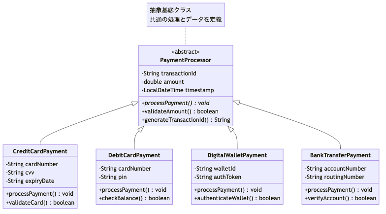
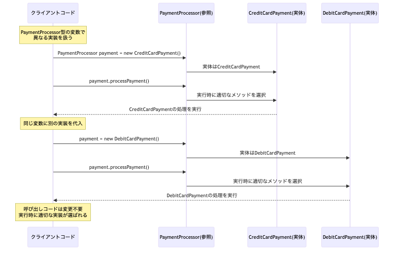

# <b>5章</b> <span>継承とポリモーフィズム</span> <small>コードの再利用と柔軟性の実現</small>

## 本章の学習目標

### この章で学ぶこと

1. 継承の基本
    - extendsキーワードによるクラスの継承
    - is-a関係の理解と適切な継承設計
    - superキーワードによる親クラスへのアクセス
2. メソッドオーバーライド
    - @Overrideアノテーションの活用
    - 親クラスの機能の特殊化
    - コンストラクタ連鎖（super()の呼び出し）
3. ポリモーフィズムの実践
    - 親クラス型での子クラスインスタンスの扱い
    - 動的バインディングによる柔軟な設計
    - テンプレートメソッドパターンの実装
4. 型変換と型判定
    - アップキャストとダウンキャスト
    - instanceof演算子による型判定
    - 安全なキャストの実装パターン

### この章を始める前に

第4章でカプセル化とクラス設計を理解していれば準備完了です。継承とポリモーフィズムにより、より柔軟で拡張性の高いプログラムを作成できるようになります。

## なぜ継承とポリモーフィズムが必要なのか

### コード重複の問題

ソフトウェア開発において、似たような機能を持つクラスを複数作成する場面は頻繁に発生します。たとえば、企業の給与計算システムを考えてみましょう。正社員、契約社員、アルバイトなど、雇用形態は異なりますが、「給与を計算する」という基本的な機能は共通しています。

継承を使わない場合、各雇用形態ごとに同じようなコードを繰り返し書くことになります。

この方法には重要な問題があります。

- 保守性の低下
-    + 同じロジックが複数箇所に散在し、修正時にすべての箇所を変更する必要がある
- バグの温床
-    + コピー&ペーストによるミスや、修正漏れによる不整合が発生しやすい
- 拡張性の欠如
-    + 新しい雇用形態を追加する際、既存コードを参考にしながら新規作成する必要がある

### 継承が解決する課題

継承は、このようなコード重複の問題を根本的に解決します。共通の機能を親クラスに集約し、各子クラスでは差分のみを実装することで、重要な利点が得られます。

DRY原則（Don't Repeat Yourself）を実現できます。共通コードを一箇所に集約することで、同じロジックを複数箇所に書く必要がなくなります。

変更の局所化も重要な利点です。共通機能の修正が親クラスの変更だけで完了するため、保守性が向上します。また、階層的な抽象化により、概念の階層関係をコードで表現できます。

### ポリモーフィズムがもたらす柔軟性

ポリモーフィズム（多態性）は、継承と組み合わせることで真価を発揮します。同じインターフェイスで異なる実装を扱えることで、柔軟な設計が可能になります。

開放閉鎖原則により、拡張に対して開いており、修正に対して閉じている設計ができます。

依存性逆転の原則も重要です。具体的な実装ではなく、抽象に依存する設計が可能になります。また、プラグイン可能なアーキテクチャにより、実行時に振る舞いを切り替えることができます。

## 実践的な継承設計パターン

第3章でオブジェクト指向の基本概念として継承を学び、第4章では実際のクラス設計で継承を活用しました。本章では、これらの基礎知識を発展させ、より高度で実践的な継承設計パターンと、ポリモーフィズムを活用した柔軟なプログラム構造について学習します。

継承は単なるコードの再利用手段ではなく、システムの拡張性と保守性を向上させる設計技法です。本章では、現実的なビジネス要件に対応できる継承階層の設計方法と、それを支えるポリモーフィズムの実践的な活用法を習得します。

### 高度な継承設計における共通課題

実践的なソフトウェア開発では、単純な継承から複雑なドメインモデルまで、さまざまなレベルの継承設計が求められます。とくに企業システムやWebアプリケーションでは、ビジネスルールの変化に対応できる柔軟な継承階層の設計が大切です。

#### 本章では、これまで学んだ基礎知識を活用して、実践的な設計課題に取り組みます。

具体的には次のような課題を扱います。

- テンプレートメソッドパターン
    + 共通アルゴリズムの骨格を定義し、詳細を子クラスに委ねる設計
- 戦略パターンとの組み合わせ
    + 継承と委譲を適切に使い分ける設計判断
- リスコフ置換原則の実践
    + 安全で予測可能な継承階層の構築
- 拡張性を考慮した設計
    + 将来の要件変更に対応できる柔軟な構造

### 継承設計の実践例：決済システム

実際のビジネスシステムでよく見られる決済処理を例に、段階的な継承設計の改善プロセスを見ていきましょう。ここでは、抽象クラスを使わずに、具象クラスの継承とメソッドのオーバーライドによってテンプレートメソッドパターンを実現する方法を示します。

<div class="figure">



</div>

<span class="listing-number">**サンプルコード5-1**</span>

```java
import java.math.BigDecimal;

// 決済結果を保持するクラス
public class PaymentResult {
    private boolean success;
    private String authorizationCode;
    private String message;
    
    public PaymentResult(boolean success, String authorizationCode, String message) {
        this.success = success;
        this.authorizationCode = authorizationCode;
        this.message = message;
    }
    
    public boolean isSuccess() { return success; }
    public String getAuthorizationCode() { return authorizationCode; }
    public String getMessage() { return message; }
}

// 決済処理の基底クラス：テンプレートメソッドパターンの実装
public class PaymentProcessor {
    protected String transactionId;
    protected BigDecimal amount;
    protected String currency;
    protected String errorMessage; // エラーメッセージを保持するフィールド
    
    public PaymentProcessor(String transactionId, BigDecimal amount, String currency) {
        this.transactionId = transactionId;
        this.amount = amount;
        this.currency = currency;
        this.errorMessage = null;
    }
    
    // テンプレートメソッド：決済処理の共通フロー
    public final PaymentResult processPayment() {
        // 1. 事前検証（共通処理）
        if (!validateCommonParameters()) {
            logError();
            return new PaymentResult(false, null, errorMessage);
        }
        
        // 2. 決済手段固有の検証（子クラスでオーバーライド可能）
        if (!validatePaymentSpecific()) {
            logError();
            return new PaymentResult(false, null, errorMessage);
        }
        
        // 3. 外部API呼び出し（子クラスでオーバーライド可能）
        String authorizationCode = callExternalAPI();
        if (authorizationCode == null) {
            logError();
            return new PaymentResult(false, null, errorMessage);
        }
        
        // 4. 処理結果の記録（共通処理）
        logTransaction(authorizationCode);
        
        return new PaymentResult(true, authorizationCode, "決済完了");
    }
    
    // 共通の検証ロジック（boolean返却、エラーメッセージはフィールドに設定）
    private boolean validateCommonParameters() {
        if (amount.compareTo(BigDecimal.ZERO) <= 0) {
            errorMessage = "金額は正の値である必要があります";
            return false;
        }
        if (amount.compareTo(new BigDecimal("1000000")) > 0) {
            errorMessage = "決済上限額を超えています";
            return false;
        }
        return true;
    }
    
    // 子クラスでオーバーライドされることを想定したメソッド（デフォルト実装を提供）
    protected boolean validatePaymentSpecific() {
        // デフォルトでは追加の検証なし
        // 子クラスでオーバーライド可能
        return true;
    }
    
    protected String callExternalAPI() {
        // デフォルトでは基本的な決済処理を実行
        // 実際の実装では外部決済サービスのAPIを呼び出す
        // エラーの場合はnullを返し、errorMessageを設定
        return "DEFAULT-" + System.currentTimeMillis();
    }
    
    // フックメソッド：子クラスでオーバーライド可能
    protected void logTransaction(String authCode) {
        System.out.println("取引ID: " + transactionId + " 承認コード: " + authCode);
    }
    
    protected void logError() {
        System.err.println("決済エラー[" + transactionId + "]: " + errorMessage);
    }
    
    // エラーメッセージを設定するヘルパーメソッド（子クラスから利用可能）
    protected void setErrorMessage(String message) {
        this.errorMessage = message;
    }
}

// 注意：このエラー処理の設計は単一スレッド環境を想定しています。
// 並行処理環境では、errorMessageフィールドの共有により問題が生じる可能性があります。
```

これは決済処理の基底クラスで、テンプレートメソッドパターンを実装しています。processPayment()メソッドが決済処理の共通フローを定義し、子クラスで特定の処理をオーバーライドできるようになっています。

#### テンプレートメソッドパターンの重要なポイント

1. 共通フローの定義
    + `processPayment()`メソッドで決済処理の標準的な流れを定義
2. 拡張ポイントの明確化
    + 子クラスがオーバーライド可能なメソッドでカスタマイズポイントを提供
3. 不変性の保証
    + `final`キーワードでテンプレートメソッドの改変を防止
4. デフォルト実装
    + 基本的な動作を提供しつつ、各決済手段に特有の処理（カード検証、API認証など）が必要な場合は子クラスで特化した実装を可能にする

#### 具体的な決済処理の実装例

<span class="listing-number">**サンプルコード5-2**</span>

```java
// クレジットカード決済の実装
public class CreditCardPayment extends PaymentProcessor {
    private String cardNumber;
    private String cvv;
    
    public CreditCardPayment(String transactionId, BigDecimal amount, 
                           String currency, String cardNumber, String cvv) {
        super(transactionId, amount, currency);
        this.cardNumber = cardNumber;
        this.cvv = cvv;
    }
    
    @Override
    protected boolean validatePaymentSpecific() {
        // クレジットカード固有の検証
        if (cardNumber == null || cardNumber.length() != 16) {
            setErrorMessage("無効なカード番号です");
            return false;
        }
        if (cvv == null || cvv.length() != 3) {
            setErrorMessage("無効なCVVです");
            return false;
        }
        return true;
    }
    
    @Override
    protected String callExternalAPI() {
        // クレジットカード決済API呼び出しのシミュレーション
        System.out.println("クレジットカード決済APIを呼び出し中...");
        
        // 実際の実装では外部APIを呼び出す
        // ここではシミュレーションとして、まれにエラーが発生する例を示す
        if (Math.random() < 0.1) {  // 10%の確率でエラー
            setErrorMessage("クレジットカード決済が拒否されました");
            return null;
        }
        
        return "CC-" + System.currentTimeMillis();
    }
}

// PayPal決済の実装
public class PayPalPayment extends PaymentProcessor {
    private String email;
    private String password;
    
    public PayPalPayment(String transactionId, BigDecimal amount, 
                        String currency, String email, String password) {
        super(transactionId, amount, currency);
        this.email = email;
        this.password = password;
    }
    
    @Override
    protected boolean validatePaymentSpecific() {
        // PayPal固有の検証
        if (email == null || !email.contains("@")) {
            setErrorMessage("無効なメールアドレスです");
            return false;
        }
        if (password == null || password.length() < 8) {
            setErrorMessage("パスワードが短すぎます");
            return false;
        }
        return true;
    }
    
    @Override
    protected String callExternalAPI() {
        // PayPal API呼び出しのシミュレーション
        System.out.println("PayPal APIを呼び出し中...");
        
        // 実際の実装では外部APIを呼び出す
        // エラーが発生した場合はnullを返す
        if (email.equals("error@example.com")) {  // テスト用のエラー条件
            setErrorMessage("PayPalアカウントが一時的に利用できません");
            return null;
        }
        
        return "PP-" + System.currentTimeMillis();
    }
    
    @Override
    protected void logTransaction(String authCode) {
        // PayPalでは詳細なログを記録
        super.logTransaction(authCode);
        System.out.println("PayPalアカウント: " + email);
    }
}
```

これらは決済処理基底クラスを継承した具体的な実装例です。CreditCardPaymentはクレジットカード特有の検証を、PayPalPaymentはPayPal特有の検証を実装し、それぞれの決済方法に応じたAPI呼び出しをシミュレートしています。

このアプローチでは、`PaymentProcessor`は抽象クラスではなく具象クラスとして実装されており、すべてのメソッドにデフォルト実装が提供されています。子クラスは各決済手段に固有の検証ロジック（クレジットカードの番号検証、PayPalのアカウント認証、銀行口座の残高確認など）が必要な場合に、これらのメソッドをオーバーライドして独自の振る舞いを実装できます。

#### 例外を使わない決済処理の使用例

<span class="listing-number">**サンプルコード5-3**</span>

```java
public class PaymentExample {
    public static void main(String[] args) {
        // クレジットカード決済の例
        CreditCardPayment ccPayment = new CreditCardPayment(
            "TXN001", 
            new BigDecimal("5000"), 
            "JPY",
            "1234567890123456",
            "123"
        );
        
        PaymentResult ccResult = ccPayment.processPayment();
        if (ccResult.isSuccess()) {
            System.out.println("決済成功: " + ccResult.getAuthorizationCode());
        } else {
            System.out.println("決済失敗: " + ccResult.getMessage());
        }
        
        // PayPal決済の例（エラーケース）
        PayPalPayment ppPayment = new PayPalPayment(
            "TXN002",
            new BigDecimal("10000"),
            "JPY",
            "invalid-email",  // 無効なメールアドレス
            "pass123"
        );
        
        PaymentResult ppResult = ppPayment.processPayment();
        if (ppResult.isSuccess()) {
            System.out.println("決済成功: " + ppResult.getAuthorizationCode());
        } else {
            System.out.println("決済失敗: " + ppResult.getMessage());
        }
    }
}
```

実行結果：
```
クレジットカード決済APIを呼び出し中...
取引ID: TXN001 承認コード: CC-1707123456789
決済成功: CC-1707123456789
決済エラー[TXN002]: 無効なメールアドレスです
決済失敗: 無効なメールアドレスです
```
（注：クレジットカード決済の成功/失敗は10%の確率でランダムに決まるため、実行ごとに結果が異なる場合があります）

#### エラー処理の設計ポイント

1. boolean戻り値
    + 検証メソッドは成功/失敗をbooleanで返す
2. エラーメッセージの保持
    + errorMessageフィールドにエラー情報を格納
3. nullチェック
    + API呼び出しの結果がnullの場合をエラーとして扱う
4. PaymentResultクラス
    + 処理結果とエラー情報をカプセル化

この設計により、例外処理を学ぶ前でも、エラー状態を適切に管理できるテンプレートメソッドパターンを実装できます。

### 段階的リファクタリング：重複コードから継承へ

実際の開発では、最初から理想的な継承構造を設計することは難しく、重複コードを発見してから継承を導入することがよくあります。その過程を段階的に見てみましょう。

#### ステップ1：重複コードの発見

実際の開発現場でよく見られる、独立して作成されたクラス間でのコード重複を示します。WordDocumentクラスとPDFDocumentクラスで、同じようなフィールドとメソッドが重複して実装されています。このような重複は保守性を低下させ、バグの温床となるため、継承を使ってリファクタリングする必要があります。

<span class="listing-number">**サンプルコード5-4**</span>

```java
public class WordDocument {
    private String filename;     // ①
    private String content;      // ①
    private long fileSize;       // ①
    
    public void open() {         // ②
        System.out.println(filename + " を開いています");
    }
    
    public void save() {         // ③
        fileSize = content.length();
        System.out.println(filename + " を保存しました: " + fileSize + "バイト");
    }
    
    public void close() {        // ④
        content = null;
        System.out.println(filename + " を閉じました");
    }
}

public class PDFDocument {
    private String filename;     // ①と重複
    private String content;      // ①と重複
    private long fileSize;       // ①と重複
    private int pageCount;       // ⑤
    
    public void open() {         // ②と完全重複
        System.out.println(filename + " を開いています");
    }
    
    public void save() {         // ③と完全重複
        fileSize = content.length();
        System.out.println(filename + " を保存しました: " + fileSize + "バイト");
    }
    
    public void close() {        // ④と完全重複
        content = null;
        System.out.println(filename + " を閉じました");
    }
    
    public void generatePDF() {  // ⑥
        System.out.println("PDF形式で " + pageCount + " ページを生成");
    }
}
```

これらのクラスを使用した例：

```java
public class DocumentTest {
    public static void main(String[] args) {
        // WordDocumentの操作
        WordDocument word = new WordDocument("report.docx", "これはWordドキュメントの内容です");
        word.open();
        word.save();
        word.close();
        
        System.out.println();
        
        // PDFDocumentの操作  
        PDFDocument pdf = new PDFDocument("manual.pdf", "これはPDFドキュメントの内容です", 10);
        pdf.open();
        pdf.save();
        pdf.generatePDF();
        pdf.close();
        
        System.out.println();
        
        // ExcelDocumentの操作
        ExcelDocument excel = new ExcelDocument("data.xlsx", "これはExcelドキュメントの内容です");
        excel.open();
        excel.save();
        excel.close();
    }
}
```

実行結果：
```
report.docx を開いています
report.docx を保存しました: 18バイト
report.docx を閉じました

manual.pdf を開いています
manual.pdf を保存しました: 17バイト
PDF形式で 10 ページを生成
manual.pdf を閉じました

data.xlsx を開いています
data.xlsx を保存しました: 19バイト
data.xlsx を閉じました
```

#### 重複コードの分析

- ①　共通フィールド
    + filename、content、fileSizeというドキュメントの基本属性がWordDocumentとPDFDocumentで重複して定義されている
- ②　ファイルオープン処理
    + open()メソッドの実装が両クラスで同一
- ③　保存処理
    + save()メソッドでfileSizeを計算し、メッセージ出力する処理が重複
- ④　クローズ処理
    + close()メソッドでcontentをnullにし、メッセージを出力するロジックが重複
- ⑤　固有フィールド
    + pageCount（ページ数）はPDF特有の属性として追加
- ⑥　固有メソッド
    + generatePDF()はPDF特有の機能として実装

<span class="listing-number">**サンプルコード5-5**</span>

```java
public class ExcelDocument {
    private String filename;
    private String content;
    private long fileSize;
    
    // また同じメソッドの重複！
    public void open() {
        System.out.println(filename + " を開いています");
    }
    
    public void save() {
        fileSize = content.length();
        System.out.println(filename + " を保存しました: " + fileSize + "バイト");
    }
    
    public void close() {
        content = null;
        System.out.println(filename + " を閉じました");
    }
}
```

これは重複コードの問題を示す例です。3つのドキュメントクラスで同じメソッドが繰り返し実装されています。

#### ステップ2：共通部分の抽出

<span class="listing-number">**サンプルコード5-6**</span>

```java
// 共通部分を親クラスとして抽出
public class Document {
    protected String filename;
    protected String content;
    protected long fileSize;
    
    public Document(String filename, String content) {
        this.filename = filename;
        this.content = content;
        this.fileSize = content != null ? content.length() : 0;
    }
    
    // 共通メソッドを親クラスに移動
    public void open() {
        System.out.println(filename + " を開いています");
    }
    
    public void save() {
        fileSize = content != null ? content.length() : 0;
        System.out.println(filename + " を保存しました: " + fileSize + "バイト");
    }
    
    public void close() {
        content = null;
        System.out.println(filename + " を閉じました");
    }
    
    // ゲッターとセッター
    public String getFilename() { return filename; }
    public long getFileSize() { return fileSize; }
}
```

#### ステップ3：子クラスの再実装

<span class="listing-number">**サンプルコード5-7**</span>

```java
// リファクタリング後：重複が除去された
public class WordDocument extends Document {
    public WordDocument(String filename, String content) {
        super(filename, content);
    }
    
    // WordDocument固有の機能があれば追加
    public void applyTemplate(String templateName) {
        System.out.println(filename + " にテンプレート " + templateName + " を適用");
    }
}

public class PDFDocument extends Document {
    private int pageCount;
    
    public PDFDocument(String filename, String content, int pageCount) {
        super(filename, content);
        this.pageCount = pageCount;
    }
    
    // saveメソッドをオーバーライド（PDFは圧縮効率が高い）
    @Override
    public void save() {
        fileSize = (content != null ? content.length() : 0) / 2; // PDFは圧縮される
        System.out.println(filename + " をPDF形式で保存: " + fileSize + "バイト");
    }
    
    public void generatePDF() {
        if (pageCount > 0) {
            System.out.println("PDF形式で " + pageCount + " ページを生成");
        } else {
            System.out.println("ページ数が指定されていません");
        }
    }
}

public class ExcelDocument extends Document {
    public ExcelDocument(String filename, String content) {
        super(filename, content);  // ①
    }
    
    @Override  // ②
    public void save() {
        fileSize = content != null ? content.length() * 2 : 0;  // ③
        System.out.println(filename + " をExcel形式で保存: " + fileSize + "バイト（メタデータ含む）");
    }
    
    public void createChart() {  // ④
        System.out.println(filename + " にグラフを作成");
    }
}
```

リファクタリング後の使用例：

```java
public class RefactoredDocumentTest {
    public static void main(String[] args) {
        // リファクタリング後の使用例
        WordDocument word = new WordDocument("report.docx", "これはWordドキュメントの内容です");
        word.open();
        word.save();
        word.applyTemplate("ビジネスレポート");
        word.close();
        
        System.out.println();
        
        PDFDocument pdf = new PDFDocument("manual.pdf", "これはPDFドキュメントの内容です", 10);
        pdf.open();
        pdf.save();  // オーバーライドされたメソッド
        pdf.generatePDF();
        pdf.close();
        
        System.out.println();
        
        ExcelDocument excel = new ExcelDocument("data.xlsx", "これはExcelドキュメントの内容です");
        excel.open();
        excel.save();  // オーバーライドされたメソッド
        excel.createChart();
        excel.close();
    }
}
```

実行結果：
```
report.docx を開いています
report.docx を保存しました: 18バイト
report.docx にテンプレート ビジネスレポート を適用
report.docx を閉じました

manual.pdf を開いています
manual.pdf をPDF形式で保存: 8バイト
PDF形式で 10 ページを生成
manual.pdf を閉じました

data.xlsx を開いています
data.xlsx をExcel形式で保存: 38バイト（メタデータ含む）
data.xlsx にグラフを作成
data.xlsx を閉じました
```

#### オーバーライドと特化機能の実装

- ①　親クラスのコンストラクタ呼び出し
    + super()により、親クラスの初期化処理を適切に実行
- ②　オーバーライドアノテーション
    + @Overrideによりコンパイラが親クラスのメソッドを正しくオーバーライドしていることを検証
- ③　特化した振る舞い
    + Excelファイルはメタデータを含むため、ファイルサイズが大きくなるよう設定
- ④　固有メソッドの追加
    + createChart()はExcel特有の機能として、親クラスには存在しないメソッドを追加


#### リファクタリングの効果

継承を導入したリファクタリングによって、コードの重複を削減できます。まず、コードの重複が除去されることで、保守性が向上します。同じコードを複数の場所に書く必要がなくなるため、バグの発生率が減り、修正も簡単になります。共通機能の変更が1箇所で済むことも大きな利点です。親クラスを修正するだけで、すべての子クラスに変更が反映されます。

また、各ドキュメントタイプの特性をオーバーライドで表現できることで、柔軟な設計が可能になります。共通のインターフェイスを保ちながら、各子クラスが独自の実装を持つことができます。さらに、新しいドキュメントタイプの追加が容易になります。親クラスを継承し、必要な部分だけをカスタマイズすることで、短時間で新しい機能を実装できます。このように、継承はソフトウェアの拡張性と保守性に寄与する技術の1つです。ただし、継承階層が3層以上になるとコードの理解が難しくなるため、コンポジションやインターフェイスの活用も検討すべきです。

### 継承の書き方：`extends`

Javaで継承を行うには、子クラスの宣言時に`extends`キーワードを使います。

#### 継承の基本構文と継承される要素

<span class="listing-number">**サンプルコード5-8**</span>

```java
public class Employee {  // 親クラス（スーパークラス）
    String employeeId;   // ①
    String name;         // ①

    void work() {        // ②
        System.out.println(this.name + "が業務を実行中");
    }
}

public class Manager extends Employee {  // ③
    void conductMeeting() {  // ④
        System.out.println(this.name + "が会議を主宰");
    }
}

public class Developer extends Employee {  // ③
    String primaryLanguage;  // ⑤

    void writeCode() {  // ④
        System.out.println(this.name + "が" + primaryLanguage + "でコーディング中");
    }
}
```

使用例：

```java
public class EmployeeTest {
    public static void main(String[] args) {
        // Managerの使用例
        Manager manager = new Manager();
        manager.employeeId = "M001";
        manager.name = "山田部長";
        manager.work();  // 継承したメソッド
        manager.conductMeeting();  // Manager固有のメソッド
        
        System.out.println();
        
        // Developerの使用例
        Developer developer = new Developer();
        developer.employeeId = "D001";
        developer.name = "鈴木開発者";
        developer.primaryLanguage = "Java";
        developer.work();  // 継承したメソッド
        developer.writeCode();  // Developer固有のメソッド
    }
}
```

実行結果：
```
山田部長が業務を実行中
山田部長が会議を主宰

鈴木開発者が業務を実行中
鈴木開発者がJavaでコーディング中
```

#### 継承の仕組みと効果

- ①　フィールドの継承
    + employeeId、nameというフィールドは自動的にすべての子クラスに引き継がれる
- ②　メソッドの継承
    + work()メソッドも同様に、すべての子クラスで利用可能になる
- ③　extends宣言
    + `extends Employee`により、ManagerとDeveloperはEmployeeクラスのすべての非privateメンバを継承
- ④　固有メソッドの追加
    + 各子クラスは継承した機能に加えて、独自のメソッドを定義可能
- ⑤　固有フィールドの追加
    + Developerクラスは継承したフィールドに加えて、primaryLanguage（主要プログラミング言語）を独自に持つ

### is-a関係

継承は、クラス間に「is-a関係」（〜は〜の一種である）が成り立つ場合に使うのが適切です。

- 「マネージャー（Manager） `is-a` 従業員(Employee)」
- 「開発者（Developer） `is-a` 従業員(Employee)」

このような関係が成り立つ場合、継承の利用を検討します。一方、「プロジェクト（Project） has aタスク(Task)」のような「has-a関係」の場合は、継承ではなく、フィールドとして持つ（コンポジション）方が適切です。


### 継承の誤用例：よくある間違い

継承を誤用すると、論理的に破綻したコードになってしまいます。実際の開発現場でよく見られる誤用パターンをいくつか見てみましょう。

#### 誤用例1：スタックがArrayListを継承

以下のコードは、継承の誤用の典型例です。スタック（後入れ先出しのデータ構造）を実装するためにArrayListを継承していますが、これによりArrayListの全メソッドが公開され、スタックの原則を破る操作が可能になってしまいます。この問題と解決策を見ていきましょう。

<span class="listing-number">**サンプルコード5-9**</span>

```java
// 悪い例：実装の詳細を継承してしまう
import java.util.ArrayList;
import java.util.EmptyStackException;

public class MyStack<E> extends ArrayList<E> {
    public void push(E item) {
        add(item);
    }
    
    public E pop() {
        if (isEmpty()) {
            throw new EmptyStackException();
        }
        return remove(size() - 1);
    }
    
    public E peek() {
        if (isEmpty()) {
            throw new EmptyStackException();
        }
        return get(size() - 1);
    }
}

// 問題点が露呈する使用例
public class StackProblem {
    public static void main(String[] args) {
        MyStack<String> stack = new MyStack<>();
        stack.push("first");
        stack.push("second");
        stack.push("third");
        
        // ArrayListのメソッドが露出してしまう
        stack.add(1, "WRONG!"); // スタックの途中に要素を挿入できてしまう
        stack.remove(0); // スタックの底から要素を削除できてしまう
        stack.clear(); // スタック全体をクリアできてしまう
        
        // スタックの約束（LIFO）が破られる
    }
}
```

#### 解決策：コンポジションを使用

<span class="listing-number">**サンプルコード5-10**</span>

```java
// 良い例：内部実装を隠蔽
import java.util.ArrayList;
import java.util.EmptyStackException;

public class MyStack<E> {
    private final ArrayList<E> elements = new ArrayList<>(); // privateで隠蔽
    
    public void push(E item) {
        elements.add(item);
    }
    
    public E pop() {
        if (isEmpty()) {
            throw new EmptyStackException();
        }
        return elements.remove(elements.size() - 1);
    }
    
    public E peek() {
        if (isEmpty()) {
            throw new EmptyStackException();
        }
        return elements.get(elements.size() - 1);
    }
    
    public boolean isEmpty() {
        return elements.isEmpty();
    }
    
    public int size() {
        return elements.size();
    }
    // ArrayListの他のメソッドは公開されない
}
```

このMyStackクラスは、コンポジションを使用してArrayListを内部に保持し、スタックに必要な機能のみを公開しています。
これにより、ArrayListのスタック操作に不要なメソッド（add、removeなど）が外部に公開されることを防いでいます。

#### 誤用例2：従業員権限階層での問題

以下の例は、継承設計の一般的な落とし穴である「すべてのサブクラスが親クラスの振る舞いを持つ」という誤った仮定を示しています。
この設計はリスコフ置換原則に違反します。

<span class="listing-number">**サンプルコード5-11**</span>

```java
// 悪い例：すべての従業員がシステム管理権限を持つという誤った前提
public class Employee {
    protected String employeeId;
    protected String name;
    
    public Employee(String employeeId, String name) {
        this.employeeId = employeeId;
        this.name = name;
    }
    
    public void modifySystemSettings() {
        System.out.println(name + " がシステム設定を変更しました");
    }
}

public class SystemAdministrator extends Employee {
    public SystemAdministrator(String employeeId, String name) {
        super(employeeId, name);
    }
    // modifySystemSettingsメソッドを適切に継承
}

public class RegularEmployee extends Employee {
    public RegularEmployee(String employeeId, String name) {
        super(employeeId, name);
    }
    
    @Override
    public void modifySystemSettings() {
        // 一般従業員にはシステム管理権限がない！
        throw new UnsupportedOperationException("権限がありません");
    }
}

// 使用時の問題
public class EmployeeManagementSystem {
    public static void performSystemMaintenance(List<Employee> employees) {
        for (Employee employee : employees) {
            employee.modifySystemSettings(); // 一般従業員で例外が発生！
        }
    }
}
```

この問題は、すべての従業員がシステム管理権限を持つという誤った仮定に基づいた継承設計の典型的な例です。一般従業員は従業員ですがシステム管理権限を持たないため、`modifySystemSettings()`メソッドで例外を投げることになり、リスコフの置換原則に違反しています。

この問題を適切に解決するためには、継承階層を見直し、共通の振る舞いのみを親クラスに定義してください。よりよい解決策として、インターフェイスを使用した設計がありますが、これについては第7章「抽象クラスとインターフェイス」で詳しく説明します。

> 注意: 継承を使用する際は、「is-a」の関係だけでなく、すべての子クラスが親クラスの振る舞いを適切に実装できるかを慎重に検討してください。

#### 誤用例3：正方形と長方形の問題

有名な例として「正方形と長方形」の問題も見てみましょう。これはリスコフ置換原則（LSP）違反の典型例です。

<span class="listing-number">**サンプルコード5-12**</span>

```java
// 問題のあるコード：数学的には正方形は長方形の一種だが...
public class Rectangle {
    protected int width;
    protected int height;
    
    public Rectangle(int width, int height) {
        this.width = width;
        this.height = height;
    }
    
    public void setWidth(int width) {
        this.width = width;
    }
    
    public void setHeight(int height) {
        this.height = height;
    }
    
    public int getArea() {
        return width * height;
    }
}

// 正方形を長方形として継承すると問題が発生
public class Square extends Rectangle {
    public Square(int size) {
        super(size, size);
    }
    
    // 正方形では幅と高さは常に同じでなければならない
    @Override
    public void setWidth(int width) {
        this.width = width;
        this.height = width; // 高さも同じ値に！
    }
    
    @Override
    public void setHeight(int height) {
        this.width = height; // 幅も同じ値に！
        this.height = height;
    }
}

// 使用例でリスコフ置換原則違反を確認
public class RectangleSquareTest {
    // 長方形を扱う一般的なメソッド
    public static void testRectangle(Rectangle rect) {
        rect.setWidth(5);
        rect.setHeight(10);
        
        // 期待される面積: 5 × 10 = 50
        int expectedArea = 50;
        int actualArea = rect.getArea();
        
        System.out.println("幅を5、高さを10に設定");
        System.out.println("期待される面積: " + expectedArea);
        System.out.println("実際の面積: " + actualArea);
        
        if (expectedArea == actualArea) {
            System.out.println("✓ テスト成功");
        } else {
            System.out.println("✗ テスト失敗！");
        }
    }
    
    public static void main(String[] args) {
        System.out.println("=== 長方形のテスト ===");
        Rectangle rectangle = new Rectangle(3, 4);
        testRectangle(rectangle);
        
        System.out.println("\n=== 正方形のテスト ===");
        Square square = new Square(5);
        testRectangle(square);
    }
}
```

実行結果：
```
=== 長方形のテスト ===
幅を5、高さを10に設定
期待される面積: 50
実際の面積: 50
✓ テスト成功

=== 正方形のテスト ===
幅を5、高さを10に設定
期待される面積: 50
実際の面積: 100
✗ テスト失敗！

この例は、正方形が長方形の振る舞いを正しく実装できないことを示しています
リスコフ置換原則の違反例です

// 使用例で問題が明らかに
public class GeometryTest {
    public static void main(String[] args) {
        Rectangle rect = new Square(5);
        
        // 長方形として扱うコード
        rect.setWidth(10);  // 幅を10に
        rect.setHeight(5);  // 高さを5に
        
        // 期待値：10 × 5 = 50
        // 実際の結果：5 × 5 = 25（最後のsetHeightで幅も5になってしまう）
        System.out.println("面積: " + rect.getArea()); // 25が出力される
    }
}
```

この例はリスコフの置換原則に違反しています。子クラスは親クラスと置き換え可能であることが大切ですが、`Square`は`Rectangle`の期待される振る舞いを破壊してしまっています。

この問題の根本的な原因は、数学的な関係（正方形は長方形の一種）とオブジェクト指向の継承関係が必ずしも一致しないことにあります。継承は「振る舞いの継承」であり、単なる概念的な関係ではありません。

この問題を解決する方法として、継承ではなくインターフェイスやコンポジションを使用する設計があります。たとえば：

<span class="listing-number">**サンプルコード5-13**</span>

```java
// 解決策の例：インターフェイスを使用
interface Shape {
    double getArea();
}

class Rectangle implements Shape {
    private int width;
    private int height;
    
    public Rectangle(int width, int height) {
        this.width = width;
        this.height = height;
    }
    
    @Override
    public double getArea() {
        return width * height;
    }
    
    // setterは矩形の特性に従う
    public void setWidth(int width) { this.width = width; }
    public void setHeight(int height) { this.height = height; }
}

class Square implements Shape {
    private int side;
    
    public Square(int side) {
        this.side = side;
    }
    
    @Override
    public double getArea() {
        return side * side;
    }
    
    // 正方形固有のsetter
    public void setSide(int side) { this.side = side; }
}
```

これらの高度な設計手法については、第7章「抽象クラスとインターフェイス」で詳しく解説します。

> 重要: 継承を使用する際は、親クラスの契約（期待される振る舞い）を子クラスが満たせるかを確認することが重要です。

### そのほかの継承の誤用パターン

継承の誤用は「正方形と長方形」以外にも多くのパターンがあります。以下によくある間違いを示します。

#### 誤用例1：実装の都合だけで継承を使う

<span class="listing-number">**サンプルコード5-14**</span>

```java
// 悪い例：Stackを継承したMyStack
public class MyStack<E> extends ArrayList<E> {
    public void push(E item) {
        add(item);
    }
    
    public E pop() {
        return remove(size() - 1);
    }
    
    public E peek() {
        return get(size() - 1);
    }
}

// 問題：ArrayListのすべてのメソッドが公開されてしまう
MyStack<String> stack = new MyStack<>();
stack.push("A");
stack.push("B");
stack.add(0, "C");  // スタックの途中に挿入できてしまう！
stack.remove(1);    // スタックの途中から削除できてしまう！
```

この例では、継承を使用したためにMyStackがArrayListのすべてのメソッドを継承し、スタックの原則を破る不正な操作が可能になってしまいます。

#### 改善策：コンポジション（委譲）を使う

<span class="listing-number">**サンプルコード5-15**</span>

```java
// 良い例：ArrayListを内部で使用
import java.util.ArrayList;
import java.util.EmptyStackException;

public class MyStack<E> {
    private ArrayList<E> list = new ArrayList<>();
    
    public void push(E item) {
        list.add(item);
    }
    
    public E pop() {
        if (isEmpty()) {
            throw new EmptyStackException();
        }
        return list.remove(list.size() - 1);
    }
    
    public E peek() {
        if (isEmpty()) {
            throw new EmptyStackException();
        }
        return list.get(list.size() - 1);
    }
    
    public boolean isEmpty() {
        return list.isEmpty();
    }
    
    public int size() {
        return list.size();
    }
}
```

#### 誤用例2：多重継承の代替として無理な継承

Javaは多重継承をサポートしないため、複数の能力を持つオブジェクトを表現するために無理な継承階層を作ることがあります。これは設計の柔軟性を損ないます。

<span class="listing-number">**サンプルコード5-16**</span>

```java
// 悪い例：「レポート作成可能」と「承認権限」を無理に継承で表現
public class Employee {
    public void work() { /* ... */ }
    public void attendMeeting() { /* ... */ }
}

public class ReportingEmployee extends Employee {
    public void generateReport() { /* ... */ }
}

public class ApprovingEmployee extends Employee {
    public void approveRequest() { /* ... */ }
}

// 問題：マネージャーはレポート作成も承認もできる、アナリストはレポート作成のみ
// どちらを継承すればよい？
```

この問題は、Javaが単一継承しかサポートしないことによる制約を示しています。複数の能力を持つオブジェクトを表現しようとすると、継承階層が複雑になり、設計の柔軟性が失われます。

たとえば、マネージャー（Manager）はレポートを作成することもできるし承認権限も持っていますが、`ReportingEmployee`と`ApprovingEmployee`のどちらか一方しか継承できません。結果として、どちらかの能力を諦めるか、複雑な継承階層を作ることになってしまいます。

この問題を解決するもっとも効果的な方法は、インターフェイスを使用して能力を表現することです。インターフェイスを使えば、クラスは必要な能力を選択的に実装でき、継承階層をシンプルに保つことができます。この設計手法については、第7章「抽象クラスとインターフェイス」で詳しく説明します。

> ポイント: 継承は強力な機能ですが、すべての問題を解決できるわけではありません。とくに複数の異なる能力を持つオブジェクトを表現する場合は、継承以外の設計手法を検討してください。

### 継承の実践例

RPGゲームのキャラクターシステムを例に、継承を実際に使用した実装例です。親クラスのフィールドやメソッドを子クラスで活用し、独自の機能を追加する方法を示しています。

<span class="listing-number">**サンプルコード5-17**</span>

```java
// Main.java
public class Main {
    public static void main(String[] args) {
        Hero hero = new Hero();
        hero.name = "勇者"; // 親クラスのフィールドを利用
        hero.hp = 100;

        Wizard wizard = new Wizard();
        wizard.name = "魔法使い";
        wizard.hp = 70;
        wizard.mp = 50; // 子クラス独自のフィールド

        hero.attack();       // 親クラスのメソッドを利用
        hero.specialMove();  // 子クラス独自のメソッド

        wizard.attack();     // 親クラスのメソッドを利用
        wizard.castSpell();  // 子クラス独自のメソッド
    }
}
```

## メソッドのオーバーライド

継承の強力な機能の1つが、メソッドのオーバーライド (Method Overriding) です。

オーバーライドとは、親クラスで定義されたメソッドを、子クラスで再定義（上書き）することです。これにより、子クラスは親クラスの基本的な振る舞いを引き継ぎつつ、自身の特性に合わせた具体的な振る舞いを実装できます。

たとえば、`User`クラスの`processRequest()`メソッドは基本的なリクエスト処理を行いますが、「管理者」は追加のセキュリティチェックを行い、「ゲストユーザー」は制限付きの処理のみを行うなど、ユーザータイプによって処理内容が異なります。これをオーバーライドで表現します。

### オーバーライドのルール

メソッドオーバーライドを正しく行うためには、いくつかの大切なルールを守ることがポイントです。まずもっとも基本的なルールとして、メソッド名、引数の型・数・順序が親クラスのメソッドと一致していることが大切です。このシグネチャ（メソッド名とパラメータリスト）が一致しない場合、それはオーバーライドではなく、単なる新しいメソッドの定義とみなされます。

次に、戻り値の型についても制約があります。基本的には、親クラスのメソッドと同じ型を返す必要があります。ただし、Java 5以降では共変戻り値型（covariant return type）がサポートされ、より具体的な（サブクラスの）型を返すことも許可されています。これにより、型安全性を保ちながらより精密な設計が可能になります。

さらに、アクセス修飾子に関する大切なルールがあります。オーバーライドするメソッドのアクセス修飾子は、親クラスのメソッドよりも制限を緩くすることしかできません。たとえば、親クラスのメソッドが`protected`である場合、子クラスでは`protected`のままにするか、`public`に変更することはできますが、`private`に変更することはできません。この制約は、ポリモーフィズムの原則を守り、リスコフの置換原則を保証するためのポイントです。

### `@Override`アノテーション

オーバーライドを行う際は、メソッドの直前に`@Override`というアノテーションを付けることが強く推奨されます。

これは、コンパイラに対して「このメソッドは親クラスのメソッドをオーバーライドする意図で書いています」と伝える目印です。もし、タイプミスなどでオーバーライドのルールを満たせていない場合、コンパイラがエラーを検知してくれます。

### `super`キーワード

子クラスのオーバーライドしたメソッド内から、親クラスの同名メソッドを呼び出したい場合があります。その際に使うのが`super`キーワードです。

`super.メソッド名()`とすることで、親クラスのメソッドを呼びだすことができます。これにより、親クラスの共通処理を活かしつつ、子クラス独自の処理を追加できます。

#### 実践例：`attack`メソッドのオーバーライド

<span class="listing-number">**サンプルコード5-18**</span>

```java
// 親クラス
public class Character {
    String name;
    int hp;

    public Character(String name, int hp) {
        this.name = name;
        this.hp = hp;
    }

    public void attack() {
        System.out.println(this.name + "の攻撃！");
    }
}

// 子クラス
public class Wizard extends Character {
    int mp;

    public Wizard(String name, int hp, int mp) {
        // super()で親クラスのコンストラクタを呼び出す
        super(name, hp); 
        this.mp = mp;
    }

    // attackメソッドをオーバーライド
    @Override
    public void attack() {
        System.out.println(this.name + "は杖で殴った！");
    }

    public void castSpell() {
        System.out.println(this.name + "は魔法を唱えた！");
    }
}

// 使用例
public class CharacterOverrideTest {
    public static void main(String[] args) {
        // 通常のキャラクター
        Character normalChar = new Character("戦士", 100);
        normalChar.attack();
        
        System.out.println();
        
        // 魔法使い
        Wizard wizard = new Wizard("魔法使い", 70, 10);
        wizard.attack();  // オーバーライドされたメソッド
        wizard.castSpell();
        
        System.out.println();
        
        // ポリモーフィズムの例
        Character polymorphicWizard = new Wizard("賢者", 80, 20);
        polymorphicWizard.attack();  // Wizardのattackメソッドが呼ばれる
        // polymorphicWizard.castSpell();  // コンパイルエラー：Character型にはcastSpellメソッドがない
    }
}
```

実行結果：
```
戦士の攻撃！

魔法使いは杖で殴った！
魔法使いは魔法を唱えた！

賢者は杖で殴った！

// 子クラス
public class Knight extends Character {
    public Knight(String name, int hp) {
        super(name, hp);
    }

    // attackメソッドをオーバーライドし、親の処理も利用する
    @Override
    public void attack() {
        super.attack(); // 親クラスのattack()を呼び出す
        System.out.println("追加で剣を振るった！"); // 子クラス独自の処理を追加
    }
}
```

### コンストラクタと`super()`

子クラスのコンストラクタでは、その処理の一番はじめに、親クラスのコンストラクタを呼びだす必要があります。これは`super()`を使って行います。

- もし、子クラスのコンストラクタで明示的に`super()`を呼び出さない場合、コンパイラは自動的に親クラスの引数なしのコンストラクタ (`super()`) を呼びだすコードを挿入する
- 親クラスに引数なしのコンストラクタが存在しない場合は、子クラスのコンストラクタで必ず明示的に`super(...)`を呼び出さなければならず、さもないとコンパイルエラーになる

## ポリモーフィズム（多態性）

ポリモーフィズム (Polymorphism) は、ギリシャ語で「多くの形を持つ」という意味で、プログラミングにおける柔軟性を実現する概念です。オブジェクト指向では継承とオーバーライドを通じて実現されますが、関数型プログラミングではパラメトリックポリモーフィズムやアドホックポリモーフィズムなど、異なる形で実現されます。

ポリモーフィズムとは、同じ型の変数や同じメソッド呼び出しが、実行時のオブジェクトの種類によって異なる振る舞いをする性質を指します。

継承とオーバーライドは、このポリモーフィズムを実現するための土台となります。

### 親クラスの型で子クラスのインスタンスを扱う

Javaでは、親クラス型の変数に、その子クラスのインスタンスを代入できます。これをアップキャストと呼びます。

<span class="listing-number">**サンプルコード5-19**</span>

```java
// 親クラス型の変数に、子クラスのインスタンスを代入
User user1 = new RegularUser("U001", "user1@example.com");
User user2 = new AdminUser("A001", "admin@example.com", "SuperAdmin");
User user3 = new GuestUser("session123");
```

このとき、変数`user1`, `user2`, `user3`はすべて`User`型として扱われます。しかし、それぞれの変数が実際に指し示しているオブジェクトの実体は`RegularUser`, `AdminUser`, `GuestUser`と異なります。

### 同じ呼び出しで、異なる振る舞いを実現する

ここからがポリモーフィズムの真骨頂です。これらの`User`型の変数に対して`processRequest()`メソッドを呼びだすと、何が起こるでしょうか。

<span class="listing-number">**サンプルコード5-20**</span>

```java
user1.processRequest("READ"); // 実行結果: ユーザー U001 が READ をリクエストしました
user2.processRequest("DELETE"); // 実行結果: 管理者権限での処理: DELETE
                               //         セキュリティチェックを実行中...
user3.processRequest("WRITE"); // 実行結果: ユーザー guest_session123 が WRITE をリクエストしました
                              //         ゲストユーザーのため、一部機能が制限されています
```

`user2.processRequest()`という同じ呼び出し方にもかかわらず、Javaの実行環境は`user2`が実際に`AdminUser`オブジェクトを指していることを認識します。そして、`AdminUser`クラスでオーバーライドされた`processRequest()`メソッドを自動的に呼び出します。これがポリモーフィズムです。

### ポリモーフィズムの利点

この性質を利用すると、非常に柔軟で拡張性の高いプログラムを書くことができます。たとえば、さまざまなユーザーをまとめて管理する配列を考えてみましょう。

<span class="listing-number">**サンプルコード5-21**</span>

```java
public class UserManagementSystem {
    public static void main(String[] args) {
        // 親クラスの配列に、さまざまな子クラスのインスタンスを格納できる
        User[] users = new User[3];
        users[0] = new RegularUser("U001", "user1@example.com");
        users[1] = new AdminUser("A001", "admin@example.com", "SuperAdmin");
        users[2] = new GuestUser("session123");

        // 全ユーザーのリクエストを処理
        for (User user : users) {
            // user変数の型はUserだが、実行時には
            // 実際のインスタンスのprocessRequest()が呼び出される
            user.processRequest("READ"); 
        }
    }
}
```

実行結果：
```
ユーザー U001 が READ をリクエストしました
管理者権限での処理: READ
セキュリティチェックを実行中...
ユーザー guest_session123 が READ をリクエストしました
ゲストユーザーのため、一部機能が制限されています
```

この`for`ループのなかでは、`user`が`RegularUser`なのか`AdminUser`なのかを一切気にしません。ただ`processRequest()`を呼びだすだけで、各ユーザータイプに応じた処理が自動的に実行されます。

もし将来、「プレミアムユーザー `PremiumUser`」という新しいユーザータイプを追加したくなっても、`UserManagementSystem`クラスのコードは一切変更しません。`PremiumUser`クラスを作成し、`User`を継承して`processRequest()`をオーバーライドし、`users`配列に追加するだけで、新しいユーザータイプも問題なく動作します。これがポリモーフィズムがもたらす拡張性です。

### ポリモーフィズムのBefore/After比較

ポリモーフィズムを使わない場合と使った場合の違いを、実際のコードで比較してみましょう。

#### Before：ポリモーフィズムを使わない場合

<span class="listing-number">**サンプルコード5-22**</span>

```java
// 型ごとに別々の処理を書く必要がある
public class UserSystemBefore {
    public static void main(String[] args) {
        RegularUser regular = new RegularUser("U001", "user1@example.com");
        AdminUser admin = new AdminUser("A001", "admin@example.com", "SuperAdmin");
        GuestUser guest = new GuestUser("session123");
        
        // それぞれの型に応じたリクエスト処理
        System.out.println("=== 全ユーザーのリクエスト処理（ポリモーフィズムなし）===");
        
        // RegularUserの処理
        regular.processRequest("READ");
        
        // AdminUserの処理
        admin.processRequest("DELETE");
        
        // GuestUserの処理
        guest.processRequest("WRITE");
        
        // 新しいユーザータイプを追加するたびに、ここにコードを追加する必要がある
        // PremiumUser premium = new PremiumUser("P001", "premium@example.com");
        // premium.processRequest("CREATE");
    }
    
    // アクセス権限を確認する場合も型別処理が必要
    public static boolean checkAccessPermission(RegularUser regular, AdminUser admin, GuestUser guest, String resource) {
        // 各型ごとに個別に処理
        if (regular != null) {
            return resource.equals("READ") || resource.equals("WRITE");
        }
        if (admin != null) {
            return true; // 管理者はすべてのリソースにアクセス可能
        }
        if (guest != null) {
            return resource.equals("READ"); // ゲストは読み取りのみ
        }
        
        // 新しい型が増えるたびに、このメソッドも修正が必要
        return false;
    }
}
```

実行結果：
```
=== 全ユーザーのリクエスト処理（ポリモーフィズムなし）===
ユーザー U001 が READ をリクエストしました
管理者権限での処理: DELETE
セキュリティチェックを実行中...
ユーザー guest_session123 が WRITE をリクエストしました
ゲストユーザーのため、一部機能が制限されています

=== アクセス権限チェック ===
Regular user READ権限: true
Admin user DELETE権限: true
Guest user WRITE権限: false
```

#### After：ポリモーフィズムを使った場合

<span class="listing-number">**サンプルコード5-23**</span>

```java
// 統一的な処理で全ての型を扱える
public class UserSystemAfter {
    public static void main(String[] args) {
        // ポリモーフィズム：親クラスの型で管理
        User[] users = {
            new RegularUser("U001", "user1@example.com"),
            new AdminUser("A001", "admin@example.com", "SuperAdmin"),
            new GuestUser("session123")
            // 新しいユーザータイプを追加しても、以下のコードは変更不要
            // new PremiumUser("P001", "premium@example.com")
        };
        
        System.out.println("=== 全ユーザーのリクエスト処理（ポリモーフィズムあり）===");
        
        // 統一的な処理で全員を扱える
        for (User user : users) {
            user.processRequest("READ"); // 実際の型に応じた処理が自動的に呼ばれる
        }
    }
    
    // アクセス権限チェックも拡張性が高い
    public static boolean checkAccessPermission(User[] users, String resource) {
        boolean hasPermission = true;
        
        // 型を意識せずに処理できる
        for (User user : users) {
            if (!user.hasPermission(resource)) {
                hasPermission = false;
                System.out.println(user.getUserId() + " には " + resource + " 権限がありません");
            }
        }
        
        return hasPermission;
    }
    
    // 特定の条件での処理も簡潔に書ける
    public static void sendNotification(User[] users, String message) {
        for (User user : users) {
            if (user.isActive()) {
                user.notify(message);
                System.out.println(user.getUserId() + " に通知を送信しました");
            }
        }
    }
}
```

実行結果：
```
=== 全ユーザーのリクエスト処理（ポリモーフィズムあり）===
ユーザー U001 が READ をリクエストしました
管理者権限での処理: READ
セキュリティチェックを実行中...
ユーザー guest_session123 が READ をリクエストしました
ゲストユーザーのため、一部機能が制限されています

=== DELETE権限のチェック ===
U001 には DELETE 権限がありません
guest_session123 には DELETE 権限がありません

=== 通知の送信 ===
U001 への通知: システムメンテナンスのお知らせ
U001 に通知を送信しました
A001 への通知: システムメンテナンスのお知らせ
A001 に通知を送信しました
guest_session123 への通知: システムメンテナンスのお知らせ
guest_session123 に通知を送信しました
```

```java
// 親クラスに共通インターフェイスを定義
class User {
    protected String userId;
    protected String email;
    
    public boolean hasPermission(String resource) {
        // デフォルトでは読み取り権限のみ
        return resource.equals("READ");
    }
    
    public void notify(String message) {
        // 通知を送信
    }
    
    public boolean isActive() {
        return true; // デフォルトではアクティブ
    }
    
    public String getUserId() { return userId; }
    public String getEmail() { return email; }
}
```

#### ポリモーフィズムの利点まとめ

1. コードの簡潔性
    + 型別の条件分岐が不要になり、コードがシンプルに
2. 拡張性
    + 新しい型を追加してもクライアントコードの変更が不要
3. 保守性
    + 処理の追加・変更が容易
4. 再利用性
    + 汎用的なメソッドが書きやすい
5. 型安全性
    + コンパイラが型をチェックする

<div class="figure">



</div>

### ポリモーフィズムの実践例：図形描画システム

より実践的な例として、図形描画システムを考えてみましょう。

#### Before：ポリモーフィズムを使わない場合

<span class="listing-number">**サンプルコード5-24**</span>

```java
// 図形の種類を列挙型で管理
enum ShapeType {
    CIRCLE, RECTANGLE, TRIANGLE
}

// すべての図形データを1つのクラスで管理（悪い設計）
class ShapeData {
    ShapeType type;
    // 円の属性
    double radius;
    // 長方形の属性
    double width, height;
    // 三角形の属性
    double base, triangleHeight;
    
    double calculateArea() {
        switch (type) {
            case CIRCLE:
                return Math.PI * radius * radius;  // Math.PIは円周率の定数
            case RECTANGLE:
                return width * height;
            case TRIANGLE:
                return 0.5 * base * triangleHeight;
            default:
                return 0;
        }
    }
    
    void draw() {
        switch (type) {
            case CIRCLE:
                System.out.println("円を描画：半径 = " + radius);
                break;
            case RECTANGLE:
                System.out.println("長方形を描画：幅 = " + width + ", 高さ = " + height);
                break;
            case TRIANGLE:
                System.out.println("三角形を描画：底辺 = " + base + ", 高さ = " + triangleHeight);
                break;
        }
    }
}

// 使用例
public class DrawingAppBefore {
    public static void main(String[] args) {
        ShapeData[] shapes = new ShapeData[3];
        
        // 円を作成
        shapes[0] = new ShapeData();
        shapes[0].type = ShapeType.CIRCLE;
        shapes[0].radius = 5.0;
        
        // 長方形を作成
        shapes[1] = new ShapeData();
        shapes[1].type = ShapeType.RECTANGLE;
        shapes[1].width = 10.0;
        shapes[1].height = 20.0;
        
        // 三角形を作成
        shapes[2] = new ShapeData();
        shapes[2].type = ShapeType.TRIANGLE;
        shapes[2].base = 15.0;
        shapes[2].triangleHeight = 8.0;
        
        // すべての図形を描画
        for (ShapeData shape : shapes) {
            shape.draw();
            System.out.println("面積: " + shape.calculateArea());
        }
    }
}
```

実行結果：
```
円を描画：半径 = 5.0
面積: 78.53981633974483
長方形を描画：幅 = 10.0, 高さ = 20.0
面積: 200.0
三角形を描画：底辺 = 15.0, 高さ = 8.0
面積: 60.0
```

#### After：ポリモーフィズムを使った場合

<span class="listing-number">**サンプルコード5-25**</span>

```java
// 基底クラス
class Shape {
    double calculateArea() {
        // デフォルトの実装（面積0を返す）
        return 0.0;
    }
    
    void draw() {
        // デフォルトの実装
        System.out.println("基本的な図形を描画");
    }
}

// 円クラス
class Circle extends Shape {
    private double radius;
    
    public Circle(double radius) {
        this.radius = radius;
    }
    
    @Override
    double calculateArea() {
        return Math.PI * radius * radius;  // Math.PIは円周率の定数
    }
    
    @Override
    void draw() {
        System.out.println("円を描画：半径 = " + radius);
    }
}

// 長方形クラス
class Rectangle extends Shape {
    private double width;
    private double height;
    
    public Rectangle(double width, double height) {
        this.width = width;
        this.height = height;
    }
    
    @Override
    double calculateArea() {
        return width * height;
    }
    
    @Override
    void draw() {
        System.out.println("長方形を描画：幅 = " + width + ", 高さ = " + height);
    }
}

// 三角形クラス
class Triangle extends Shape {
    private double base;
    private double height;
    
    public Triangle(double base, double height) {
        this.base = base;
        this.height = height;
    }
    
    @Override
    double calculateArea() {
        return 0.5 * base * height;
    }
    
    @Override
    void draw() {
        System.out.println("三角形を描画：底辺 = " + base + ", 高さ = " + height);
    }
}

// 使用例
public class DrawingAppAfter {
    public static void main(String[] args) {
        Shape[] shapes = {
            new Circle(5.0),
            new Rectangle(10.0, 20.0),
            new Triangle(15.0, 8.0)
        };
        
        // すべての図形を描画（型を意識しない）
        for (Shape shape : shapes) {
            shape.draw();
            System.out.println("面積: " + shape.calculateArea());
        }
        
        // 新しい図形（五角形）を追加しても、このコードは変更不要
    }
}

// 新しい図形の追加が容易
class Pentagon extends Shape {
    private double side;
    
    public Pentagon(double side) {
        this.side = side;
    }
    
    @Override
    double calculateArea() {
        return 0.25 * Math.sqrt(5 * (5 + 2 * Math.sqrt(5))) * side * side;
    }
    
    @Override
    void draw() {
        System.out.println("五角形を描画：一辺 = " + side);
    }
}
```

実行結果：
```
円を描画：半径 = 5.0
面積: 78.53981633974483
長方形を描画：幅 = 10.0, 高さ = 20.0
面積: 200.0
三角形を描画：底辺 = 15.0, 高さ = 8.0
面積: 60.0

=== 新しい図形を追加 ===
五角形を描画：一辺 = 5.0
面積: 43.01193501472417
```

#### ポリモーフィズムがもたらす設計上の利点

1. Open/Closed原則の実現
    + 拡張に対して開いており、修正に対して閉じている
2. 単一責任原則
    + 各図形クラスは自身の描画と面積計算のみに責任を持つ
3. 依存関係逆転の原則
    + 高レベルのコードが低レベルの詳細に依存しない
4. テストの容易性
    + 各図形クラスを独立してテスト可能
5. 並列開発
    + 複数の開発者が異なる図形クラスを同時に開発可能

## `instanceof`演算子とキャスト

親クラスの型でオブジェクトを扱っていると、そのオブジェクトがもともとどの具体的な子クラスのインスタンスだったかを知り、その子クラス独自の機能を使いたくなることがあります。

たとえば、`User`型の変数`user`が、もし`AdminUser`だったら`performAdminTask()`メソッドを呼びたい、という場合です。

<span class="listing-number">**サンプルコード5-26**</span>

```java
User user = new AdminUser("A001", "admin@example.com", "SuperAdmin");
// user.performAdminTask(); // コンパイルエラー！
```
これはコンパイルエラーになります。なぜなら、コンパイラは変数`user`を`User`型としてしか認識しておらず、`User`クラスには`performAdminTask()`メソッドが定義されていないからです。

### `instanceof`演算子：型の調査

`instanceof`演算子を使うと、あるオブジェクトが特定のクラス（またはそのサブクラス）のインスタンスであるかどうかを調べることができます。

`変数 instanceof クラス名` の形で使用し、結果は`boolean`値（`true`または`false`）で返されます。

### キャスト：型変換

オブジェクトが特定の子クラスのインスタンスであることがわかったら、その変数の型を一時的に子クラスの型に変換できます。これをダウンキャストと呼びます。

`(変換したい型)変数` のように記述します。

<span class="listing-number">**サンプルコード5-27**</span>

```java
public class UserAccessControl {
    public static void main(String[] args) {
        User[] users = {
            new RegularUser("U001", "user1@example.com"),
            new AdminUser("A001", "admin@example.com", "SuperAdmin"),
            new GuestUser("session123")
        };

        for (User user : users) {
            user.processRequest("READ"); // これはポリモーフィズムでOK

            // もし、ユーザーがAdminUserだったら、特別に管理タスクを実行
            if (user instanceof AdminUser) {
                // userをAdminUser型にダウンキャストする
                AdminUser admin = (AdminUser) user; 
                admin.performAdminTask();
            }
        }
    }
}
```

実行結果：
```
ユーザー U001 が READ をリクエストしました

管理者権限での処理: READ
セキュリティチェックを実行中...
管理者タスクを実行: SuperAdmin レベルの権限で処理

ユーザー guest_session123 が READ をリクエストしました
ゲストユーザーのため、一部機能が制限されています
```

注意： `instanceof`でチェックせずにいきなりキャストしようとすると、もしオブジェクトがその型でなかった場合に`ClassCastException`という実行時エラーが発生します。必ず`instanceof`で確認してからキャストするのが安全です。

#### モダンJavaのパターンマッチング

Java 16から、`instanceof`とキャストをより簡潔に書ける「`instanceof`のパターンマッチング」が導入されました。

<span class="listing-number">**サンプルコード5-28**</span>

```java
// 従来の書き方
if (user instanceof AdminUser) {
    AdminUser admin = (AdminUser) user;
    admin.performAdminTask();
}

// パターンマッチングを使った書き方 (Java 16以降)
if (user instanceof AdminUser admin) {
    // instanceofがtrueの場合、キャスト済みのadmin変数が使える
    admin.performAdminTask();
}
```
この新しい書き方を使うと、より安全で読みやすいコードになります。

## 章末演習

### 演習課題へのアクセス
本章の演習課題は、GitHubリポジトリで提供されています。<br>
`https://github.com/Nagatani/techbook-java-primer/tree/main/exercises/chapter05/`

### 課題構成
- 本章の基本概念の理解確認
- 応用的な実装練習
- 実践的な総合問題

詳細な課題内容と実装のヒントは、各課題フォルダ内のREADME.mdを参照してください。

- 継承を使ったクラス階層の設計と実装
- メソッドのオーバーライドによる振る舞いの特殊化
- ポリモーフィズムを活用した柔軟なプログラム設計
- instanceof演算子とキャストの安全な使用

### 基礎課題のヒント

PayrollSystem（給与計算システム）
- Employeeクラスを親クラスとして設計
- 正社員、アルバイト、派遣社員などの子クラスを実装
- calculateSalary()メソッドをオーバーライドして各雇用形態に応じた給与計算を実装
- 配列を使って異なる型の従業員を一括管理

### 実装のポイント

1. 親クラスの設計
    + 共通属性（名前、社員番号）を定義
2. 抽象メソッドの活用
    + 給与計算ロジックは子クラスで実装
3. ポリモーフィズムの実践
    + Employee[]配列で全従業員を管理
4. 型判定の活用
    + 子クラス固有の機能が必要な場合にinstanceofで特定の処理を実行

詳細な課題内容と実装のヒントは、GitHubリポジトリの各課題フォルダ内のREADME.mdを参照してください。

次のステップ： 基礎課題が完了したら、第6章「不変性とfinalキーワード」に進みましょう。

## 例外処理の基礎（補足）

本章では継承とポリモーフィズムに焦点を当てましたが、継承を使う際には例外処理に関する重要なルールがあります。

> **注意**: 例外処理の基本概念（try-catch構文、例外の種類など）については、第14章「例外処理」で詳しく説明しています。ここでは継承に関連する例外処理のルールのみを取り上げます。

### 継承における例外処理の注意点


メソッドをオーバーライドする際、親クラスのメソッドが投げる例外より広い例外を投げることはできません。

<span class="listing-number">**サンプルコード5-29**</span>

```java
class Parent {
    void doSomething() throws IOException {
        // 処理
    }
}

class Child extends Parent {
    @Override
    void doSomething() throws IOException {  // OK
        // IOException以下の例外のみ宣言可能
    }
    
    // @Override
    // void doSomething() throws Exception {  // コンパイルエラー
    //     // より広い例外は宣言できない
    // }
}
```

これは例外処理におけるオーバーライドの制約を示す例です。子クラスは親クラスよりも広い例外（Exception > IOException）を投げることはできません。

この基本的な例外処理の知識があれば、本書の残りの章でもより実践的なコードを理解できるでしょう。第14章では、例外処理の詳細な仕組みやベストプラクティスを学習します。

※ 本章の高度な内容については、付録B.04「仮想メソッドテーブル」（`https://github.com/Nagatani/techbook-java-primer/tree/main/appendix/b04-virtual-method-table/`）を参照してください。

## よくあるエラーと対処法

本章では、継承とポリモーフィズムに特有のエラーを扱います。

### 本章特有のエラー

#### 1. super()呼び出しエラー
問題: 親クラスのコンストラクタを正しく呼び出さない

<span class="listing-number">**サンプルコード5-30**</span>

```java
// エラー例
class Parent {
    public Parent(String name) { }  // デフォルトコンストラクタなし
}

class Child extends Parent {
    public Child() { }  // エラー：super()が暗黙的に呼ばれるがParent()は存在しない
}
```

このエラーはParentクラスにデフォルトコンストラクタがないため、Childのコンストラクタから暗黙的にsuper()が呼ばれたときに発生します。

解決策:

<span class="listing-number">**サンプルコード5-31**</span>

```java
class Child extends Parent {
    public Child() {
        super("default");  // 明示的に親のコンストラクタを呼び出す
    }
}
```

実行結果：
```
Parent30 コンストラクタ: default
Child31 コンストラクタ
```

重要なポイント:
- 親クラスにパラメータ付きコンストラクタのみがある場合は明示的なsuper()が必要
- super()は必ずコンストラクタの最初に記述
- デフォルトコンストラクタは自動生成されない

#### 2. オーバーライドエラー
問題: メソッドオーバーライド時の制約違反

<span class="listing-number">**サンプルコード5-32**</span>

```java
// エラー例1：アクセス修飾子の制限強化
class Parent {
    public void method() { }
}
class Child extends Parent {
    private void method() { }  // エラー：publicからprivateへ
}

// エラー例2：戻り値型の不一致
class Parent {
    public int getValue() { return 0; }
}
class Child extends Parent {
    public String getValue() { return ""; }  // エラー：戻り値型が異なる
}
```

このエラーは、子クラスが親クラスのメソッドよりも制限的なアクセス修飾子を使用しようとした場合や、戻り値型が一致しない場合に発生します。

解決策:

<span class="listing-number">**サンプルコード5-33**</span>

```java
class Child extends Parent {
    @Override
    public void method() { }  // 同じかより緩いアクセス修飾子
    
    @Override
    public int getValue() { return 42; }  // 同じ戻り値型
}
```

これにより、親クラスでpublicメソッドとして公開されているものが、子クラスでも同じく公開されることが保証されます。

重要なポイント:
- アクセス修飾子は同じかより緩いものを使用
- 戻り値型は同じか共変戻り値型（サブタイプ）
- @Overrideアノテーションでミスを防ぐ

#### 3. キャストエラー
問題: 互換性のない型へのキャストによるClassCastException

<span class="listing-number">**サンプルコード5-34**</span>

```java
// エラー例
Parent p = new Parent();
Child c = (Child) p;  // 実行時エラー：ParentはChildではない
```

このコードを実行するとClassCastExceptionが発生します。Parentクラスのインスタンスを Childクラスにキャストできないからです。

解決策:

<span class="listing-number">**サンプルコード5-35**</span>

```java
// instanceof使用
if (p instanceof Child) {
    Child c = (Child) p;
}

// パターンマッチング（Java 14+）
if (p instanceof Child child) {
    child.childMethod();
}
```

実行結果：
```
p1はChild34ではないため、キャストできません
p2はChild34にキャスト可能
Child34 固有メソッド
```

重要なポイント:
- キャスト前にinstanceofで型チェック
- ダウンキャストは慎重に行う
- パターンマッチングで安全性と簡潔性を両立

### 関連する共通エラー

以下のエラーも本章の内容に関連します。

- **NullPointerException**（→ 付録A.1.1）
  - 継承階層でのnull参照に注意
- **抽象メソッドの実装忘れ**（→ 第7章）
  - 抽象クラス継承時の必須実装
- **メソッドシグネチャの理解不足**（→ 第4章）
  - オーバーライド条件の詳細

### デバッグのヒント

1. 継承階層の可視化
   - クラス図を描いて関係を整理
   - どのメソッドがどこで定義されているか確認

2. @Overrideの活用
   - 必ず付けることでコンパイル時チェック
   - オーバーライドの意図を明確化

3. 段階的なテスト
   - 親クラス単体→子クラス単体→ポリモーフィズムの順

