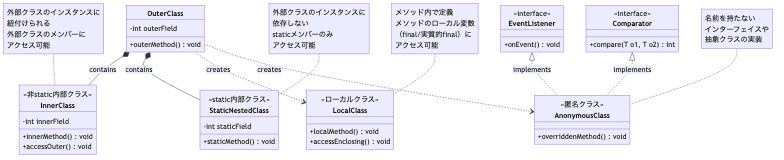

# <b>8章</b> <span>Javaの特殊なクラス形式</span> <small>列挙型とレコードによる効率的な実装</small>

## 本章の学習目標

### この章で学ぶこと

本章では、Javaが提供する特殊なクラス形式について学習します。
具体的には以下の内容を扱います。

1. 列挙型（Enum）の理解と活用
    - 型安全な定数定義の実現方法
    - 高度なEnum機能とデザインパターンへの応用
2. レコード（Record）の理解と活用
    - 不変データクラスの簡潔な定義方法
    - パターンマッチングとの統合による高度な活用
3. 両者の使い分けと実践的な設計
    - それぞれの特徴を活かした設計上の選択
    - 実際のアプリケーションでの組み合わせ方

### この章を始める前に

第6章のfinalキーワードとstatic final定数、第7章のインターフェイスを理解していれば準備完了です。
これらの知識により、従来の定数定義やデータクラスの問題点と、EnumやRecordがもたらす改善を実感できます。

## Part 1: 列挙型（Enum）

### enumとは？

`enum`（列挙型）は、決まったいくつかの値だけを取りうる型を定義するための、特殊なクラスです。たとえば、「曜日（月、火、水、木、金、土、日）」や「信号の色（赤、青、黄）」のように、値の範囲が限定されているものを扱うのに最適です。


### なぜenumが必要なのか？

`enum`がない場合、このような定数は`public static final int`フィールドとして定義することが一般的でした。しかし、この方法には以下のような問題点があります。

- `int`型ですので、`setSignal(100)`のような無効な値も代入できてしまう
- `int`という型からは、それが「信号の色」を表すという情報がわからない
- 変数の値を表示しても`0`としか出力されず、それが「赤」を意味するのかわからない

`enum`は、これらの問題をすべて解決します。`enum`で定義された各要素（列挙子）は、その`enum`型のユニークなインスタンスとして扱われ、型安全性を保証します。

### 基本的な構文と使い方

以下のコードは、曜日を表す列挙型の最も基本的な定義例です。enumキーワードを使って7つの曜日を定義することで、DayOfWeek型はこれら7つの値のみを取ることができる型安全な定数となります。各列挙子（SUNDAY、MONDAYなど）は自動的にDayOfWeek型の唯一のインスタンスとして生成されます。

<span class="listing-number">**サンプルコード8-1**</span>

```java
public enum DayOfWeek {
    SUNDAY, MONDAY, TUESDAY, WEDNESDAY, THURSDAY, FRIDAY, SATURDAY
}
```

これだけで、`DayOfWeek`という新しい型が作られ、その型が取りうる値は定義された7つの曜日に限定されます。

<span class="listing-number">**サンプルコード8-2**</span>

```java
public class EnumExample {
    public static void main(String[] args) {
        DayOfWeek today = DayOfWeek.WEDNESDAY;
        
        System.out.println("今日は " + today + " です。");
        // toString()がオーバーライドされており、"WEDNESDAY"と表示される
        
        // 型安全なので、不正な値はコンパイルエラーになる
        // DayOfWeek tomorrow = "Thursday"; // エラー
    }
}
```

実行結果：
```
今日は WEDNESDAY です。
```

### enumの便利な機能

Javaの`enum`は、暗黙的に`java.lang.Enum`クラスを継承しており、便利なメソッドが標準で提供されています。

- `values()`: すべての列挙子を定義順に格納した配列を返す
- `valueOf(String name)`: 指定された名前の列挙子を返す
- `name()`: 列挙子の名前（定義した通りの文字列）を返す
- `ordinal()`: 列挙子の定義順序（ゼロから始まる）を返す

<span class="listing-number">**サンプルコード8-3**</span>

```java
public class EnumMethodsExample {
    public static void main(String[] args) {
        // すべての曜日を出力
        for (DayOfWeek day : DayOfWeek.values()) {
            System.out.println(day.ordinal() + ": " + day.name());
        }
        
        // 文字列からenumへの変換
        DayOfWeek friday = DayOfWeek.valueOf("FRIDAY");
        System.out.println("金曜日: " + friday);
    }
}
```

実行結果：
```
0: SUNDAY
1: MONDAY
2: TUESDAY
3: WEDNESDAY
4: THURSDAY
5: FRIDAY
6: SATURDAY
金曜日: FRIDAY
```

### フィールドとメソッドを持つenum

`enum`は単なる定数の集合ではなく、フィールドやメソッドを持つことができます。これにより、各列挙子に関連するデータや振る舞いを定義できます。

<span class="listing-number">**サンプルコード8-4**</span>

```java
public enum Planet {
    MERCURY(3.303e+23, 2.4397e6),
    VENUS(4.869e+24, 6.0518e6),
    EARTH(5.976e+24, 6.37814e6),
    MARS(6.421e+23, 3.3972e6);
    
    private final double mass;   // 質量（kg）
    private final double radius; // 半径（m）
    
    // コンストラクタ（暗黙的にprivate）
    Planet(double mass, double radius) {
        this.mass = mass;
        this.radius = radius;
    }
    
    public double getMass() {
        return mass;
    }
    
    public double getRadius() {
        return radius;
    }
    
    // 表面重力を計算
    public double surfaceGravity() {
        double G = 6.67300E-11; // 万有引力定数
        return G * mass / (radius * radius);
    }
}
```

### switch文とenumの組み合わせ

`enum`と`switch`文は非常に相性がよく、読みやすいコードを書くことができます。

<span class="listing-number">**サンプルコード8-5**</span>

```java
public class TrafficLight {
    public enum Color {
        RED, YELLOW, GREEN
    }
    
    public void handleSignal(Color color) {
        switch (color) {
            case RED:
                System.out.println("停止してください");
                break;
            case YELLOW:
                System.out.println("注意して進んでください");
                break;
            case GREEN:
                System.out.println("進んでください");
                break;
        }
    }
}
```

実行結果（テストコード付き）：
```
信号のテスト:
停止してください
注意して進んでください
進んでください
```

### 列挙子ごとのメソッド実装

各列挙子でメソッドをオーバーライドすることで、列挙子ごとに異なる振る舞いをさせることができます。

<span class="listing-number">**サンプルコード8-6**</span>

```java
public enum Operation {
    PLUS("+") {
        public double apply(double x, double y) { return x + y; }
    },
    MINUS("-") {
        public double apply(double x, double y) { return x - y; }
    },
    TIMES("*") {
        public double apply(double x, double y) { return x * y; }
    },
    DIVIDE("/") {
        public double apply(double x, double y) { return x / y; }
    };

    private final String symbol;
    
    Operation(String symbol) {
        this.symbol = symbol;
    }
    
    public abstract double apply(double x, double y);
    
    @Override
    public String toString() {
        return symbol;
    }
}
```

実行結果（テストコード付き）：
```
x = 6.0, y = 2.0
6.000000 + 2.000000 = 8.000000
6.000000 - 2.000000 = 4.000000
6.000000 * 2.000000 = 12.000000
6.000000 / 2.000000 = 3.000000
```

### enumを使ったデザインパターン

#### Singletonパターン

`enum`を使うと、最も簡潔で安全なシングルトンを実装できます。

<span class="listing-number">**サンプルコード8-7**</span>

```java
public enum DatabaseConnection {
    INSTANCE;
    
    private Connection connection;
    
    DatabaseConnection() {
        // データベース接続の初期化
        this.connection = initializeConnection();
    }
    
    public Connection getConnection() {
        return connection;
    }
    
    private Connection initializeConnection() {
        // 接続の初期化ロジック
        return null; // 実際の実装では適切な接続を返す
    }
}
```

#### Strategyパターン

<span class="listing-number">**サンプルコード8-8**</span>

```java
public enum PaymentStrategy {
    CREDIT_CARD {
        @Override
        public void pay(double amount) {
            System.out.println("クレジットカードで" + amount + "円を支払いました");
        }
    },
    BANK_TRANSFER {
        @Override
        public void pay(double amount) {
            System.out.println("銀行振込で" + amount + "円を支払いました");
        }
    },
    CASH {
        @Override
        public void pay(double amount) {
            System.out.println("現金で" + amount + "円を支払いました");
        }
    };
    
    public abstract void pay(double amount);
}
```

実行結果（テストコード付き）：
```
支払い方法のテスト:
クレジットカードで1500.0円を支払いました
銀行振込で1500.0円を支払いました
現金で1500.0円を支払いました
```

### インターフェイスの実装

`enum`はインターフェイスを実装することもできます。

<span class="listing-number">**サンプルコード8-9**</span>

```java
public interface Printable {
    void print();
}

public enum DocumentType implements Printable {
    PDF {
        @Override
        public void print() {
            System.out.println("PDFドキュメントを印刷します");
        }
    },
    WORD {
        @Override
        public void print() {
            System.out.println("Wordドキュメントを印刷します");
        }
    },
    TEXT {
        @Override
        public void print() {
            System.out.println("テキストファイルを印刷します");
        }
    }
}
```

### EnumSetとEnumMap

Java標準ライブラリには、`enum`専用の高速なコレクションクラスが用意されています。

<span class="listing-number">**サンプルコード8-10**</span>

```java
import java.util.EnumSet;
import java.util.EnumMap;

public class EnumCollectionExample {
    public enum Permission {
        READ, WRITE, EXECUTE, DELETE
    }
    
    public static void main(String[] args) {
        // EnumSet: enum専用の高速なSet実装
        EnumSet<Permission> adminPermissions = EnumSet.allOf(Permission.class);
        EnumSet<Permission> userPermissions = EnumSet.of(Permission.READ, Permission.WRITE);
        
        System.out.println("管理者権限: " + adminPermissions);
        System.out.println("ユーザー権限: " + userPermissions);
        
        // EnumMap: enumをキーとする高速なMap実装
        EnumMap<Permission, String> permissionDescriptions = new EnumMap<>(Permission.class);
        permissionDescriptions.put(Permission.READ, "読み取り権限");
        permissionDescriptions.put(Permission.WRITE, "書き込み権限");
        permissionDescriptions.put(Permission.EXECUTE, "実行権限");
        permissionDescriptions.put(Permission.DELETE, "削除権限");
        
        for (Permission p : Permission.values()) {
            System.out.println(p + ": " + permissionDescriptions.get(p));
        }
    }
}
```

実行結果：
```
管理者権限: [READ, WRITE, EXECUTE, DELETE]
ユーザー権限: [READ, WRITE]
READ: 読み取り権限
WRITE: 書き込み権限
EXECUTE: 実行権限
DELETE: 削除権限
```

### enumのベストプラクティス

1. 名前の付け方
   - enum型名
   -    + 単数形の名詞（`Status`、`Color`など）
   - 列挙子名
   -    + すべて大文字でアンダースコア区切り（`PENDING`、`IN_PROGRESS`など）

2. いつenumを使うべきか
   - 値の集合が明確に定義できる場合
   - 値の集合が頻繁に変更されない場合
   - 型安全性が重要な場合

3. いつenumを避けるべきか
   - 値の集合が動的に変化する場合
   - 値の数が非常に多い場合（数百以上）
   - 外部システムとの互換性が重要な場合

### よくあるエラーと対処法

#### enum定数の大文字小文字を間違える

<span class="listing-number">**サンプルコード8-11**</span>

```java
// 間違い
if (status == Status.active) {  // コンパイルエラー
    // 処理
}

// 正しい
if (status == Status.ACTIVE) {
    // 処理
}
```

#### switch文でenum名を含めてしまう

<span class="listing-number">**サンプルコード8-12**</span>

```java
// 間違い
switch (status) {
    case Status.ACTIVE:  // コンパイルエラー
        break;
}

// 正しい
switch (status) {
    case ACTIVE:
        break;
}
```

## Part 2: レコード（Record）

### Recordとは？

Recordは、Java 16で正式に導入された、不変（immutable）なデータを保持するための、簡潔なクラスを定義するための機能です。

これまで、データを保持するためだけのクラス（データクラスやデータキャリアと呼ばれる）を作るには、多くの定型的なコード（ボイラープレートコード）が必要でした。

- `private final`なフィールド
- 全フィールドを初期化するコンストラクタ
- 全フィールドのゲッタメソッド（アクセサ）
- `equals()`, `hashCode()`, `toString()` メソッドのオーバーライド

`Record`は、これらの定型コードをコンパイラが自動的に生成してくれます。

### 基本的な構文

以下のコードは、Recordの最も簡潔な定義例です。recordキーワードを使って、名前と年齢を持つPersonクラスを1行で定義しています。この短い定義から、コンパイラは自動的にコンストラクタ、アクセサメソッド、equals()、hashCode()、toString()などの必要なメソッドをすべて生成します。

<span class="listing-number">**サンプルコード8-13**</span>

```java
public record Person(String name, int age) {}
```

これだけで、以下をすべて定義したのとほぼ同じ意味になります。

#### 上記のRecord定義は、コンパイラによって以下のような完全なクラス定義に展開されます

<span class="listing-number">**サンプルコード8-14**</span>

```java
public final class Person {
    private final String name;  // ①
    private final int age;      // ①
    
    public Person(String name, int age) {  // ②
        this.name = name;
        this.age = age;
    }
    
    public String name() { return this.name; }  // ③
    public int age() { return this.age; }       // ③
    
    @Override
    public boolean equals(Object o) { /* 全フィールドを比較する実装 */ }  // ④
    
    @Override
    public int hashCode() { /* 全フィールドから計算する実装 */ }  // ⑤
    
    @Override
    public String toString() { /* 全フィールドを表示する実装 */ }  // ⑥
}
```

### 自動生成される要素の詳細

- ① 不変フィールド
-    + 全フィールドがprivate finalとして宣言される
- ② 正準コンストラクタ
-    + 全フィールドを初期化する標準的なコンストラクタ
- ③ アクセサメソッド
-    + フィールド名と同じ名前のメソッド（従来のgetXxx()形式ではない）
- ④ equals()メソッド
-    + 全フィールドの値を比較する実装
- ⑤ hashCode()メソッド
-    + 全フィールドから一貫性のあるハッシュ値を計算
- ⑥ toString()メソッド
-    + フィールド名と値を読みやすい形式で表示

### Recordのメリット・デメリット

メリット:
- 簡潔さ: ボイラープレートコードを劇的に削減できる
- 不変性: フィールドはすべて`final`となり、プログラムの安全性が向上
- 明確な意図: このクラスが「データを保持するためのものである」という意図が明確

デメリット:
- 拡張性の制限: `Record`は暗黙的に`final`であり、継承できない
- 可変オブジェクトには不向き: 状態を変更する必要があるオブジェクトには使えない

### Recordの使い方

<span class="listing-number">**サンプルコード8-15**</span>

```java
public class RecordExample {
    public static void main(String[] args) {
        Person person1 = new Person("山田太郎", 25);
        Person person2 = new Person("山田太郎", 25);
        Person person3 = new Person("鈴木花子", 30);
        
        // アクセサメソッドの使用
        System.out.println("名前: " + person1.name());
        System.out.println("年齢: " + person1.age());
        
        // toString()の自動実装
        System.out.println(person1);  // Person[name=山田太郎, age=25]
        
        // equals()の自動実装
        System.out.println(person1.equals(person2));  // true
        System.out.println(person1.equals(person3));  // false
        
        // hashCode()の自動実装
        System.out.println(person1.hashCode() == person2.hashCode());  // true
    }
}
```

実行結果：
```
名前: 山田太郎
年齢: 25
Person[name=山田太郎, age=25]
true
false
true
```

### カスタムコンストラクタとバリデーション

Recordでは、コンパクトコンストラクタを使用してバリデーションを追加できます。

<span class="listing-number">**サンプルコード8-16**</span>

```java
public record BankAccount(String accountNumber, double balance) {
    // コンパクトコンストラクタ
    public BankAccount {
        // 暗黙的にフィールドへの代入が行われる前に実行される
        if (accountNumber == null || accountNumber.isBlank()) {
            throw new IllegalArgumentException("口座番号は必須です");
        }
        if (balance < 0) {
            throw new IllegalArgumentException("残高は0以上でなければなりません");
        }
        // フィールドへの代入は自動的に行われる
    }
}
```

### 追加のコンストラクタ

標準のコンストラクタ以外にも、追加のコンストラクタを定義できます。

<span class="listing-number">**サンプルコード8-17**</span>

```java
public record Rectangle(double width, double height) {
    // 正方形用のコンストラクタ
    public Rectangle(double side) {
        this(side, side);
    }
    
    // 面積を計算するメソッド
    public double area() {
        return width * height;
    }
    
    // 周囲の長さを計算するメソッド
    public double perimeter() {
        return 2 * (width + height);
    }
}
```

### 静的ファクトリメソッド

Recordでも静的ファクトリメソッドパターンを使用できます。

<span class="listing-number">**サンプルコード8-18**</span>

```java
public record Temperature(double value, String unit) {
    // 静的ファクトリメソッド
    public static Temperature ofCelsius(double celsius) {
        return new Temperature(celsius, "C");
    }
    
    public static Temperature ofFahrenheit(double fahrenheit) {
        return new Temperature(fahrenheit, "F");
    }
    
    public static Temperature ofKelvin(double kelvin) {
        return new Temperature(kelvin, "K");
    }
    
    // 摂氏に変換
    public double toCelsius() {
        return switch (unit) {
            case "C" -> value;
            case "F" -> (value - 32) * 5 / 9;
            case "K" -> value - 273.15;
            default -> throw new IllegalStateException("未知の単位: " + unit);
        };
    }
}
```

### withメソッドパターン

不変性を保ちながら部分的な更新を行うwithメソッドパターンは、Recordで頻繁に使用されます。

<span class="listing-number">**サンプルコード8-19**</span>

```java
public record Configuration(
    String host,
    int port,
    boolean useSsl,
    Duration timeout
) {
    // withメソッド群
    public Configuration withHost(String newHost) {
        return new Configuration(newHost, port, useSsl, timeout);
    }
    
    public Configuration withPort(int newPort) {
        return new Configuration(host, newPort, useSsl, timeout);
    }
    
    public Configuration withSsl(boolean newUseSsl) {
        return new Configuration(host, port, newUseSsl, timeout);
    }
    
    public Configuration withTimeout(Duration newTimeout) {
        return new Configuration(host, port, useSsl, newTimeout);
    }
}
```

### パターンマッチング（Java 19以降）

Java 19以降では、Recordとパターンマッチングを組み合わせて使用できます。

<span class="listing-number">**サンプルコード8-20**</span>

```java
public record Point(int x, int y) {}

public class PatternMatchingExample {
    public static String describe(Object obj) {
        return switch (obj) {
            case Point(int x, int y) -> 
                String.format("座標(%d, %d)の点", x, y);
            case String s -> 
                String.format("文字列: %s", s);
            case null -> 
                "null値";
            default -> 
                "未知のオブジェクト";
        };
    }
    
    public static void main(String[] args) {
        Point p = new Point(10, 20);
        System.out.println(describe(p));  // 座標(10, 20)の点
    }
}
```

実行結果（拡張版）：
```
座標(10, 20)の点
文字列: Hello
null値
未知のオブジェクト
```

### ローカルRecord

メソッド内でのみ使用する小さなデータ構造として、ローカルRecordを定義できます。

<span class="listing-number">**サンプルコード8-21**</span>

```java
public class LocalRecordExample {
    public static void analyzeData(List<Integer> numbers) {
        // ローカルRecord
        record Statistics(int count, double average, int max, int min) {}
        
        if (numbers.isEmpty()) {
            System.out.println("データがありません");
            return;
        }
        
        int count = numbers.size();
        double average = numbers.stream()
            .mapToInt(Integer::intValue)
            .average()
            .orElse(0.0);
        int max = Collections.max(numbers);
        int min = Collections.min(numbers);
        
        Statistics stats = new Statistics(count, average, max, min);
        System.out.println("統計情報: " + stats);
    }
}
```

### ネストされたRecord

Recordは他のRecordを含むことができ、複雑なデータ構造を表現できます。

<span class="listing-number">**サンプルコード8-22**</span>

```java
public record Address(String street, String city, String country) {}
public record Company(String name, Address headquarters) {}
public record Employee(String name, String id, Company company) {
    // 従業員の完全な住所を取得
    public String getFullAddress() {
        return String.format("%s works at %s, located at %s, %s %s",
            name,
            company.name(),
            company.headquarters().street(),
            company.headquarters().city(),
            company.headquarters().country()
        );
    }
}
```

### Recordの実践的な使用例

#### DTOパターン

<span class="listing-number">**サンプルコード8-23**</span>

```java
// APIレスポンス用のDTO
public record ApiResponse<T>(
    boolean success,
    T data,
    String message,
    long timestamp
) {
    public ApiResponse(boolean success, T data, String message) {
        this(success, data, message, System.currentTimeMillis());
    }
    
    public static <T> ApiResponse<T> success(T data) {
        return new ApiResponse<>(true, data, "Success");
    }
    
    public static <T> ApiResponse<T> error(String message) {
        return new ApiResponse<>(false, null, message);
    }
}
```

#### Value Objectパターン

<span class="listing-number">**サンプルコード8-24**</span>

```java
public record Money(BigDecimal amount, String currency) {
    public Money {
        if (amount == null) {
            throw new IllegalArgumentException("金額はnullにできません");
        }
        if (currency == null || currency.isBlank()) {
            throw new IllegalArgumentException("通貨は必須です");
        }
        // 金額を小数点以下2桁に丸める
        amount = amount.setScale(2, RoundingMode.HALF_UP);
    }
    
    public Money add(Money other) {
        if (!this.currency.equals(other.currency)) {
            throw new IllegalArgumentException("異なる通貨は加算できません");
        }
        return new Money(this.amount.add(other.amount), this.currency);
    }
    
    public Money multiply(int quantity) {
        return new Money(this.amount.multiply(BigDecimal.valueOf(quantity)), this.currency);
    }
}
```

### sealed interfaceとRecordの組み合わせ

sealed interfaceは、実装可能なクラスを明示的に制限する機能で、Recordと組み合わせることで型安全な設計を実現できます。

<span class="listing-number">**サンプルコード8-25**</span>

```java
// 図形を表現する代数的データ型
public sealed interface Shape permits Circle, Rectangle, Triangle {}

public record Circle(double radius) implements Shape {}
public record Rectangle(double width, double height) implements Shape {}
public record Triangle(double base, double height) implements Shape {}

// パターンマッチングによる処理
public class ShapeCalculator {
    public static double calculateArea(Shape shape) {
        return switch (shape) {
            case Circle(var radius) -> Math.PI * radius * radius;
            case Rectangle(var width, var height) -> width * height;
            case Triangle(var base, var height) -> 0.5 * base * height;
        };
    }
}
```

### データ指向プログラミング（DOP）

データ指向プログラミングは、データ構造とビジネスロジックを明確に分離する設計パラダイムです。

<span class="listing-number">**サンプルコード8-26**</span>

```java
// データの定義（Records）
public record Order(String orderId, Customer customer, List<OrderItem> items, LocalDateTime orderDate) {}
public record Customer(String id, String name, String email) {}
public record OrderItem(String productName, int quantity, BigDecimal price) {}

// ロジックの分離（純粋関数）
public class OrderProcessor {
    public static BigDecimal calculateTotal(Order order) {
        return order.items().stream()
            .map(item -> item.price().multiply(BigDecimal.valueOf(item.quantity())))
            .reduce(BigDecimal.ZERO, BigDecimal::add);
    }
    
    public static boolean hasProduct(Order order, String productName) {
        return order.items().stream()
            .anyMatch(item -> item.productName().equals(productName));
    }
}
```

## Part 3: EnumとRecordの使い分けと組み合わせ

### 使い分けのガイドライン

#### Enumを使うべき場合
- 値の集合が固定的で明確に定義できる
- 各値に特定の振る舞いを持たせたい
- switch文での分岐処理が必要
- Singletonパターンが必要

#### Recordを使うべき場合
- 不変のデータ構造が必要
- equals()、hashCode()、toString()の標準的な実装で十分
- DTOやValue Objectを実装したい
- 簡潔なコードでデータクラスを定義したい

### EnumとRecordの組み合わせ

<span class="listing-number">**サンプルコード8-27**</span>

```java
public enum OrderStatus {
    PENDING("注文受付", false),
    PROCESSING("処理中", false),
    SHIPPED("発送済み", false),
    DELIVERED("配達完了", true),
    CANCELLED("キャンセル", true);
    
    private final String description;
    private final boolean isFinal;
    
    OrderStatus(String description, boolean isFinal) {
        this.description = description;
        this.isFinal = isFinal;
    }
    
    public String getDescription() {
        return description;
    }
    
    public boolean isFinal() {
        return isFinal;
    }
}

public record Order(
    String orderId,
    String customerId,
    LocalDateTime orderDate,
    OrderStatus status,
    BigDecimal totalAmount
) {
    public Order {
        if (orderId == null || orderId.isBlank()) {
            throw new IllegalArgumentException("注文IDは必須です");
        }
        if (totalAmount.compareTo(BigDecimal.ZERO) < 0) {
            throw new IllegalArgumentException("合計金額は0以上でなければなりません");
        }
    }
    
    public Order updateStatus(OrderStatus newStatus) {
        if (this.status.isFinal()) {
            throw new IllegalStateException("最終状態の注文は更新できません");
        }
        return new Order(orderId, customerId, orderDate, newStatus, totalAmount);
    }
}
```

### 実践的なアプリケーション例

<span class="listing-number">**サンプルコード8-28**</span>

```java
// ゲームのキャラクタークラス
public enum CharacterClass {
    WARRIOR("戦士", 100, 20, 10),
    MAGE("魔法使い", 60, 10, 30),
    ARCHER("弓使い", 80, 15, 15);
    
    private final String name;
    private final int baseHealth;
    private final int baseAttack;
    private final int baseMagic;
    
    CharacterClass(String name, int baseHealth, int baseAttack, int baseMagic) {
        this.name = name;
        this.baseHealth = baseHealth;
        this.baseAttack = baseAttack;
        this.baseMagic = baseMagic;
    }
    
    // ゲッターメソッド省略
}

public record CharacterStats(int level, int health, int attack, int magic) {
    public CharacterStats levelUp() {
        return new CharacterStats(
            level + 1,
            health + 10,
            attack + 2,
            magic + 2
        );
    }
}

public record GameCharacter(
    String playerName,
    CharacterClass characterClass,
    CharacterStats stats
) {
    public static GameCharacter create(String playerName, CharacterClass characterClass) {
        return new GameCharacter(
            playerName,
            characterClass,
            new CharacterStats(
                1,
                characterClass.getBaseHealth(),
                characterClass.getBaseAttack(),
                characterClass.getBaseMagic()
            )
        );
    }
    
    public GameCharacter levelUp() {
        return new GameCharacter(playerName, characterClass, stats.levelUp());
    }
}
```

## Part 4: 内部クラス（Inner Classes）

### 内部クラスとは？

内部クラスは、他のクラスの内部に定義されるクラスです。Javaでは4種類の内部クラスがあり、それぞれ異なる特性と用途を持ちます。

<div class="figure">



<figcaption>図8-3: 内部クラスの種類と関係性</figcaption>
</div>

### 内部クラスの種類

#### 1. メンバー内部クラス（Non-static Inner Class）

外部クラスのインスタンスに関連付けられた内部クラスです。

<span class="listing-number">**サンプルコード8-29**</span>

```java
public class OuterClass {
    private String outerField = "外部フィールド";
    
    // メンバー内部クラス
    public class InnerClass {
        public void printOuterField() {
            // 外部クラスのprivateメンバーにアクセス可能
            System.out.println("外部クラスのフィールド: " + outerField);
        }
    }
    
    public static void main(String[] args) {
        OuterClass outer = new OuterClass();
        // 内部クラスのインスタンス化には外部クラスのインスタンスが必要
        OuterClass.InnerClass inner = outer.new InnerClass();
        inner.printOuterField();
    }
}
```

実行結果：
```
外部クラスのフィールド: 外部フィールド
```

#### 2. 静的内部クラス（Static Nested Class）

外部クラスのインスタンスに依存しない内部クラスです。

<span class="listing-number">**サンプルコード8-30**</span>

```java
public class MathOperations {
    // 静的内部クラス
    public static class Vector2D {
        private final double x, y;
        
        public Vector2D(double x, double y) {
            this.x = x;
            this.y = y;
        }
        
        public double magnitude() {
            return Math.sqrt(x * x + y * y);
        }
    }
    
    public static void main(String[] args) {
        // 外部クラスのインスタンスなしで生成可能
        Vector2D vector = new Vector2D(3, 4);
        System.out.println("大きさ: " + vector.magnitude()); // 5.0
    }
}
```

実行結果：
```
大きさ: 5.0
```

#### 3. ローカル内部クラス（Local Inner Class）

メソッド内で定義される内部クラスです。

<span class="listing-number">**サンプルコード8-31**</span>

```java
public class LocalClassExample {
    public void processData(final String prefix) {
        // ローカル内部クラス
        class DataProcessor {
            public String process(String data) {
                // メソッドのfinalまたは実質的にfinalな変数にアクセス可能
                return prefix + ": " + data.toUpperCase();
            }
        }
        
        DataProcessor processor = new DataProcessor();
        System.out.println(processor.process("hello")); // PREFIX: HELLO
    }
}
```

#### 4. 匿名内部クラス（Anonymous Inner Class）

名前を持たない内部クラスで、インターフェイスの実装や抽象クラスの継承に使用されます。

<span class="listing-number">**サンプルコード8-32**</span>

```java
import java.util.Arrays;
import java.util.Comparator;

public class AnonymousClassExample {
    public static void main(String[] args) {
        String[] names = {"Alice", "Bob", "Charlie"};
        
        // 匿名内部クラスでComparatorを実装
        Arrays.sort(names, new Comparator<String>() {
            @Override
            public int compare(String s1, String s2) {
                return s2.compareTo(s1); // 逆順ソート
            }
        });
        
        // Java 8以降はラムダ式で簡潔に記述可能
        // Arrays.sort(names, (s1, s2) -> s2.compareTo(s1));
        
        System.out.println(Arrays.toString(names));
    }
}
```

実行結果：
```
[Charlie, Bob, Alice]
```

### 実践的な使用例：イテレータパターン

<span class="listing-number">**サンプルコード8-33**</span>

```java
import java.util.Iterator;

public class MyList<T> implements Iterable<T> {
    private Object[] elements;
    private int size = 0;
    
    public MyList(int capacity) {
        elements = new Object[capacity];
    }
    
    public void add(T element) {
        if (size < elements.length) {
            elements[size++] = element;
        }
    }
    
    @Override
    public Iterator<T> iterator() {
        // 匿名内部クラスでIteratorを実装
        return new Iterator<T>() {
            private int index = 0;
            
            @Override
            public boolean hasNext() {
                return index < size;
            }
            
            @Override
            @SuppressWarnings("unchecked")
            public T next() {
                return (T) elements[index++];
            }
        };
    }
}
```

### 内部クラスのベストプラクティス

1. **適切な種類の選択**
   - 外部クラスのインスタンスが必要
   -    + メンバー内部クラス
   - 独立して使用
   -    + 静的内部クラス
   - 一時的な使用
   -    + ローカル/匿名内部クラス

2. **メモリリークの回避**
   - 長期間生存する内部クラスは静的にする
   - 不要になった外部クラスへの参照を切る

3. **Java 8以降の代替手段**
   - 匿名内部クラスの多くはラムダ式で置き換え可能
   - より簡潔で読みやすいコードに

## まとめ

本章では、Javaの特殊なクラス形式であるEnum、Record、内部クラスについて学習しました。

### Enumの重要ポイント
- 型安全な定数定義を実現
- フィールドとメソッドを持つことができる
- switch文との相性がよい
- デザインパターンの実装に活用できる

### Recordの重要ポイント
- 不変データクラスを簡潔に定義
- ボイラープレートコードを自動生成
- パターンマッチングとの統合
- DTOやValue Objectの実装に使用される

### 内部クラスの重要ポイント
- 4種類の内部クラスそれぞれの特性と用途
- 外部クラスとの関係性とアクセス制御
- メモリモデルとパフォーマンスへの影響
- Java 8以降のラムダ式による代替

### 次のステップ
これらの特殊なクラス形式を理解することで、より簡潔で保守性の高いコードを書けるようになります。次章では、コレクションフレームワークについて学習し、データの効率的な管理方法を習得します。

## 章末演習

### 演習課題へのアクセス

本章の理解を深めるための演習課題を用意しています。以下のGitHubリポジトリで、実践的な問題に挑戦してください。

**演習課題URL**: https://github.com/Nagatani/techbook-java-primer/tree/main/exercises/chapter08/

### 課題構成

演習は難易度別に以下の3つのレベルで構成されています。

- 基礎演習: EnumとRecordの基本的な使い方
- 応用演習: 実践的なアプリケーションでの活用
- 発展演習: パターンマッチングや高度な設計パターン

各演習には、詳細な要件と期待される実装のヒントが含まれています。