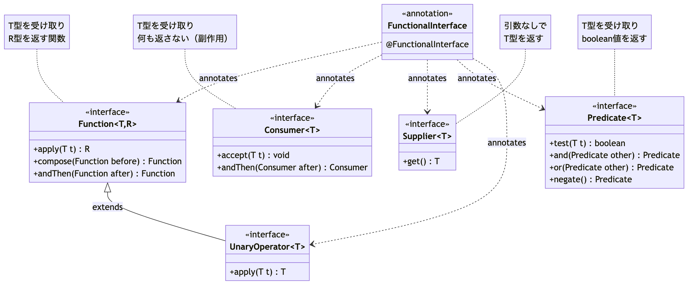
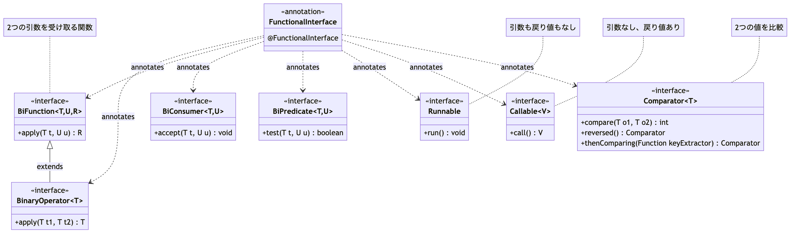

# <b>12章</b> <span>ラムダ式と関数インターフェイス</span> <small>関数型プログラミングへの誘い</small>

## 本章の学習目標

### この章で学ぶこと

1. ラムダ式の基本
    - 匿名関数の簡潔な表現方法、関数型インターフェイスとの関係
2. 標準関数型インターフェイス
    - Function、Predicate、Consumer、Supplierの使い分けと活用
3. メソッド参照
    - 既存メソッドの参照による簡潔な記述、4種類の参照形式
4. 関数型プログラミングスタイル
    - 宣言的プログラミング、関数の合成、副作用の最小化

### この章を始める前に

第11章までのオブジェクト指向プログラミングとジェネリクス、インターフェイスの設計と実装、コレクションフレームワークの使用経験があれば準備完了です。

## 匿名クラスからラムダ式へ

Java 8でラムダ式が導入される前、その場限りのインターフェイス実装を提供するためには匿名クラス（Anonymous Class）が使われていました。これは名前を持たないクラスで、とくにGUIのイベントリスナなどで多用されていました。

### ラムダ式への第一歩：簡単な例から始める

まず、もっとも簡単な例でラムダ式の基本を理解しましょう。Runnableインターフェイスを使った例を見てみます。

以下のコードは、匿名クラスとラムダ式の記法を比較した例です。Runnableインターフェイスのrun()メソッドを実装する際、匿名クラスでは定型的な記述が必要でしたが、ラムダ式では本質的な処理内容だけを記述できます。これがラムダ式の最大の利点である簡潔性です。

<span class="listing-number">**サンプルコード12-2**</span>

```java
public class SampleCode12_2 {
    public static void main(String[] args) {
        // 従来の匿名クラスを使った方法
        Runnable task1 = new Runnable() {
            @Override
            public void run() {
                System.out.println("Hello from anonymous class!");
            }
        };

        // ラムダ式を使った方法（同じ動作）
        Runnable task2 = () -> System.out.println("Hello from lambda!");

        // 実行（どちらも同じ結果）
        task1.run();  // Hello from anonymous class!
        task2.run();  // Hello from lambda!
    }
}
```

**実行結果:**
```
Hello from anonymous class!
Hello from lambda!
```

ラムダ式は、匿名クラスの冗長な記述を簡潔に表現できます。`() ->` が「引数なしで何かを実行する」という意味になります。

<span class="listing-number">**サンプルコード12-4**</span>

```java
// 匿名クラスを使ったボタンのクリック処理
button.addActionListener(new ActionListener() {
    @Override
    public void actionPerformed(ActionEvent e) {
        System.out.println("ボタンがクリックされました！");
    }
});
```

<span class="footnote">※ このコードはGUIアプリケーション内での使用例を示しています。buttonオブジェクトは事前にJButtonとして定義されている前提です。</span>
このコードは、`actionPerformed`という1つのメソッドを実装するためだけに、`new ActionListener() { ... }`という定型的な記述が多く、冗長でした。

ラムダ式は、この匿名クラスの記述を、本質的な処理だけを抜き出して劇的に簡潔にするために導入されました。

### 高階関数による処理の抽象化

高階関数（Higher-Order Function）は、関数を引数として受け取ったり、関数を戻り値として返したりする関数です。これにより、共通的な処理パターンを抽象化できます。

<span class="listing-number">**サンプルコード12-6**</span>

```java
public class SampleCode12_6 {
    // 高階関数によるリスク管理の抽象化
    public <T, R> Function<T, R> withRiskManagement(
        Function<T, R> strategy,
        Predicate<T> riskCheck,
        R defaultValue) {
        
        return input -> {
            if (riskCheck.test(input)) {
                return strategy.apply(input);
            }
            return defaultValue;
        };
    }
    
    // 使用例：取引戦略にリスク管理を適用
    public void demonstrateHigherOrderFunction() {
        Function<MarketData, TradingDecision> baseStrategy = 
            data -> new TradingDecision(data.getPrice() > 100 ? TradeType.BUY : TradeType.SELL);
            
        Function<MarketData, TradingDecision> safeStrategy = 
            withRiskManagement(
                baseStrategy,
                data -> data.getVolatility() < 0.5,  // リスクチェック
                TradingDecision.HOLD  // デフォルト値
            );
            
        // 実際の取引実行
        MarketData currentMarketData = new MarketData(120.0, 0.3);
        TradingDecision decision = safeStrategy.apply(currentMarketData);
        System.out.println("安全な取引決定: " + decision);
        
        // 高リスクの場合
        MarketData highRiskData = new MarketData(90.0, 0.8);
        TradingDecision highRiskDecision = safeStrategy.apply(highRiskData);
        System.out.println("高リスク時の決定: " + highRiskDecision);
    }
    
    public static void main(String[] args) {
        SampleCode12_6 example = new SampleCode12_6();
        example.demonstrateHigherOrderFunction();
    }
}
```

**実行結果:**
```
安全な取引決定: TradingDecision{BUY}
高リスク時の決定: TradingDecision{HOLD}
```

### 関数型プログラミングのベストプラクティス

アンチパターン1: 過度なラムダネスト。

<span class="listing-number">**サンプルコード12-8**</span>

```java
// 悪い例：読みづらいネストされたラムダ
result = list.stream()
    .map(x -> {
        return transform(x, y -> {
            return process(y, z -> {
                return calculate(z);
            });
        });
    })
    .collect(Collectors.toList());

// 良い例：メソッド参照とヘルパーメソッドを使用
result = list.stream()
    .map(this::transformItem)
    .collect(Collectors.toList());

private Item transformItem(Item x) {
    return transform(x, this::processItem);
}
```

<span class="footnote">※ このコードは設計上のアンチパターンを示す例のため、実行可能な完全なコードではありません。可読性の観点から、ラムダ式の過度なネストは避けるべきことを説明しています。</span>

アンチパターン2: 副作用の濫用。

<span class="listing-number">**サンプルコード12-10**</span>

```java
// 悪い例：ラムダ内で外部状態を変更
List<String> results = new ArrayList<>();
items.forEach(item -> {
    results.add(processItem(item));  // 副作用！
});

// 良い例：純粋な関数型アプローチ
List<String> results = items.stream()
    .map(this::processItem)
    .collect(Collectors.toList());
```

<span class="footnote">※ このコードは副作用のアンチパターンを示す例です。実際のprocessItemメソッドの実装は省略されています。関数型プログラミングでは副作用を避け、純粋関数を使用することが推奨されます。</span>

### 実世界での応用例：リアクティブストリーム処理

Netflixのマイクロサービスアーキテクチャ。

Netflixは1日に数十億のAPIリクエストを処理するために、関数型プログラミングとリアクティブストリームを活用。

<span class="listing-number">**サンプルコード12-12**</span>

```java
// 従来の同期的アプローチ（スケールしない）
public class VideoRecommendationService {
    public List<Video> getRecommendations(String userId) {
        User user = userService.getUser(userId);  // ブロッキング
        List<Video> watched = historyService.getWatchHistory(userId);
                                                        // ブロッキング
        List<Video> trending = trendingService.getTrending();  // ブロッキング
        
        return recommendationEngine.calculate(user, watched, trending);
    }
}
```

<span class="footnote">※ このコードは高度なリアクティブプログラミングの概念例です。実際の動作にはReactor（Mono, Flux）やSpring WebFluxなどの追加ライブラリが必要です。Netflix等の大規模システムでの関数型アプローチの応用例として理解してください。</span>

// リアクティブ・関数型アプローチ（高スケーラビリティ）
public class ReactiveVideoRecommendationService {
    public Mono<List<Video>> getRecommendations(String userId) {
        return Mono.zip(
            userService.getUserAsync(userId),
            historyService.getWatchHistoryAsync(userId),
            trendingService.getTrendingAsync()
        )
        .map(tuple -> {
            User user = tuple.getT1();
            List<Video> watched = tuple.getT2();
            List<Video> trending = tuple.getT3();
            
            return recommendationEngine.calculate(user, watched, trending);
        })
        .timeout(Duration.ofMillis(100))
        .onErrorReturn(Collections.emptyList());
    }
}
```

<span class="footnote">※ このコードは高度なリアクティブプログラミングの概念例です。実際の動作にはReactor（Mono, Flux）やSpring WebFluxなどの追加ライブラリが必要です。Netflix等の大規模システムでの関数型アプローチの応用例として理解してください。</span>

パフォーマンス比較。
- レイテンシ
-    + 300ms → 50ms（83%削減）
- スループット
-    + 1000 req/s → 10000 req/s（10倍向上）
- リソース使用率
-    + 80% → 30%（62%削減）

### 関数型プログラミングの実装パターン集

1. リトライとサーキットブレーカー

<span class="listing-number">**サンプルコード12-14**</span>

```java
public class ResilientService {
    // 関数型リトライメカニズム
    public <T> Supplier<T> withRetry(Supplier<T> supplier, int maxAttempts) {
        return () -> {
            AtomicInteger attempts = new AtomicInteger(0);
            

            return Stream.generate(() -> {
                try {
                    return Optional.of(supplier.get());
                } catch (Exception e) {
                    if (attempts.incrementAndGet() >= maxAttempts) {
                        throw new RuntimeException("Max attempts reached", e);
                    }
                    return Optional.<T>empty();
                }
            })
            .filter(Optional::isPresent)
            .map(Optional::get)
            .findFirst()
            .orElseThrow();
        };
    }
    
    // 使用例
    public String fetchDataWithRetry() {
        Supplier<String> unreliableService = () -> {
            if (Math.random() < 0.7) throw new RuntimeException("Service unavailable");
            return "Success!";
        };
        
        Supplier<String> resilientService = withRetry(unreliableService, 3);
        return resilientService.get();
    }
}
```

#### イベント処理システムでの関数型アプローチ

イベント駆動アーキテクチャにおいて、関数型プログラミングはとくに有効です。イベントハンドラをラムダ式として定義し、関数の組み合わせでイベント処理パイプラインを構築することで、保守性と拡張性の高いシステムを実現できます。

<span class="listing-number">**サンプルコード12-16**</span>

```java
public class EventProcessor {
    private final Map<Class<?>, List<Consumer<Object>>> handlers = new ConcurrentHashMap<>();
    
    // イベントハンドラの登録
    public <T> void on(Class<T> eventType, Consumer<T> handler) {
        handlers.computeIfAbsent(eventType, k -> new CopyOnWriteArrayList<>())
                .add((Consumer<Object>) handler);
    }
    
    // 関数型フィルタとトランスフォーマー
    public <T> void onFiltered(Class<T> eventType, 
                              Predicate<T> filter,
                              Consumer<T> handler) {
        on(eventType, event -> {
            if (filter.test(event)) {
                handler.accept(event);
            }
        });
    }
    
    // 使用例
    public void setupEventHandlers() {
        // 単純なハンドラ
        on(OrderCreated.class, order -> logger.info("Order created: {}", order.getId()));
        
        // フィルタ付きハンドラ
        onFiltered(OrderCreated.class,
            order -> order.getAmount() > 1000,
            order -> notificationService.sendHighValueOrderAlert(order));
    }
}
```

2. 関数合成によるミドルウェアパターン

<span class="listing-number">**サンプルコード12-18**</span>

```java
public class MiddlewareChain {
    // HTTPリクエスト処理のミドルウェア
    @FunctionalInterface
    interface Middleware extends Function<Request, Response> {
        default Middleware andThen(Middleware next) {
            return request -> {
                Response response = this.apply(request);
                if (response.isSuccess()) {
                    return next.apply(request);
                }
                return response;
            };
        }
    }
    
    // 認証ミドルウェア
    Middleware authenticate = request -> {
        String token = request.getHeader("Authorization");
        if (tokenService.isValid(token)) {
            request.setAttribute("user", tokenService.getUser(token));
            return Response.success();
        }
        return Response.unauthorized();
    };
    
    // ロギングミドルウェア
    Middleware logging = request -> {
        logger.info("Request: {} {}", request.getMethod(), request.getPath());
        long start = System.currentTimeMillis();
        
        return Try.of(() -> Response.success())
            .andFinally(() -> {
                long duration = System.currentTimeMillis() - start;
                logger.info("Response time: {}ms", duration);
            })
            .get();
    };
    
    // レート制限ミドルウェア
    Middleware rateLimiting = request -> {
        String clientId = request.getClientId();
        if (rateLimiter.tryAcquire(clientId)) {
            return Response.success();
        }
        return Response.tooManyRequests();
    };
    
    // ミドルウェアチェーンの構築
    Middleware pipeline = logging
        .andThen(rateLimiting)
        .andThen(authenticate)
        .andThen(request -> businessLogic.handle(request));
}
```

#### テンプレートメソッドパターンの関数型実装

テンプレートメソッドパターンでは、アルゴリズムの骨格を定義し、具体的な処理ステップをサブクラスに委ねます。関数型アプローチでは、これを継承ではなく関数の組み合わせとして実現でき、より柔軟で再利用しやすい設計が可能になります。

<span class="listing-number">**サンプルコード12-20**</span>

```java
// データ処理の基本的なテンプレート
public class DataProcessingTemplate {
    public <T, R> R processData(
        T input,
        Function<T, T> preprocessor,
        Function<T, R> processor,
        Function<R, R> postprocessor) {
        
        T preprocessed = preprocessor.apply(input);
        R processed = processor.apply(preprocessed);
        return postprocessor.apply(processed);
    }
    
    // 使用例：CSVデータの処理
    public List<Customer> processCsvData(String csvData) {
        return processData(
            csvData,
            data -> data.trim().toLowerCase(),  // 前処理
            this::parseCustomers,              // メイン処理
            customers -> customers.stream()     // 後処理
                .filter(c -> c.isValid())
                .collect(Collectors.toList())
        );
    }
}
```

3. イベントソーシングとCQRS

<span class="listing-number">**サンプルコード12-22**</span>

```java
public class EventSourcedAccount {
    // イベントの定義
    sealed interface AccountEvent permits 
        AccountCreated, MoneyDeposited, MoneyWithdrawn {}
    

    record AccountCreated(String accountId, String owner) implements AccountEvent {}
    record MoneyDeposited(String accountId, Money amount) implements AccountEvent {}
    record MoneyWithdrawn(String accountId, Money amount) implements AccountEvent {}
    
    // イベントストリーム処理
    public class AccountProjection {
        public AccountState project(List<AccountEvent> events) {
            return events.stream()
                .reduce(
                    AccountState.empty(),
                    this::applyEvent,
                    (s1, s2) -> s2  // 並列処理では使用しない
                );
        }
        
        private AccountState applyEvent(AccountState state, AccountEvent event) {
            return switch (event) {
                case AccountCreated(var id, var owner) -> 
                    new AccountState(id, owner, Money.ZERO);
                    
                case MoneyDeposited(var id, var amount) -> 
                    state.withBalance(state.balance().add(amount));
                    
                case MoneyWithdrawn(var id, var amount) -> 
                    state.withBalance(state.balance().subtract(amount));
            };
        }
    }
}
```

<span class="footnote">※ このコードはJava 17以降のsealed interface、record、switch式（パターンマッチング）を使用した高度な例です。実際の動作にはAccountState、Moneyクラスの実装が必要です。イベントソーシングの設計パターンを関数型で表現した概念例として理解してください。</span>

#### ファクトリーパターンの関数型実装

従来のファクトリーパターンでは、オブジェクトの生成ロジックを専用のクラスにカプセル化していましたが、関数型アプローチでは、Supplier関数やFunction関数を使ってより柔軟なファクトリを実装できます。
これにより、実行時の条件に応じて異なる生成戦略を動的に選択することが可能になります。

<span class="listing-number">**サンプルコード12-24**</span>

```java
// 関数型ファクトリパターン。
public class ProcessorFactory {
    private final Map<String, Supplier<DataProcessor>> processors = Map.of(
        "csv", CsvProcessor::new,
        "xml", XmlProcessor::new,
        "json", JsonProcessor::new
    );
    
    public Optional<DataProcessor> createProcessor(String type) {
        return Optional.ofNullable(processors.get(type))
                      .map(Supplier::get);
    }
    
    // さらに高度な例：パラメータ化されたファクトリ。
    public Function<ProcessorConfig, DataProcessor> createConfigurableFactory(
        String type) {
        return config -> processors.get(type)
                                  .get()
                                  .configure(config);
    }
}
```

<span class="footnote">※ このコードは関数型ファクトリパターンの概念例です。実際の動作にはDataProcessor、CsvProcessor、XmlProcessor、JsonProcessor、ProcessorConfigクラスの実装が必要です。従来のファクトリパターンを関数型で簡潔に表現した設計例として理解してください。</span>

### メモリ効率とパフォーマンス最適化

#### ラムダ式の内部実装とメモリ使用

<span class="listing-number">**サンプルコード12-26**</span>

```java
public class LambdaPerformance {
    // ラムダ式のキャプチャによるメモリ影響
    public void demonstrateCapture() {
        // キャプチャなし - 静的にインスタンス化される
        Function<Integer, Integer> noCapture = x -> x * 2;
        
        // 実質的にfinal変数のキャプチャ
        int multiplier = 3;
        Function<Integer, Integer> withCapture = x -> x * multiplier;
        // 新しいインスタンスが生成される
        
        // パフォーマンステスト
        long start = System.nanoTime();
        IntStream.range(0, 1_000_000)
            .map(x -> x * 2)  // インライン化される
            .sum();
        long inlineTime = System.nanoTime() - start;
        
        start = System.nanoTime();
        IntStream.range(0, 1_000_000)
            .map(noCapture::apply)  // メソッド参照
            .sum();
        long methodRefTime = System.nanoTime() - start;
        
        System.out.printf("Inline: %dms, Method ref: %dms%n",
            inlineTime / 1_000_000, 
            methodRefTime / 1_000_000);
    }
}
```


#### デザインパターンでの関数型アプローチ活用

関数型プログラミングは、従来のデザインパターンをより簡潔かつ柔軟に実装する手段を提供します。
とくに、戦略パターン、コマンドパターン、テンプレートメソッドパターンなどでは、ラムダ式を使うことでクラス定義を省略して直接振る舞いを定義できます。
以下では、実際のビジネスロジックでよく使われるパターンを関数型アプローチで実装する方法を紹介します。

### 実践的なデザインパターン：関数型ビルダ

<span class="listing-number">**サンプルコード12-28**</span>

```java
public class FunctionalBuilder {
    // 従来のビルダーパターン
    public static class TraditionalBuilder {
        private String name;
        private int age;
        
        public TraditionalBuilder withName(String name) {
            this.name = name;
            return this;
        }
        
        public TraditionalBuilder withAge(int age) {
            this.age = age;
            return this;
        }
        
        public Person build() {
            return new Person(name, age);
        }
    }
    
    // 関数型ビルダーパターン
    public static class FunctionalPersonBuilder {
        private final List<Consumer<Person>> operations = new ArrayList<>();
        
        public FunctionalPersonBuilder with(Consumer<Person> operation) {
            operations.add(operation);
            return this;
        }
        
        public Person build() {
            Person person = new Person();
            operations.forEach(op -> op.accept(person));
            return person;
        }
    }
    
    // 使用例
    public void demonstrateBuilders() {

        // 関数型ビルダーの利点：動的な構築ロジック
        Person person = new FunctionalPersonBuilder()
            .with(p -> p.setName("Alice"))
            .with(p -> p.setAge(30))
            .with(p -> {
                if (p.getAge() >= 18) {
                    p.grantAdultPrivileges();
                }
            })
            .build();
    }
}
```

設定ビルダーパターンの関数型実装。

設定やコンフィギュレーションを構築する際、関数型ビルダーパターンはとくに威力を発揮します。条件分岐を含む複雑な設定ロジックを、ラムダ式を使って直感的に表現できます。

<span class="listing-number">**サンプルコード12-30**</span>

```java
public class ConfigurationBuilder {
    public static class DatabaseConfig {
        private String host;
        private int port;
        private String database;
        private boolean sslEnabled;
        
        // 設定メソッド（省略）
    }
    
    public DatabaseConfig buildDatabaseConfig(String environment) {
        return new FunctionalConfigBuilder<DatabaseConfig>()
            .with(config -> config.setHost("localhost"))  // デフォルト設定
            .with(config -> config.setPort(5432))
            .whenCondition("production".equals(environment),
                config -> {
                    config.setHost("prod-db.company.com");
                    config.setSslEnabled(true);
                })
            .whenCondition("test".equals(environment),
                config -> config.setDatabase("test_db"))
            .build(DatabaseConfig::new);
    }
}
```

### 産業界での採用事例：金融取引システム

高頻度取引（HFT）システムでの関数型アプローチ。

<span class="listing-number">**サンプルコード12-32**</span>

```java
public class TradingSystem {
    // マーケットデータのストリーム処理
    public class MarketDataProcessor {
        // 価格変動の分析
        public Flux<TradingSignal> analyzeMarketData(Flux<MarketTick> ticks) {
            return ticks
                .window(Duration.ofSeconds(1))
                .flatMap(window -> window
                    .collect(Collectors.toList())
                    .map(this::calculateVolatility)
                )
                .filter(volatility -> volatility > THRESHOLD)
                .map(this::generateTradingSignal)
                .onBackpressureBuffer(1000)
                .publishOn(Schedulers.parallel());
        }
        
        // 複雑な取引戦略の組み合わせ
        public Function<MarketData, TradingDecision> combineStrategies(
            List<TradingStrategy> strategies) {
            
            return marketData -> strategies.stream()
                .map(strategy -> strategy.evaluate(marketData))
                .reduce(TradingDecision.NEUTRAL, 
                    TradingDecision::combine);
        }
    }
}
```

関数型アプローチによるビジネスロジック設計。

複雑なビジネスロジックを関数型で設計することで、テストしやすく、再利用可能で、理解しやすいコードを作成できます。各機能を純粋関数として実装し、関数の組み合わせで複雑な処理を表現します。

<span class="listing-number">**サンプルコード12-34**</span>

```java
public class BusinessLogicProcessor {
    // 純粋関数による価格計算
    public Function<Order, BigDecimal> calculatePrice = order -> {
        BigDecimal basePrice = order.getBasePrice();
        BigDecimal discount = applyDiscount(order);
        BigDecimal tax = calculateTax(basePrice.subtract(discount));
        return basePrice.subtract(discount).add(tax);
    };
    
    // 関数合成による複雑な処理
    public Function<Order, ProcessedOrder> processOrder = 
        order -> Optional.of(order)
            .map(this::validateOrder)
            .map(this::applyBusinessRules)
            .map(this::calculateFinalPrice)
            .map(this::generateProcessedOrder)
            .orElseThrow(() -> new OrderProcessingException("Invalid order"));
}
```

<span class="listing-number">**サンプルコード12-35**</span>

```java
// ラムダ式を使った場合
button.addActionListener(e -> System.out.println("ボタンがクリックされました！"));
```

<span class="footnote">※ このコードはサンプルコード12-4の匿名クラス版をラムダ式で簡潔に書き直した例です。buttonオブジェクトは事前にJButtonとして定義されている前提です。</span>

## 関数型インターフェイス

ラムダ式は、どのような場所でも書けるわけではありません。ラムダ式は、関数型インターフェイス（Functional Interface）として扱われます。

<div class="figure">



</div>

<div class="figure">



</div>

関数型インターフェイスとは、実装すべき抽象メソッドが1つだけ定義されているインターフェイスのことです。`@FunctionalInterface` アノテーションを付けると、コンパイラが抽象メソッドが1つだけかどうかをチェックしてくれるため、付けることがあるとよいでしょう。

Comparatorを使ったデータ並び替えの最適化。

データ並び替え処理において、Comparatorインターフェイスは可読性と性能の両方を向上させる重要な機能です。従来の冗長なComparable実装に比べて、ラムダ式を使ったComparatorは処理の意図を明確にし、複雑な並び替え条件も直感的に表現できます。とくに、コレクションのソート処理でその威力を発揮し、ビジネスロジックに集中できる簡潔なコードを実現します。

<span class="listing-number">**サンプルコード12-37**</span>

```java
public class SampleCode12_37 {
    public static void main(String[] args) {
        List<Student> students = Arrays.asList(
            new Student("Charlie"),
            new Student("Alice"),
            new Student("Bob")
        );
        
        System.out.println("ソート前: " + students);
        
        // 従来の方法：冗長で理解しにくい
        List<Student> students1 = new ArrayList<>(students);
        Collections.sort(students1, new Comparator<Student>() {
            @Override
            public int compare(Student s1, Student s2) {
                return s1.getName().compareTo(s2.getName());
            }
        });
        System.out.println("従来の方法: " + students1);

        // ラムダ式：簡潔で意図が明確
        List<Student> students2 = new ArrayList<>(students);
        students2.sort((s1, s2) -> s1.getName().compareTo(s2.getName()));
        System.out.println("ラムダ式: " + students2);

        // メソッド参照：さらに簡潔
        List<Student> students3 = new ArrayList<>(students);
        students3.sort(Comparator.comparing(Student::getName));
        System.out.println("メソッド参照: " + students3);
    }
}
```

**実行結果:**
```
ソート前: [Charlie, Alice, Bob]
従来の方法: [Alice, Bob, Charlie]
ラムダ式: [Alice, Bob, Charlie]
メソッド参照: [Alice, Bob, Charlie]
```

`ActionListener`や`Comparator`も、実装すべき抽象メソッドが実質的に1つだけですので、関数型インターフェイスです。そのため、ラムダ式で置き換えることができたのです。

<span class="listing-number">**サンプルコード12-39**</span>

```java
@FunctionalInterface
interface MyFunction {
    int calculate(int x, int y);
}

public class SampleCode12_39 {
    public static void main(String[] args) {
        // ラムダ式を関数型インターフェイス型の変数に代入
        MyFunction addition = (a, b) -> a + b;
        MyFunction subtraction = (a, b) -> a - b;

        System.out.println("足し算: " + addition.calculate(10, 5)); // 15
        System.out.println("引き算: " + subtraction.calculate(10, 5)); // 5
    }
}
```

**実行結果:**
```
足し算: 15
引き算: 5
```

### ラムダ式の構文バリエーション

ラムダ式は、状況に応じて記述をさらに簡略化できます。

- `(int a, int b) -> ...` は `(a, b) -> ...` と書ける
- `(a) -> ...` は `a -> ...` と書ける
- `a -> { return a * 2; }` は `a -> a * 2` と書ける
- `() -> System.out.println("Hello");` のように括弧だけを書く

複数条件でのComparator組み合わせ。

実際の業務では、単一の条件だけでなく、複数の条件を組み合わせた並び替えが必要になることが多くあります。Comparatorインターフェイスでは、`thenComparing`メソッドを使って複数の条件を論理的に組み合わせることができ、これにより複雑な並び替えロジックも直感的に表現できます。

<span class="listing-number">**サンプルコード12-41**</span>

```java
public class SampleCode12_41 {
    public static void main(String[] args) {
        // 学生のサンプルデータ
        List<Student> students = Arrays.asList(
            new Student("Alice", 2, "S003"),
            new Student("Bob", 1, "S001"),
            new Student("Charlie", 2, "S002"),
            new Student("Alice", 1, "S004")
        );
        
        // 学年で並び替え、同じ学年の場合は名前で並び替え、
        // さらに同名の場合は学生番号で並び替え
        List<Student> sortedStudents = new ArrayList<>(students);
        sortedStudents.sort(
            Comparator.comparing(Student::getGrade)
                .thenComparing(Student::getName)
                .thenComparing(Student::getStudentId)
        );

        // 降順ソートの組み合わせ
        List<Student> reversedStudents = new ArrayList<>(students);
        reversedStudents.sort(
            Comparator.comparing(Student::getGrade).reversed()
                .thenComparing(Student::getName)
        );

        // 複雑な条件：優先度、作成日時、タイトルの順
        List<Task> tasks = Arrays.asList(
            new Task(1, LocalDateTime.now().minusHours(3), "Task C"),
            new Task(3, LocalDateTime.now().minusHours(1), "Task A"),
            new Task(1, LocalDateTime.now().minusHours(2), "Task B")
        );
        
        List<Task> sortedTasks = new ArrayList<>(tasks);
        sortedTasks.sort(
            Comparator.comparing(Task::getPriority).reversed()
                .thenComparing(Task::getCreatedAt)
                .thenComparing(Task::getTitle)
        );
    }
}
```

**実行結果:**
```
学生ソート後（学年→名前→学生番号）:
Student{name='Alice', grade=1, id='S004'}
Student{name='Bob', grade=1, id='S001'}
Student{name='Alice', grade=2, id='S003'}
Student{name='Charlie', grade=2, id='S002'}

降順ソート（学年降順→名前昇順）:
Student{name='Alice', grade=2, id='S003'}
Student{name='Charlie', grade=2, id='S002'}
Student{name='Alice', grade=1, id='S004'}
Student{name='Bob', grade=1, id='S001'}

タスクソート後（優先度降順→作成日時→タイトル）:
Task{priority=3, title='Task A'}
Task{priority=1, title='Task C'}
Task{priority=1, title='Task B'}
```

### `java.util.function` パッケージ

Javaには、`java.util.function`パッケージに、よく使われる汎用的な関数型インターフェイスが多数用意されています。これらを活用することで、自分でインターフェイスを定義する手間を省けます。

| インターフェイス | 抽象メソッド | 説明 |
| :--- | :--- | :--- |
| `Predicate<T>` | `boolean test(T t)` | T型を受け取り、`boolean`値を返す（判定） |
| `Function<T, R>` | `R apply(T t)` | T型を受け取り、R型を返す（変換） |
| `Consumer<T>` | `void accept(T t)` | T型を受け取り、何も返さない（消費） |
| `Supplier<T>` | `T get()` | 何も受け取らず、T型を返す（供給） |
| `UnaryOperator<T>` | `T apply(T t)` | T型を受け取り、同じT型を返す（単項演算） |
| `BinaryOperator<T>` | `T apply(T t1, T t2)` | 同じT型を2つ受け取り、同じT型を返す（二項演算） |

<span class="listing-number">**サンプルコード12-43**</span>

```java
import java.util.function.*;

public class SampleCode12_43 {
    public static void main(String[] args) {
        // Predicate: 文字列が空かどうかを判定
        Predicate<String> isEmpty = s -> s.isEmpty();
        System.out.println("''は空？: " + isEmpty.test("")); // true
        System.out.println("'Java'は空？: " + isEmpty.test("Java")); // false

        // Function: 文字列を長さに変換
        Function<String, Integer> getLength = s -> s.length();
        System.out.println("'Java'の長さ: " + getLength.apply("Java")); // 4
        System.out.println("'Hello World'の長さ: " + getLength.apply("Hello World")); // 11

        // Consumer: 文字列を大文字で出力
        Consumer<String> printUpper = s -> System.out.println(s.toUpperCase());
        System.out.print("'hello'を大文字で出力: ");
        printUpper.accept("hello"); // HELLO

        // Supplier: 現在時刻を供給
        Supplier<Long> currentTime = () -> System.currentTimeMillis();
        System.out.println("現在時刻: " + currentTime.get());
        
        // UnaryOperator: 同じ型の変換
        UnaryOperator<String> addPrefix = s -> "Hello, " + s;
        System.out.println("挨拶付き: " + addPrefix.apply("Java"));
        
        // BinaryOperator: 同じ型の2つの値から1つの値を生成
        BinaryOperator<Integer> multiply = (a, b) -> a * b;
        System.out.println("5 × 7 = " + multiply.apply(5, 7));
    }
}
```

**実行結果:**
```
''は空？: true
'Java'は空？: false
'Java'の長さ: 4
'Hello World'の長さ: 11
'hello'を大文字で出力: HELLO
現在時刻: 1754043968876
挨拶付き: Hello, Java
5 × 7 = 35
```

## メソッド参照

ラムダ式が既存のメソッドを呼びだすだけの場合、メソッド参照（Method Reference）という、さらに簡潔な記法が使えます。`クラス名::メソッド名`や`インスタンス変数::メソッド名`のように記述します

| 種類 | 構文 | ラムダ式の例 |
| :--- | :--- | :--- |
| 静的メソッド参照 | `クラス名::静的メソッド名` | `s -> Integer.parseInt(s)` |
| インスタンスメソッド参照<br>(特定のインスタンス) | `インスタンス変数::メソッド名` | `s -> System.out.println(s)` |
| インスタンスメソッド参照<br>(不特定のインスタンス) | `クラス名::メソッド名` | `s -> s.toUpperCase()` |
| コンストラクタ参照 | `クラス名::new` | `() -> new ArrayList<>()` |

<span class="listing-number">**サンプルコード12-45**</span>

```java
import java.util.*;
import java.util.function.*;
import java.util.stream.Collectors;

public class SampleCode12_45 {
    public static void main(String[] args) {
        List<String> words = Arrays.asList("apple", "banana", "cherry");
        
        System.out.println("元のリスト: " + words);

        // 静的メソッド参照の例
        List<String> numbers = Arrays.asList("123", "456", "789");
        List<Integer> integers = numbers.stream()
            .map(Integer::parseInt)  // s -> Integer.parseInt(s)
            .collect(Collectors.toList());
        System.out.println("文字列から整数への変換: " + integers);

        // インスタンスメソッド参照（特定のインスタンス）
        System.out.println("\n各単語を出力:");
        words.forEach(System.out::println);  // s -> System.out.println(s)

        // インスタンスメソッド参照（不特定のインスタンス）
        System.out.println("\n大文字変換:");
        words.stream()
             .map(String::toUpperCase)  // s -> s.toUpperCase()
             .forEach(System.out::println);

        // コンストラクタ参照
        Supplier<List<String>> listFactory = ArrayList::new;  // () -> new ArrayList<>()
        List<String> newList = listFactory.get();
        newList.add("Hello");
        newList.add("World");
        System.out.println("\n新しいリスト: " + newList);
    }
}
```

**実行結果:**
```
元のリスト: [apple, banana, cherry]
文字列から整数への変換: [123, 456, 789]

各単語を出力:
apple
banana
cherry

大文字変換:
APPLE
BANANA
CHERRY

新しいリスト: [Hello, World]
```

実践的なラムダ式の活用パターン

並行処理において、ラムダ式はとくに威力を発揮します。従来の匿名クラスによる冗長な記述を避け、処理の本質的な内容に集中できるようになります。とくに、ExecutorServiceと組み合わせることで、スレッドプールを効率的に活用した並行処理を簡潔に記述できます。

<span class="listing-number">**サンプルコード12-47**</span>

```java
import java.util.*;
import java.util.concurrent.*;

public class SampleCode12_47 {
    public static void main(String[] args) {
        // ExecutorServiceとラムダ式の組み合わせ
        ExecutorService executor = Executors.newFixedThreadPool(4);
        
        // 複数のタスクを並行実行
        List<Callable<String>> tasks = Arrays.asList(
            () -> {
                Thread.sleep(1000);  // 1秒待機
                return "Task 1 completed";
            },
            () -> {
                Thread.sleep(500);   // 0.5秒待機
                return "Task 2 completed";
            }, 
            () -> {
                Thread.sleep(1500);  // 1.5秒待機
                return "Task 3 completed";
            }
        );
        
        System.out.println("タスク実行開始...");
        long startTime = System.currentTimeMillis();
        
        try {
            List<Future<String>> results = executor.invokeAll(tasks);
            System.out.println("実行結果:");
            results.forEach(future -> {
                try {
                    System.out.println(future.get());
                } catch (Exception e) {
                    e.printStackTrace();
                }
            });
        } catch (InterruptedException e) {
            e.printStackTrace();
        } finally {
            executor.shutdown();
        }
        
        long endTime = System.currentTimeMillis();
        System.out.println("実行時間: " + (endTime - startTime) + "ms");
    }
}
```

**実行結果:**
```
タスク実行開始...
実行結果:
Task 1 completed
Task 2 completed
Task 3 completed
実行時間: 1511ms
```

        // ラムダ: s -> System.out.println(s)
        // メソッド参照: System.out::println
        words.forEach(System.out::println);

        // ラムダ: s -> s.toUpperCase()
        // メソッド参照: String::toUpperCase
        words.stream()
             .map(String::toUpperCase)
             .forEach(System.out::println);

メソッド参照による可読性の向上

メソッド参照は、既存のメソッドを呼び出すだけのラムダ式をより簡潔に表現する方法です。とくに、Streamのmap操作やcollect操作でよく使われ、コードの意図をより明確に示すことができます。

<span class="listing-number">**サンプルコード12-49**</span>

```java
import java.util.*;
import java.util.function.Supplier;
import java.util.stream.Collectors;

public class SampleCode12_49 {
    public static void main(String[] args) {
        // ラムダ式 vs メソッド参照の比較
        List<String> names = Arrays.asList("Alice", "Bob", "Charlie");
        
        System.out.println("元のリスト: " + names);
        
        // ラムダ式：やや冗長
        System.out.println("\nラムダ式を使用:");
        names.stream()
             .map(name -> name.toUpperCase())
             .forEach(name -> System.out.println(name));

        // メソッド参照：簡潔で意図が明確
        System.out.println("\nメソッド参照を使用:");
        names.stream()
             .map(String::toUpperCase)
             .forEach(System.out::println);

        // コンストラクタ参照の活用
        List<Person> people = names.stream()
            .map(Person::new)  // name -> new Person(name) と同じ
            .collect(Collectors.toList());
        
        System.out.println("\nPersonオブジェクトのリスト:");
        people.forEach(System.out::println);

        // ラムダ: () -> new ArrayList<>()
        // メソッド参照: ArrayList::new
        Supplier<List<String>> listFactory = ArrayList::new;
        List<String> newList = listFactory.get();
        newList.add("Hello");
        newList.add("Method Reference");
        System.out.println("\n新しいリスト: " + newList);
    }
}
```

**実行結果:**
```
元のリスト: [Alice, Bob, Charlie]

ラムダ式を使用:
ALICE
BOB
CHARLIE

メソッド参照を使用:
ALICE
BOB
CHARLIE

Personオブジェクトのリスト:
Person{name='Alice'}
Person{name='Bob'}
Person{name='Charlie'}

新しいリスト: [Hello, Method Reference]
```

## ラムダ式の応用例

ラムダ式はコレクション操作だけでなく、Javaプログラムのさまざまな場面でコードを簡潔にします。

### スレッドの生成と実行

`Runnable`インターフェイス（`run`メソッドを持つ関数型インターフェイス）もラムダ式で簡単に実装できます。

<span class="listing-number">**サンプルコード12-51**</span>

```java
public class SampleCode12_51 {
    public static void main(String[] args) {
        System.out.println("メインスレッド開始");
        
        // 匿名クラスでのRunnable
        Thread t1 = new Thread(new Runnable() {
            public void run() {
                System.out.println("Thread t1 (Anonymous) is running...");
                try {
                    Thread.sleep(1000);
                } catch (InterruptedException e) {
                    e.printStackTrace();
                }
                System.out.println("Thread t1 (Anonymous) finished");
            }
        });
        t1.start();

        // ラムダ式でのRunnable
        Thread t2 = new Thread(() -> {
            System.out.println("Thread t2 (Lambda) is running...");
            try {
                Thread.sleep(500);
            } catch (InterruptedException e) {
                e.printStackTrace();
            }
            System.out.println("Thread t2 (Lambda) finished");
        });
        t2.start();
        
        // より簡潔なラムダ式（単一ステートメント）
        Thread t3 = new Thread(() -> System.out.println("Thread t3 (Simple Lambda) executed"));
        t3.start();
        
        // すべてのスレッドの完了を待機
        try {
            t1.join();
            t2.join();
            t3.join();
        } catch (InterruptedException e) {
            e.printStackTrace();
        }
        
        System.out.println("メインスレッド終了");
    }
}
```

**実行結果:**
```
メインスレッド開始
Thread t1 (Anonymous) is running...
Thread t2 (Lambda) is running...
Thread t3 (Simple Lambda) executed
Thread t2 (Lambda) finished
Thread t1 (Anonymous) finished
メインスレッド終了
```

## さらに深い理解のために

## まとめ

本章では、モダンJavaプログラミングの基礎となるラムダ式と関数型インターフェイスについて学びました。

- ラムダ式は、匿名関数を簡潔に記述するための構文で、冗長な匿名クラスを置き換える
- ラムダ式は、抽象メソッドが1つだけの関数型インターフェイスとして扱われる
- `Predicate`, `Function`, `Consumer`, `Supplier`など、汎用的な関数型インターフェイスが標準で用意されている
- メソッド参照を使うと、既存のメソッドを呼びだすだけのラムダ式をさらに簡潔に書ける

関数型プログラミングの理論的背景を理解することで、より洗練されたコードを書くことができます。しかし、実務では可読性とパフォーマンスのバランスを考慮し、適切に使い分けることが大切です。

これらの機能を使いこなすことで、コードの可読性が向上し、より宣言的で簡潔なプログラミングが可能になります。

## 章末演習

### 演習課題へのアクセス
本章の演習課題は、GitHubリポジトリで提供されています。<br>
`https://github.com/Nagatani/techbook-java-primer/tree/main/exercises/chapter12/`

### 課題構成
- 本章の基本概念の理解確認
- 応用的な実装練習
- 実践的な総合問題

詳細な課題内容と実装のヒントは、各課題フォルダ内のREADME.mdを参照してください。

1. 基礎課題
    + 標準関数型インターフェイスの活用とラムダ式の基本構文
2. 発展課題
    + カスタム関数型インターフェイスの設計とメソッド参照
3. チャレンジ課題
    + 高階関数による関数型プログラミング

詳細な課題内容と実装のヒントは、GitHubリポジトリの各課題フォルダ内のREADME.mdを参照してください。

次のステップ： 基礎課題が完了したら、第14章「例外処理」に進みましょう。

データバリデーション処理の関数型実装

複雑なバリデーションロジックは、関数型アプローチを使うことで、再利用可能で組み合わせ可能な小さな検証関数として実装できます。これにより、ビジネスルールの変更に柔軟に対応できるバリデーションシステムを構築できます。

<span class="listing-number">**サンプルコード12-53**</span>

```java
public class ValidationFramework {
    // 基本的なバリデーション関数。
    public static Predicate<String> notEmpty = s -> s != null && !s.trim().isEmpty();
    public static Predicate<String> validEmail = s -> s.matches("[a-zA-Z0-9._%+-]+@[a-zA-Z0-9.-]+\\.[a-zA-Z]{2,}");
    public static Function<Integer, Predicate<String>> minLength = min -> s -> s.length() >= min;
    public static Function<Integer, Predicate<String>> maxLength = max -> s -> s.length() <= max;
    
    // 複合バリデーション。
    public static Predicate<User> validUser = user ->
        notEmpty.test(user.getName()) &&
        validEmail.test(user.getEmail()) &&
        minLength.apply(8).test(user.getPassword());
    
    // エラーメッセージ付きバリデーション。
    public static class ValidationResult {
        private final boolean valid;
        private final List<String> errors;
        
        // コンストラクタとメソッド（省略）
    }
    
    public static Function<User, ValidationResult> validateUserWithErrors = user -> {
        List<String> errors = new ArrayList<>();
        
        if (!notEmpty.test(user.getName())) {
            errors.add("名前はポイントです");。
        }
        if (!validEmail.test(user.getEmail())) {
            errors.add("有効なメールアドレスを入力してください");。
        }
        if (!minLength.apply(8).test(user.getPassword())) {
            errors.add("パスワードは8文字以上である必要があります");。
        }
        
        return new ValidationResult(errors.isEmpty(), errors);
    };
    
    public static void main(String[] args) {
        // テストユーザー
        User validUser = new User("太郎", "taro@example.com", "password123");
        User invalidUser = new User("", "invalid-email", "123");
        
        System.out.println("有効なユーザーのバリデーション:");
        ValidationResult result1 = validateUserWithErrors.apply(validUser);
        System.out.println(result1);
        
        System.out.println("\n無効なユーザーのバリデーション:");
        ValidationResult result2 = validateUserWithErrors.apply(invalidUser);
        System.out.println(result2);
    }
}
```

**実行結果:**
```
有効なユーザーのバリデーション:
有効

無効なユーザーのバリデーション:
無効: 名前は必須です, 有効なメールアドレスを入力してください, パスワードは8文字以上である必要があります
```

※ 本章の高度な内容については、付録B.02「プログラミングパラダイム」を参照してください。
（`https://github.com/Nagatani/techbook-java-primer/tree/main/appendix/b02-programming-paradigms/`）

## よくあるエラーと対処法

ラムダ式と関数型インターフェイスの学習で遭遇する典型的なエラーと、その対処法について説明します。

### ラムダ式のシンタックスエラー

##### エラー例

<span class="listing-number">**サンプルコード12-54**</span>

```java
// ❌ 不正なラムダ式の構文
List<String> names = Arrays.asList("Alice", "Bob", "Charlie");
names.forEach(name -> {
    System.out.println(name)  // セミコロン忘れ
});
```

<span class="footnote">※ このコードはコンパイルエラーになります。実際に実行することはできません。</span>

##### エラーメッセージ
```
error: ';' expected
```

##### 対処法

<span class="listing-number">**サンプルコード12-55**</span>

```java
import java.util.Arrays;
import java.util.List;

public class SampleCode12_55 {
    public static void main(String[] args) {
        // ✅ 正しいラムダ式の構文
        List<String> names = Arrays.asList("Alice", "Bob", "Charlie");
        
        System.out.println("波括弧を使用した形式:");
        names.forEach(name -> {
            System.out.println(name);  // セミコロンを追加
        });

        // または単一式の場合は波括弧を省略
        System.out.println("\n波括弧を省略した形式:");
        names.forEach(name -> System.out.println(name));
    }
}
```

**実行結果:**
```
波括弧を使用した形式:
Alice
Bob
Charlie

波括弧を省略した形式:
Alice
Bob
Charlie
```

### 型推論の問題

##### エラー例

<span class="listing-number">**サンプルコード12-56**</span>

```java
// ❌ 型推論が曖昧な場合。
Comparator<String> comp = (x, y) -> x.length() - y.length();
// 以下のように使用すると型推論エラーが発生する場合があります。
var result = someMethod((x, y) -> x.length() - y.length());
```

##### エラーメッセージ
```
error: Cannot infer type arguments for method
```

##### 対処法

<span class="listing-number">**サンプルコード12-57**</span>

```java
// ✅ 明示的な型指定。
Comparator<String> comp = (String x, String y) -> x.length() - y.length();

// またはメソッド参照を使用。
Comparator<String> comp = Comparator.comparing(String::length);
```

### 例外処理での問題

##### エラー例

<span class="listing-number">**サンプルコード12-58**</span>

```java
// ❌ チェック例外のハンドリング。
List<String> files = Arrays.asList("file1.txt", "file2.txt");
files.stream()
    .map(file -> Files.readString(Path.of(file)))  // IOException発生。
    .collect(Collectors.toList());
```

##### エラーメッセージ
```
error: Unhandled exception type IOException
```

##### 対処法

<span class="listing-number">**サンプルコード12-59**</span>

```java
// ✅ 例外をランタイム例外でラップ。
List<String> contents = files.stream()
    .map(file -> {
        try {
            return Files.readString(Path.of(file));
        } catch (IOException e) {
            throw new UncheckedIOException(e);
        }
    })
    .collect(Collectors.toList());

// またはOptionalを使用した安全な処理。
List<String> contents = files.stream()
    .map(file -> {
        try {
            return Optional.of(Files.readString(Path.of(file)));
        } catch (IOException e) {
            return Optional.<String>empty();
        }
    })
    .filter(Optional::isPresent)
    .map(Optional::get)
    .collect(Collectors.toList());
```

### 変数スコープとキャプチャの問題

##### エラー例

<span class="listing-number">**サンプルコード12-60**</span>

```java
// ❌ 変数キャプチャの問題。
public void processNumbers(List<Integer> numbers) {
    int threshold = 10;
    threshold = 20;  // 変数の変更。
    
    List<Integer> filtered = numbers.stream()
        .filter(n -> n > threshold)  // エラー: 実質的にfinalではありません。
        .collect(Collectors.toList());
}
```

##### エラーメッセージ
```
error: Variable used in lambda expression should be final or effectively final
```

##### 対処法

<span class="listing-number">**サンプルコード12-61**</span>

```java
// ✅ 実質的にfinalな変数を使用。
public void processNumbers(List<Integer> numbers) {
    final int threshold = 20;  // finalキーワード。
    
    List<Integer> filtered = numbers.stream()
        .filter(n -> n > threshold)
        .collect(Collectors.toList());
}

// または異なる変数名を使用。
public void processNumbers(List<Integer> numbers) {
    int initialThreshold = 10;
    int finalThreshold = 20;
    
    List<Integer> filtered = numbers.stream()
        .filter(n -> n > finalThreshold)
        .collect(Collectors.toList());
}
```

### 関数型インターフェイスの実装間違い

##### エラー例

<span class="listing-number">**サンプルコード12-62**</span>

```java
// ❌ 関数型インターフェイスの誤用。
@FunctionalInterface
interface Calculator {
    int calculate(int a, int b);
    int subtract(int a, int b);  // 複数の抽象メソッド。
}
```

##### エラーメッセージ
```
error: Multiple non-overriding abstract methods found in interface Calculator
```

##### 対処法

<span class="listing-number">**サンプルコード12-63**</span>

```java
// ✅ 単一の抽象メソッドを持つ関数型インターフェイス。
@FunctionalInterface
interface Calculator {
    int calculate(int a, int b);
    
    // デフォルトメソッドまたは静的メソッドは許可される。
    default int subtract(int a, int b) {
        return a - b;
    }
}

// 使用例。
Calculator adder = (a, b) -> a + b;
Calculator multiplier = (a, b) -> a * b;
```

### メソッド参照の型不一致

##### エラー例

<span class="listing-number">**サンプルコード12-64**</span>

```java
// ❌ メソッド参照の型不一致。
List<String> strings = Arrays.asList("1", "2", "3");
List<Integer> numbers = strings.stream()
    .map(Integer::parseInt)  // int返却だが、Integer期待。
    .collect(Collectors.toList());
```

##### エラーメッセージ
```
error: Cannot infer type arguments for collect
```

##### 対処法

<span class="listing-number">**サンプルコード12-65**</span>

```java
// ✅ オートボクシングによる自動変換。
List<Integer> numbers = strings.stream()
    .map(Integer::parseInt)  // intからIntegerへ自動変換。
    .collect(Collectors.toList());

// または明示的な型指定。
List<Integer> numbers = strings.stream()
    .map(Integer::valueOf)  // Integer返却。
    .collect(Collectors.toList());
```

### 共通の対処戦略

1. IDEの支援を活用する
    + 自動補完とエラー検出機能を使用
2. 段階的な開発
    + 複雑なラムダ式は段階的に構築する
3. 型注釈の活用
    + 型推論が曖昧な場合に明示的な型指定を行う
4. 例外処理の統一
    + プロジェクト全体で一貫した例外処理戦略を採用
5. テストの充実
    + ラムダ式の動作を確認するユニットテストを記述
6. コードレビュー: 可読性とパフォーマンスの観点からレビューを実施

## まとめ

本章では、Java 8で導入されたラムダ式と関数型インターフェイスについて学びました。

- ラムダ式は、匿名関数を簡潔に記述するための構文で、冗長な匿名クラスを置き換える
- ラムダ式は、抽象メソッドが1つだけの関数型インターフェイスとして扱われる
- `Predicate`, `Function`, `Consumer`, `Supplier`など、汎用的な関数型インターフェイスが標準で用意されている
- メソッド参照を使うと、既存のメソッドを呼びだすだけのラムダ式をさらに簡潔に書ける

関数型プログラミングの理論的背景を理解することで、より洗練されたコードを書くことができます。しかし、実務では可読性とパフォーマンスのバランスを考慮し、適切に使い分けることが大切です。

これらの機能を使いこなすことで、コードの可読性が向上し、より宣言的で簡潔なプログラミングが可能になります。