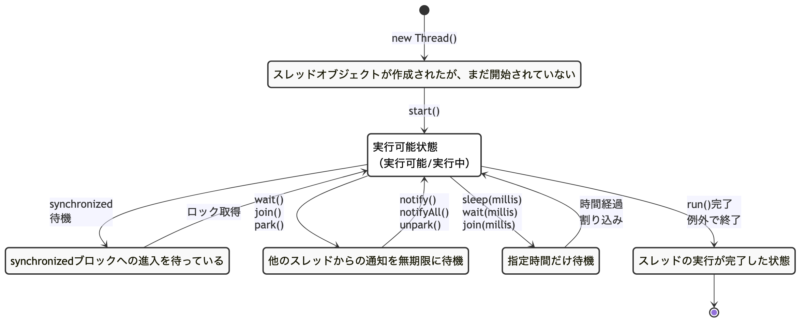
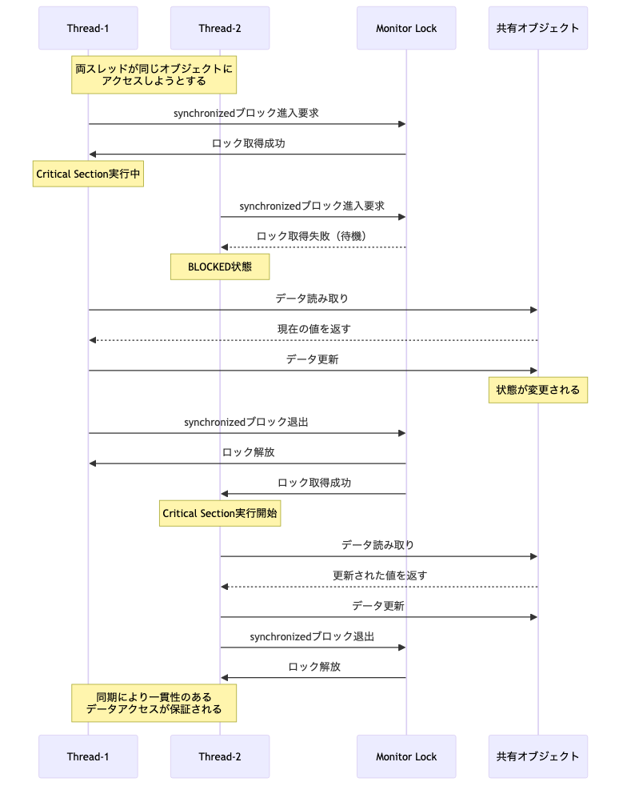

# <b>16章</b> <span>マルチスレッドプログラミング</span> <small>並行処理と同期制御の実践</small>

## 本章の学習目標

### この章で学ぶこと

1. マルチスレッドの基本
    - ThreadクラスとRunnableインターフェイスの使い分け
    - スレッドのライフサイクルと状態遷移
    - 競合状態とデッドロックの理解と回避
2. 同期制御の技術
    - synchronizedキーワードによる排他制御
    - LockインターフェイスとReentrantLockの活用
    - Atomic変数によるロックフリーな同期化
3. ExecutorServiceとスレッドプール
    - スレッドプールの種類と選択基準
    - タスクのスケジューリングと管理
    - FutureとCompletableFutureによる非同期処理
4. 並行コレクション
    - ConcurrentHashMap、CopyOnWriteArrayListなどの活用
    - BlockingQueueによるプロデューサー・コンシューマーパターン
    - パフォーマンスとスケーラビリティの最適化

### この章を始める前に

第13章までのJavaアプリケーション開発能力、とくに例外処理とコレクションフレームワークを理解していれば準備完了です。

最終的な到達レベルとして、基本的な並行処理プログラムを安全に実装できることから始まり、段階的にスキルを向上させます。
ExecutorServiceを使った実用的な非同期処理の実装、デッドロック回避やライブロック対策、マルチコア環境での2倍以上の性能向上を実現するプログラムの作成まで習得します。
これにより、高性能で応答性の高いアプリケーションを構築する能力を身につけます。

## 並行処理の世界への招待

### なぜマルチスレッドが必要なのか

これまでの章で学習してきたプログラムは、すべて「1つずつ順番に」処理を実行してきました。
しかし、現実のアプリケーションでは、複数の作業を同時に行いたい場面がよくあります。

たとえば、Webブラウザを考えてみましょう。
- 画像をダウンロードしている
- HTMLを解析している
- JavaScriptを実行している
- ユーザーのクリックに反応している

これらすべてが「同時に」動いているように見えます。
もし1つずつ順番に処理していたら、画像のダウンロードが終わるまでページが表示されず、
とても使いづらいブラウザになってしまいます。

### 身近な例で理解する並行処理

レストランの厨房を想像してください。

#### シングルスレッド（一人のシェフ）の場合
```
1. お客様Aの前菜を作る（5分）
2. お客様Aのメイン料理を作る（15分）
3. お客様Aのデザートを作る（5分）
4. お客様Bの前菜を作る（5分）... 
```
お客様Aの料理がすべて完成するまで25分、お客様Bは最低でも25分待つことになります。

#### マルチスレッド（複数のシェフ）の場合
```
シェフ1: お客様Aの前菜 → お客様Bの前菜 → ...
シェフ2: お客様Aのメイン → お客様Bのメイン → ...
シェフ3: お客様Aのデザート → お客様Bのデザート → ...
```
複数のシェフが並行して働くことで、短時間で多くの料理を提供できます。

### Javaでの簡単な例

まず、シングルスレッドの例を見てみましょう。

以下のコードは、朝食の準備を順番に行うシングルスレッドのプログラムです。コーヒー（3秒）、トースト（2秒）、卵（5秒）を順番に処理するため、合計10秒かかります。各処理が完了するまで次の処理を開始できないため、待ち時間が無駄になっています。

<span class="listing-number">**サンプルコード16-2**</span>

```java
public class SingleThreadExample {
    public static void main(String[] args) {
        System.out.println("朝食の準備を開始");
        
        // コーヒーを淹れる（3秒かかる）
        makeCoffee();
        
        // トーストを焼く（2秒かかる）
        makeToast();
        
        // 卵を茹でる（5秒かかる）
        boilEgg();
        
        System.out.println("朝食の準備完了！");
        // 合計: 10秒かかる
    }
    
    private static void makeCoffee() {
        System.out.println("コーヒーを淹れています...");
        sleep(3000);
        System.out.println("コーヒーができました");
    }
    
    private static void makeToast() {
        System.out.println("トーストを焼いています...");
        sleep(2000);
        System.out.println("トーストができました");
    }
    
    private static void boilEgg() {
        System.out.println("卵を茹でています...");
        sleep(5000);
        System.out.println("ゆで卵ができました");
    }
    
    private static void sleep(int milliseconds) {
        try {
            Thread.sleep(milliseconds);
        } catch (InterruptedException e) {
            e.printStackTrace();
        }
    }
}
```

実行結果：
```
朝食の準備を開始
コーヒーを淹れています...
コーヒーができました
トーストを焼いています...
トーストができました
卵を茹でています...
ゆで卵ができました
朝食の準備完了！
（実行時間：約10秒）
```

これをマルチスレッドで書き換えると。

<span class="listing-number">**サンプルコード16-4**</span>

```java
public class MultiThreadExample {
    public static void main(String[] args) throws InterruptedException {
        System.out.println("朝食の準備を開始");
        
        // それぞれ別々のスレッドで同時に実行
        Thread coffeeThread = new Thread(() -> makeCoffee());
        Thread toastThread = new Thread(() -> makeToast());
        Thread eggThread = new Thread(() -> boilEgg());
        
        // スレッドを開始
        coffeeThread.start();
        toastThread.start();
        eggThread.start();
        
        // すべてのスレッドが終了するのを待つ
        coffeeThread.join();
        toastThread.join();
        eggThread.join();
        
        System.out.println("朝食の準備完了！");
        // 合計: 約5秒（もっとも時間のかかる卵の時間）で完了
    }
    
    // makeCoffee、makeToast、boilEgg、sleepメソッドは同じ
}
```

実行結果：
```
朝食の準備を開始
コーヒーを淹れています...
卵を茹でています...
トーストを焼いています...
トーストができました
コーヒーができました
ゆで卵ができました
朝食の準備完了！
（実行時間：約5秒）
```

このように、マルチスレッドを使うことで、10秒かかっていた処理を5秒に短縮できました。

## 章の構成

本章は、マルチスレッドプログラミングを体系的に学習できるよう、以下のパートで構成されています。

### [Part A: マルチスレッドの基礎](chapter16a-thread-basics.md)
- マルチスレッドプログラミングの必要性
- スレッドの作成と実行
- 共有リソースと同期制御
- synchronizedキーワードによる排他制御

<div class="figure">



</div>

### [Part B: Executorフレームワーク](chapter16b-executor-framework.md)
- ExecutorServiceとスレッドプール
- FutureとCallableによる非同期処理
- CompleテーブルFutureによる高度な非同期処理

### [Part C: 並行コレクションと同期プリミティブ](chapter16c-concurrent-utilities.md)
- 並行コレクション（ConcurrentHashMap、BlockingQueue等）
- 高度な同期プリミティブ（Lock、Semaphore、CountDownLatch等）
- プロデューサー・コンシューマーパターン

### [Part D: 実践的な並行処理](chapter16d-practical-concurrency.md)
- パフォーマンス測定とベンチマーク
- スレッドセーフなパターン
- 並行処理の落とし穴と解決策
- ForkJoinPoolと並列ストリーム

### [Part E: 章末演習](chapter16e-exercises.md)
- 基礎レベル課題スレッド操作と同期処理
- 実践レベル課題並行コレクションとExecutor
- 応用レベル課題高度な並行処理パターン

## 学習の進め方

1. Part Aでスレッドの基本概念と同期制御を理解
2. Part Bで実用的なExecutorフレームワークを習得
3. Part Cで並行処理専用のユーティリティを学習
4. Part Dで実践的な並行処理の設計と実装を習得
5. Part Eの演習課題で実践的なスキルを身につける

各パートは独立して読むことも可能ですが、順番に学習することで、基礎から実践まで体系的にマルチスレッドプログラミングを習得できるよう設計されています。

本章で学んだマルチスレッドプログラミングの概念を活用して、実践的な練習課題に取り組みましょう。

### 演習の目標
マルチスレッドプログラミングの基礎から高度な並行処理までを習得します。

## 基礎レベル課題（ポイント）

### 課題1: 基本的なスレッド操作

基本的なスレッド生成と操作を実装してください。


<span class="listing-number">**サンプルコード16-6**</span>

```java
// ① Thread継承方式（非推奨）
class MyThread extends Thread {
    @Override
    public void run() {
        System.out.println("Thread継承方式で実行");
    }
}

// ② Runnable実装方式（推奨）  
class MyTask implements Runnable {
    @Override
    public void run() {
        System.out.println("Runnable実装方式で実行");
    }
}

// ③ ラムダ式方式（Java 8以降推奨）
// ラムダ式を使用することで、簡潔でわかりやすいスレッド作成が可能になります。
// この方式は一度だけ実行する短時間のタスクに最適で、無名クラスの冗長さを排除できます。
// 関数型プログラミングのパラダイムに従い、実行される処理（タスク）を明確に表現できます。
new Thread(() -> {
    System.out.println("ラムダ式方式で実行");
}).start();
```

この演習では、マルチスレッドプログラミングの基礎を実践的に学びます。

#### 要求仕様
- Threadクラスの継承によるスレッド作成
- Runnableインターフェイスの実装によるスレッド作成
- スレッドの開始、停止、待機
- スレッド間の実行順序の確認
- スレッドの優先度設定

実行例。
```
=== 基本的なスレッド操作 ===
メインスレッド開始: main

Thread継承方式:
WorkerThread-1 開始
WorkerThread-1: タスク 1 実行中...
WorkerThread-1: タスク 2 実行中...
WorkerThread-1: タスク 3 実行中...
WorkerThread-1 完了

Runnable実装方式:
Thread-pool-1-thread-1: カウンタ 1
Thread-pool-1-thread-2: カウンタ 1
Thread-pool-1-thread-3: カウンタ 1
Thread-pool-1-thread-1: カウンタ 2
Thread-pool-1-thread-2: カウンタ 2
Thread-pool-1-thread-3: カウンタ 2

複数スレッド並行実行:
スレッドA: 処理 1/5
スレッドB: 処理 1/5
スレッドC: 処理 1/5
スレッドA: 処理 2/5
スレッドB: 処理 2/5
スレッドC: 処理 2/5
...

スレッド情報:
スレッドA: ID=12, 優先度=5, 状態=RUNNABLE
スレッドB: ID=13, 優先度=7, 状態=RUNNABLE
スレッドC: ID=14, 優先度=3, 状態=RUNNABLE

実行時間測定:
シングルスレッド: 5,000ms
マルチスレッド（3スレッド）: 1,750ms
性能向上: 2.86倍

全スレッド完了
メインスレッド終了
```

評価ポイント。
- スレッド作成方法の理解
- 並行実行の概念理解
- スレッドライフサイクルの理解

実装ヒント。
- Thread.start（）でスレッド開始（run() 直接呼び出しは×）
- Thread.join() で他スレッドの完了待機
- Thread.sleep() で一時停止

### 課題2: 同期処理とデータ競合対策

同期処理を実装し、データ競合を防ぐ方法を理解してください。

技術的背景：並行処理の問題と同期化メカニズム。

マルチスレッド環境での共有リソースアクセスは、さまざまな問題を引き起こします。

データ競合（Race Condition）の危険性。
データ競合が発生する危険なコード例。

以下の例は、マルチスレッド環境でデータ競合（レースコンディション）が発生する典型的なパターンです。一見単純に見える`count++`操作が、実際にはCPUレベルで3つの独立した処理（①現在値の読み込み、②値のインクリメント、③結果の書き込み）に分解されます。複数のスレッドが同時に実行すると、期待と異なる結果になります。

<span class="listing-number">**サンプルコード16-8**</span>

```java
class UnsafeCounter {
    private int count = 0;
    
    public void increment() {
        count++;  // ①
    }
}
```

①の処理内容`count++`は以下の3つの原子的でない操作で構成されています。
- CPU命令1: メモリからcountの現在値を読み込み  
- CPU命令2: レジスタ内で値を1増加
- CPU命令3: 増加後の値をメモリに書き戻し

実際の実行結果10個のスレッドがそれぞれ1000回incrementを実行した場合、理論的には10,000になるはずですが、実際には8,000～9,800程度の値になってしまいます。これは、複数のスレッドが同じタイミングで同じ値を読み込み、同じ結果を書き込むことで、一部のインクリメント操作が失われるためです。

同期化メカニズムの比較。
- synchronizedシンプルだが粒度が粗い
- ReentrantLock柔軟だが複雑（tryLock、公平性制御）
- ReadWriteLock読み込み多数の場合に高性能

<div class="figure">



</div>
- Atomic変数CAS（Compare-And-Swap）による高速化

実世界での同期化の例。
- 銀行システム口座残高の一貫性保証
- 在庫管理
-    + 同時注文による在庫のマイナス防止
- チケット予約座席の二重予約防止
- キャッシュ管理データの整合性維持

デッドロックの4条件（Coffman条件）
1. 相互排他
    + リソースの排他的使用
2. 保持と待機
    + リソースを保持しながらほかを待つ
3. 横取り不可
    + 強制的なリソース解放不可
4. 循環待機
    + 待機の循環グラフ形成

パフォーマンスへの影響。
- ロック競合スループット低下の主要因
- コンテキストスイッチ1-10マイクロ秒のオーバーヘッド
- メモリバリアCPUキャッシュの同期コスト
- スケーラビリティコア数増加による性能向上の限界

この演習では、さまざまな同期化技術を実践し、パフォーマンス要件に応じた選択ができる能力を養います。

#### 要求仕様
- synchronizedキーワードによる排他制御
- Lockインターフェイスを使った明示的なロック
- volatileキーワードの使用
- スレッドセーフなデータ構造の実装
- デッドロック回避策

実行例。
```
=== 同期処理とデータ競合対策 ===
データ競合テスト:
非同期カウンタ:
期待値: 10,000
実際の値: 8,743
データ競合が発生しました！

同期カウンタ:
期待値: 10,000
実際の値: 10,000
データ整合性が保たれました

銀行口座の並行操作:
初期残高: 100,000円

並行取引（10スレッド×100回取引）:
スレッド1: 取引開始
スレッド2: 取引開始
...
スレッド1: 1,000円入金 → 残高: 101,000円
スレッド2: 500円出金 → 残高: 100,500円
スレッド3: 2,000円入金 → 残高: 102,500円
...

最終残高: 150,000円
取引回数: 1,000回
成功取引: 950回
失敗取引: 50回（残高不足）

Lockを使った高度な同期:
ReadWriteLock テスト:
読み取りスレッド×5: 並行実行可能
書き込みスレッド×2: 排他実行
読み取り時間: 100ms
書き込み時間: 500ms

デッドロック回避テスト:
Account A → Account B 振込: 成功
Account B → Account A 振込: 成功
ロック順序制御により デッドロック回避

volatile変数テスト:
フラグ変更前: false
フラグ変更後: true（全スレッドで即座に反映）
```

### 課題3: 並行コレクションとExecutor

並行処理専用のコレクションとExecutorServiceを活用してください。

技術的背景スレッドプールとタスク管理の重要性。

Executorフレームワークは、Doug Leaによって設計された革新的な並行処理フレームワークです。

スレッド生成の問題点とアンチパターン。

以下は、マルチスレッドプログラミングでよく見られる危険なアンチパターンです。大量のタスクに対して無制限にスレッドを生成することで、深刻なパフォーマンス問題とシステムクラッシュを引き起こす可能性があります。

<span class="listing-number">**サンプルコード16-10**</span>

```java
// アンチパターン：スレッドの無制限生成
for (int i = 0; i < 10000; i++) {
    new Thread(() -> processTask()).start();  // ①
}
```

#### ①のコードが引き起こす問題

- OutOfMemoryError
    + 各スレッドは約1-8MBのスタックメモリを消費するため、10,000スレッドで最大80GBのメモリが必要
- コンテキストスイッチの嵐
    + OSが大量のスレッドを切り替える際の莫大なオーバーヘッド（1回約1-10マイクロ秒×10,000スレッド）
- CPUリソースの枯渇
    + 実際の作業よりもスレッド管理にCPU時間が費やされる
- システム不安定化
    + OSのスケジューラーが正常に動作できなくなる

#### Executorの利点
- スレッドプール再利用によるオーバーヘッド削減
- タスクキューバックプレッシャー制御
- 統計情報監視とチューニング
- 優雅な終了shutdown()による安全な停止

#### 並行コレクションの必要性とスレッドセーフティ

通常のコレクションクラスは、マルチスレッド環境では致命的な問題を引き起こす可能性があります。以下の例では、スレッドセーフでないHashMapと、並行アクセスに対応したConcurrentHashMapの違いを示しています。

<span class="listing-number">**サンプルコード16-12**</span>

```java
// 危険：通常のHashMapの並行アクセス
Map<String, Integer> unsafeMap = new HashMap<>();  // ①

// 安全：ConcurrentHashMapの使用
Map<String, Integer> safeMap = new ConcurrentHashMap<>();  // ②
```

##### ①の問題点
- データ破損
    + 複数のスレッドが同時に内部データ構造を変更し、不正な状態になる
- 無限ループ
    + 内部のリンクリストが循環構造になり、get操作が永久に終わらない
- 予期しない例外
    + ConcurrentModificationExceptionが実行時に発生

##### ②の利点
- セグメントロック
    + データを16個のセグメントに分割し、部分的なロックで高い並行性を実現
- 非ブロッキング読み取り
    + 読み取り操作はロックを取得せず、高いパフォーマンスを維持
- アトミック操作
    + putIfAbsent、replace、computeIfAbsentなどの複合操作が安全に実行可能

##### 実際のシステムでの使用例
- Webサーバリクエスト処理用スレッドプール
- データベース接続プールコネクション管理
- メッセージキュー非同期処理の実装
- バッチ処理並列データ処理

##### ExecutorServiceの種類と用途
- FixedThreadPool
    + CPU集約的タスク（コア数×2）
- CachedThreadPool
    + I/O集約的タスク（動的拡張）
- ScheduledThreadPool
    + 定期実行タスク
- ForkJoinPool
    + 分割統治アルゴリズム

##### パフォーマンスの考慮

- 最適スレッド数
    + Little's Law → N = λ × W
- キューサイズメモリとレイテンシのトレードオフ
- 拒否ポリシー
    + CallerRunsPolicy、AbortPolicy等

この演習では、プロダクションレベルの並行処理設計を学びます。

#### 要求仕様
- ConcurrentHashMap、CopyOnWriteArrayList等の使用
- ExecutorServiceによるスレッドプール管理
- FutureとCallableによる結果取得
- CompleテーブルFutureによる非同期処理
- 並行処理パターンの実装

##### 実行例

```
=== 並行コレクションとExecutor ===
ConcurrentHashMap テスト:
初期データ: {user1=100, user2=200, user3=300}

並行更新（10スレッド）:
スレッド1: user1 に 10 追加
スレッド2: user2 に 20 追加
スレッド3: user3 に 30 追加
...

最終結果: {user1=150, user2=250, user3=350}
データ整合性: 保証

CopyOnWriteArrayList テスト:
読み取り専用操作（高速）
書き込み時のコピー作成
並行読み取り: 10スレッド同時実行
読み取り時間: 1ms（ロックなし）

ExecutorService テスト:
スレッドプール作成: 5スレッド
タスク投入: 20個

タスク実行中:
Thread-1: タスク1 実行（1秒）
Thread-2: タスク2 実行（2秒）
Thread-3: タスク3 実行（1秒）
Thread-4: タスク4 実行（3秒）
Thread-5: タスク5 実行（1秒）

進行状況: 5/20 完了
進行状況: 10/20 完了
進行状況: 15/20 完了
進行状況: 20/20 完了

実行結果:
全タスク完了時間: 8秒
平均タスク時間: 1.6秒

Future による結果取得:
非同期計算開始: 複雑な数学計算
他の処理継続中...
計算結果取得: 42（計算時間: 3秒）

CompletableFuture チェーン:
step1: データ取得 → [1, 2, 3, 4, 5]
step2: 変換処理 → [2, 4, 6, 8, 10]
step3: 集計処理 → 30
最終結果: 30

スレッドプール統計:
アクティブスレッド: 0
完了タスク数: 20
キューサイズ: 0
プール状態: 正常終了
```

### 課題4: プロデューサー・コンシューマーパターン

プロデューサー・コンシューマーパターンを実装し、スレッド間通信を理解してください。

#### 技術的背景

+ プロデューサー・コンシューマーパターンとスレッド間協調。
プロデューサー・コンシューマーパターンは、並行処理の古典的かつもっとも重要なデザインパターンの1つです。

パターンの必要性。
- 速度差の吸収
    + 生産速度と消費速度の不一致
- バッファリング
    + 一時的なスパイクへの対応
- デカップリング
    + 生産者と消費者の独立性
- スケーラビリティ
    + 動的な生産者/消費者の増減

##### 実世界での適用例

プロデューサー・コンシューマーパターンは、多くの実際のシステムで活用されています。以下に代表的な適用例を示します。

###### ログ処理システムの場合

多数のアプリケーションが生成するログメッセージを遅延なく処理するシステムでは、プロデューサー・コンシューマーパターンが有効です。
①アプリケーション（生産者）がログメッセージを生成し、
②BlockingQueue（バッファ）がメッセージを一時的に蓄積します。
③ログライター（消費者）がファイルやデータベースに書き込みます。
これにより、アプリケーションの処理速度とディスクI/Oの速度差を吸収できます。

動画エンコーディングシステムの場合。
大容量の動画ファイルを高速に処理するために、以下の構成を使用します。
①動画読み込み部（生産者）がフレームを抽出し、②フレームキュー（バッファ）がメモリ使用量を制御しながらフレームを蓄積します。
③エンコーダー（消費者）が圧縮処理を実行します。
これにより、I/O処理とCPU集約的な処理を分離し、マルチコアCPUの性能を最大限に活用できます。

<span class="listing-number">**サンプルコード16-14**</span>

```java
// システム構成の概念図
// Producer → [BlockingQueue] → Consumer
//    ↓            ↓              ↓
// データ生成 → バッファリング → データ処理
```

##### BlockingQueueの種類と特性
- ArrayBlockingQueue固定サイズ、公平性オプション
- LinkedBlockingQueueオプショナル容量、高スループット
- PriorityBlockingQueue優先度付きタスク処理
- SynchronousQueue: 容量0、直接受け渡し

##### 古典的wait/notifyの問題点と正しい実装パターン

wait/notifyは、Javaの初期から存在するスレッド間通信のメカニズムです。1つのスレッドが特定の条件を待ち（wait）、別のスレッドがその条件を満たしたら通知（notify）するという仕組みです。しかし、このメカニズムは多くの微妙な問題を含んでおり、正しく使用するには注意が重要です。

##### wait/notifyの基本的な仕組み
- `wait()`: 現在のスレッドを待機状態にし、ロックを解放する
- `notify()`: 待機中のスレッドを1つ起こす
- `notifyAll()`: 待機中のすべてのスレッドを起こす

以下の例では、よくある間違った実装と正しい実装パターンを比較します。

<span class="listing-number">**サンプルコード16-16**</span>

```java
// 誤った実装例（危険）
synchronized(lock) {
    if (!condition) {  // ①
        lock.wait();
    }
}

// 正しい実装例（推奨）
synchronized(lock) {
    while (!condition) {  // ②
        lock.wait();
    }
}
```

###### ①の問題点（if文の使用）
- Spurious Wakeup
    + OSレベルで発生する偽の起床により、条件が満たされていないのにwait()から復帰する可能性
- Lost Notification
    + notify()のタイミングによっては、通知が失われてスレッドが永続的に待機状態になる
- 競合状態
    + wait()から復帰した時点で、他のスレッドがすでに条件を変更している可能性

###### ②の利点（while文の使用）
- 再チェック保証
    + wait()から復帰するたびに条件を再評価し、確実に条件が満たされていることを確認
- Spurious Wakeup対応
    + 偽の起床が発生しても、条件が満たされるまで再度待機
- 競合耐性
    + 複数のスレッドが同時に動作する環境でも安全に動作

###### パフォーマンスチューニング
- キューサイズ
    + メモリとレイテンシのバランス
- 生産者/消費者比率
    + リトルの法則による最適化
- バッチ処理
    + スループット向上技術
- バックプレッシャー
    + 過負荷時の制御戦略

###### 実際のシステムでの問題
- メモリ枯渇
    + 無制限キューの危険性
- 飢餓状態
    + 消費者の処理能力不足
- レイテンシ
    + キューイング遅延の蓄積

この演習では、実践的なスレッド間協調メカニズムを習得します。

#### 要求仕様
- BlockingQueueを使ったプロデューサー・コンシューマーパターン
- wait/notifyを使った低レベル同期
- セマフォによるリソース制限
- スレッド間のデータ受け渡し
- 処理能力のバランス調整

##### 実行例

```
=== プロデューサー・コンシューマーパターン ===
BlockingQueue による実装:
キューサイズ: 10
生産者: 2スレッド
消費者: 3スレッド

生産開始:
Producer-1: アイテム1 生成 → キュー[1]
Producer-2: アイテム2 生成 → キュー[1,2]
Producer-1: アイテム3 生成 → キュー[1,2,3]
...

消費開始:
Consumer-1: アイテム1 消費 ← キュー[2,3,4]
Consumer-2: アイテム2 消費 ← キュー[3,4,5]
Consumer-3: アイテム3 消費 ← キュー[4,5,6]
...

統計情報:
生産アイテム数: 1,000個
消費アイテム数: 1,000個
平均キューサイズ: 5.2個
生産速度: 100個/秒
消費速度: 120個/秒

wait/notify による実装:
共有バッファ（サイズ: 5）
Producer: データ生成中...
Buffer: [data1] - notify消費者
Consumer: data1 消費 - notify生産者
Buffer: [data2] - notify消費者
Consumer: data2 消費 - notify生産者

セマフォによるリソース制限:
利用可能リソース: 3個
Thread-1: リソース取得（残り2個）
Thread-2: リソース取得（残り1個）
Thread-3: リソース取得（残り0個）
Thread-4: 待機中...
Thread-1: リソース解放（残り1個）
Thread-4: リソース取得（残り0個）

スループット測定:
生産者1：消費者1 → 50個/秒
生産者1：消費者2 → 75個/秒
生産者2：消費者2 → 90個/秒
生産者2：消費者3 → 95個/秒
最適構成: 生産者2：消費者3

パフォーマンス比較:
ArrayBlockingQueue: 95個/秒
LinkedBlockingQueue: 87個/秒
SynchronousQueue: 120個/秒（直接受け渡し）
```

評価ポイント。
- プロデューサー・コンシューマーパターンの理解
- 用途に応じた同期プリミティブの選択
- スループット最適化の考慮

実装ヒント。
- ArrayBlockingQueueで固定サイズキュー
- put（）でブロッキング挿入、take() でブロッキング取得
- Semaphoreでリソース数制限

## 実装のヒント

### マルチスレッドのポイント

1. スレッド作成
    + Thread継承vs Runnable実装
2. 同期制御
    + synchronized vs Lockインターフェイス
3. 並行コレクション
    + スレッドセーフなデータ構造
4. ExecutorService: スレッドプールによるリソースの共有
5. スレッド間通信
    + BlockingQueue、wait/notify
6. パフォーマンス
    + 最適な並行度とオーバーヘッド考慮

### よくある落とし穴
- run（）メソッドの直接呼び出し（start()を使う）
- 同期処理の範囲が広すぎる・狭すぎる
- デッドロックの発生（ロック順序に注意）
- リソースリーク（ExecutorServiceのshutdown忘れ）

### 設計のベストプラクティス
- 可能な限りimmuテーブルオブジェクトを使用
- 共有状態を最小限に抑制
- 並行コレクションの積極的活用
- ブロック単位やメソッド単位での必要最小限の同期処理設計

## 実装環境

演習課題の詳細な実装テンプレート、テストコード、解答例は以下のディレクトリを参照してください。

```
exercises/chapter16/
├── basic/          # 基礎レベル課題
│   ├── README.md   # 詳細な課題説明
│   ├── BasicThreading.java
│   ├── SynchronizedCounter.java
│   ├── ConcurrentCollections.java
│   └── ProducerConsumer.java
├── advanced/       # 応用レベル課題
├── challenge/      # 発展レベル課題
└── solutions/      # 解答例（実装完了後に参照）
```

## 完了確認チェックリスト

### 基礎レベル
- 基本的なスレッド操作ができている
- 同期処理とデータ競合対策が実装できている
- 並行コレクションとExecutorが活用できている
- プロデューサー・コンシューマーパターンが実装できている

### 技術要素
- スレッドセーフなプログラムが書けている
- 効果的な並行処理設計ができている
- パフォーマンスを考慮した実装ができている
- デッドロック等の問題を回避できている

### 応用レベル
- 高度な並行処理パターンを実装できている
- パフォーマンス測定と最適化ができている
- 実用的な並行アプリケーションが構築できている
- 並行処理のトラブルシューティングができている

次のステップ： 基本課題が完了したら、advanced/の発展課題でより高度な並行プログラミングに挑戦しましょう！。

## マルチスレッドプログラミングの基礎

スレッドとは、プログラム内での処理の流れを表す実行単位です。
通常、1つのプログラムは1つのスレッド（メインスレッド）で実行されます。

マルチスレッドとは、1つのプログラム内で複数のスレッドを同時に実行し、処理を並行して進める技術です。

### なぜマルチスレッドが必要か

現代のコンピュータは、複数のコアを持つCPU（マルチコアプロセッサ）を搭載するのが一般的です。マルチスレッドプログラミングは、この複数のコアを並列に活用し、アプリケーションのパフォーマンスを向上させるための重要な技術です。

- 時間のかかる処理を複数のスレッドに分割し、同時に実行することで、全体の処理時間を短縮できる
- GUIアプリケーションなどで、時間のかかる処理をバックグラウンドのスレッドに任せることで、ユーザーインターフェイスが固まるのを防ぎる
- サーバアプリケーションなどでは、複数のクライアントからのリクエストを同時に処理することで、計算リソースを有効に活用できる

### スレッドの作成と実行

Javaでスレッドを作成するには、主に`Runnable`インターフェイスを実装する方法が推奨されます。

### `Runnable`インターフェイスの実装（推奨）

`Runnable`は、スレッドが実行するタスク（処理内容）を定義するための関数型インターフェイスです。`run()`メソッドを1つだけ持ちます。

<span class="listing-number">**サンプルコード16-18**</span>

```java
// Runnableを実装したクラス
class MyTask implements Runnable {
    @Override
    public void run() {
        System.out.println("タスク実行中: " + Thread.currentThread().getName());
    }
}

public class Main {
    public static void main(String[] args) {
        MyTask task = new MyTask();
        Thread thread = new Thread(task);
        thread.start(); // スレッドを開始

        // ラムダ式を使えばさらに簡潔
        new Thread(() -> {
            System.out.println("ラムダ式でのタスク実行: " + Thread.currentThread().getName());
        }).start();
    }
}
```

`Runnable`を利用する方法は、Javaがクラスの多重継承をサポートしないという制約を受けず、また「タスク（何をするか）」と「スレッド（どう実行するか）」を分離できるため、より柔軟な設計が可能です。

### 共有リソースと同期制御

複数のスレッドが、同じデータ（オブジェクトや変数）に同時にアクセスすると、予期せぬ問題が発生することがあります。これを競合状態 (Race Condition) と呼びます。

同期の必要性を示す具体例。

たとえば、銀行口座の残高を更新する処理を考えてみましょう。残高10,000円の口座から「2つのATMで同時に」8,000円を引き出そうとした場合を想定します。
同期制御がないと両方の引き出しが成功してしまい、残高がマイナスになる可能性があります。これは、以下のような処理の流れで発生します。

1. ATM1が残高10,000円を読み取る
2. ATM2も残高10,000円を読み取る（まだATM1の処理は完了していない）
3. ATM1が「10,000円 - 8,000円 = 2,000円」と計算して更新
4. ATM2も「10,000円 - 8,000円 = 2,000円」と計算して更新
5. 結果
    + 16,000円が引き出されてしまう

### `synchronized`による排他制御

この問題を解決するために、Javaは`synchronized`キーワードによる排他制御のしくみを提供します。`synchronized`で保護されたコードブロックは、一度に1つのスレッドしか実行できないことが保証されます。

synchronizedメソッドの基本的な使い方。

`synchronized`キーワードをメソッドに付けることで、そのメソッド全体が排他制御の対象となります。これにより、同時に1つのスレッドしかそのメソッドを実行できなくなり、データの整合性が保たれます。

<span class="listing-number">**サンプルコード16-20**</span>

```java
class SynchronizedCounter {
    private int count = 0;

    // synchronizedキーワードにより、このメソッドは同時に1つのスレッドしか実行できない
    // これにより、count++という複合操作（読み取り→インクリメント→書き込み）が
    // 原子的（アトミック）に実行されることが保証される
    public synchronized void increment() {
        count++;
    }

    // 読み取りメソッドも一貫性のため、synchronizedにすることが推奨される
    public synchronized int getCount() {
        return count;
    }
}
```

`synchronized`は非常に強力ですが、使用には注意が必要です。
ロックの範囲が広すぎるとパフォーマンスの低下を招きます。
また、複数のロックが絡み合うとデッドロック（スレッドがお互いを待ち続けて処理が進まなくなる状態）を引き起こす危険性もあります。

synchronizedブロックによる細かい制御。

メソッド全体ではなく、特定のコードブロックだけを同期化したい場合は、`synchronized`ブロックを使用します。これにより、必要最小限の範囲だけをロックすることができ、パフォーマンスの向上につながります。

<span class="listing-number">**サンプルコード16-22**</span>

```java
class BankAccount {
    private double balance;
    private final Object lock = new Object(); // ロックオブジェクト
    
    public void deposit(double amount) {
        // 検証処理は同期化の外で実行（パフォーマンス向上）
        if (amount <= 0) {
            throw new IllegalArgumentException("入金額は正の数である必要があります");
        }
        
        // 残高の更新部分だけを同期化
        synchronized (lock) {
            System.out.println("入金前残高: " + balance);
            balance += amount;
            System.out.println("入金後残高: " + balance);
        }
    }
    
    public boolean withdraw(double amount) {
        if (amount <= 0) {
            return false;
        }
        
        synchronized (lock) {
            if (balance >= amount) {
                System.out.println("引き出し前残高: " + balance);
                balance -= amount;
                System.out.println("引き出し後残高: " + balance);
                return true;
            }
            return false;
        }
    }
}
```

### volatileキーワードによるメモリ可視性の保証

`volatile`キーワードは、変数への変更が他のスレッドから即座に見えることを保証します。これは主に、スレッド間でのフラグの共有などに使用されます。

volatileの主な特徴。
- メモリの可視性を保証（あるスレッドの変更が他のスレッドから即座に見える）
- 単純な読み書きのみをアトミックにする（複合操作は保証しない）
- synchronizedより軽量だが、機能も限定的

<span class="listing-number">**サンプルコード16-24**</span>

```java
class ThreadStopExample {
    // volatileフラグによる安全なスレッド停止
    private volatile boolean stopRequested = false;
    
    public void startWorker() {
        Thread worker = new Thread(() -> {
            int count = 0;
            // volatileフラグを定期的にチェック
            while (!stopRequested) {
                count++;
                if (count % 1000000 == 0) {
                    System.out.println("Working... count: " + count);
                }
            }
            System.out.println("Worker stopped at count: " + count);
        });
        worker.start();
    }
    
    public void stopWorker() {
        // volatileにより、この変更は即座に他のスレッドから見える
        stopRequested = true;
        System.out.println("Stop requested");
    }
}

// 使用例
public class VolatileDemo {
    public static void main(String[] args) throws InterruptedException {
        ThreadStopExample example = new ThreadStopExample();
        example.startWorker();
        
        // 3秒間動作させる
        Thread.sleep(3000);
        
        // ワーカーを停止
        example.stopWorker();
    }
}
```

注意点volatileは複合操作（読み取り→計算→書き込み）をアトミックにしません。カウンターのインクリメントなどには使用できないため、そのような場合は`AtomicInteger`などのアトミッククラスを使用してください。

### Atomicクラスによるロックフリーなアトミック操作

`java.util.concurrent.atomic`パッケージは、ロックを使わずにアトミックな操作を実現するクラス群を提供します。これらは内部的にCAS（Compare-And-Swap）操作を使用し、高性能な並行処理を実現します。

主なAtomicクラス。
- `AtomicInteger`: int値のアトミック操作
- `AtomicLong`: long値のアトミック操作
- `AtomicBoolean`: boolean値のアトミック操作
- `AtomicReference<T>`: 参照型のアトミック操作

<span class="listing-number">**サンプルコード16-26**</span>

```java
import java.util.concurrent.atomic.AtomicInteger;
import java.util.concurrent.ExecutorService;
import java.util.concurrent.Executors;
import java.util.concurrent.TimeUnit;

public class AtomicCounterExample {
    // スレッドセーフなカウンター
    private final AtomicInteger counter = new AtomicInteger(0);
    
    public void performCounting() throws InterruptedException {
        ExecutorService executor = Executors.newFixedThreadPool(10);
        
        // 10スレッドが同時に1000回ずつインクリメント
        for (int i = 0; i < 10; i++) {
            executor.execute(() -> {
                for (int j = 0; j < 1000; j++) {
                    // アトミックなインクリメント操作
                    int newValue = counter.incrementAndGet();
                    if (newValue % 1000 == 0) {
                        System.out.println("Counter reached: " + newValue);
                    }
                }
            });
        }
        
        executor.shutdown();
        executor.awaitTermination(10, TimeUnit.SECONDS);
        
        System.out.println("Final counter value: " + counter.get());
        // 常に正確に10,000になる
    }
    
    // その他の便利なアトミック操作
    public void demonstrateAtomicOperations() {
        AtomicInteger value = new AtomicInteger(10);
        
        // 現在値を取得して、新しい値を設定
        int oldValue = value.getAndSet(20);
        System.out.println("Old: " + oldValue + ", New: " + value.get());
        
        // 条件付き更新（CAS操作）
        boolean updated = value.compareAndSet(20, 30);
        System.out.println("Updated: " + updated + ", Value: " + value.get());
        
        // 加算操作
        int result = value.addAndGet(5);
        System.out.println("After adding 5: " + result);
    }
}
```

Atomicクラスはsynchronizedよりもはるかに高速で、とくに読み取りが多い場合や競合が少ない場合に優れたパフォーマンスを発揮します。

### Executorフレームワークによる高度なスレッド管理

スレッドを直接生成・管理するのは複雑でエラーも発生しやすいため、現代のJavaプログラミングではExecutorフレームワークを使用するのが一般的です。これはスレッドの生成・管理を抽象化し、スレッドプールを利用してタスクを順次実行するためのしくみです。

#### ExecutorServiceとスレッドプール

`ExecutorService`は、タスクの投入とスレッドプールの管理を行うためのインターフェイスです。スレッドプールは、あらかじめ作成された再利用可能なスレッドの集まりです。

ExecutorServiceの利点。
- スレッドの生成・破棄コストを削減できる
- 作成されるスレッド数を制限し、システムの安定性を高める
- 実行待ちタスクをキューで管理する
- 例外が発生してもスレッドプールは継続して動作する

主なExecutorServiceの種類。
- `newFixedThreadPool(int)`: 固定数のスレッドを持つプール
- `newCachedThreadPool()`: I/O待機が多いタスク向けにスレッドを作成・再利用するプール
- `newSingleThreadExecutor()`: 単一スレッドで順次実行するプール
- `newScheduledThreadPool(int)`: スケジュール実行が可能なプール

<span class="listing-number">**サンプルコード16-28**</span>

```java
import java.util.concurrent.ExecutorService;
import java.util.concurrent.Executors;
import java.util.concurrent.TimeUnit;

public class ExecutorExample {
    public static void main(String[] args) {
        // 3つのスレッドを持つスレッドプールを作成
        ExecutorService executor = Executors.newFixedThreadPool(3);

        for (int i = 0; i < 10; i++) {
            final int taskId = i;
            executor.execute(() -> {
                System.out.println("Task " + taskId + " is being executed by " + 
                    Thread.currentThread().getName());
                try {
                    Thread.sleep(1000); // 1秒の処理をシミュレート
                } catch (InterruptedException e) {
                    Thread.currentThread().interrupt();
                }
            });
        }

        // ExecutorServiceをシャットダウン
        executor.shutdown();
        try {
            if (!executor.awaitTermination(15, TimeUnit.SECONDS)) {
                executor.shutdownNow();
            }
        } catch (InterruptedException e) {
            executor.shutdownNow();
        }
    }
}
```

### 実践的なマルチスレッドの例

#### プロデューサー・コンシューマーパターンの実装

プロデューサー・コンシューマーパターンは、並行処理における古典的かつ重要なデザインパターンです。
プロデューサー（生産者）がデータを生成し、コンシューマー（消費者）がそれを処理するという構造で、
両者の処理速度の違いをバッファ（キュー）で吸収します。
このパターンは、ログ処理、メッセージキュー、パイプライン処理など、多くの実用的なシステムで使用されています。

<span class="listing-number">**サンプルコード16-30**</span>

```java
import java.util.concurrent.BlockingQueue;
import java.util.concurrent.LinkedBlockingQueue;
import java.util.concurrent.atomic.AtomicInteger;

public class ProducerConsumerExample {
    // 共有キュー
    // BlockingQueueは、スレッド間でデータを安全に受け渡すための
    // 特殊なキューです。キューが満杯の時は生産者が自動的にブロックされ、
    // キューが空の時は消費者が自動的にブロックされます。
    private static final BlockingQueue<Integer> queue = new LinkedBlockingQueue<>(10);
    private static final AtomicInteger producedCount = new AtomicInteger(0);
    private static final AtomicInteger consumedCount = new AtomicInteger(0);
    
    // プロデューサー（生産者）
    static class Producer implements Runnable {
        private final String name;
        private final int itemsToProduce;
        
        public Producer(String name, int itemsToProduce) {
            this.name = name;
            this.itemsToProduce = itemsToProduce;
        }
        
        @Override
        public void run() {
            try {
                for (int i = 0; i < itemsToProduce; i++) {
                    int item = producedCount.incrementAndGet();
                    queue.put(item); // キューがいっぱいの場合はブロック
                    System.out.printf("%s produced: %d (queue size: %d)%n", 
                        name, item, queue.size());
                    Thread.sleep(100); // 生産に時間がかかることをシミュレート
                }
            } catch (InterruptedException e) {
                Thread.currentThread().interrupt();
            }
        }
    }
    
    // コンシューマー（消費者）
    static class Consumer implements Runnable {
        private final String name;
        private final int itemsToConsume;
        
        public Consumer(String name, int itemsToConsume) {
            this.name = name;
            this.itemsToConsume = itemsToConsume;
        }
        
        @Override
        public void run() {
            try {
                for (int i = 0; i < itemsToConsume; i++) {
                    Integer item = queue.take(); // キューが空の場合はブロック
                    consumedCount.incrementAndGet();
                    System.out.printf("%s consumed: %d (queue size: %d)%n", 
                        name, item, queue.size());
                    Thread.sleep(200); // 消費に時間がかかることをシミュレート
                }
            } catch (InterruptedException e) {
                Thread.currentThread().interrupt();
            }
        }
    }
    
    public static void main(String[] args) throws InterruptedException {
        ExecutorService executor = Executors.newFixedThreadPool(5);
        
        // 2つのプロデューサーと3つのコンシューマーを作成
        executor.execute(new Producer("Producer-1", 10));
        executor.execute(new Producer("Producer-2", 10));
        executor.execute(new Consumer("Consumer-1", 7));
        executor.execute(new Consumer("Consumer-2", 7));
        executor.execute(new Consumer("Consumer-3", 6));
        
        executor.shutdown();
        executor.awaitTermination(30, TimeUnit.SECONDS);
        
        System.out.println("\n=== 最終結果 ===");
        System.out.println("生産された総数: " + producedCount.get());
        System.out.println("消費された総数: " + consumedCount.get());
        System.out.println("キューの残り: " + queue.size());
    }
}
```

#### Future と Callable を使った非同期処理

`Future`インターフェイスは、非同期処理の結果を表現するオブジェクトです。`Callable`は`Runnable`と似ていますが、値を返すことができ、例外をスローすることも可能です。

FutureとCallableの特徴。
- Callable: 戻り値を持つタスクを定義（`Runnable`は戻り値なし）
- Future: 非同期処理の結果を保持し、完了を待機できる
- 例外処理
-    + `Callable`は検査例外をスローできる
- キャンセル機能
-    + 実行中のタスクをキャンセル可能

<span class="listing-number">**サンプルコード16-32**</span>

```java
import java.util.concurrent.*;
import java.util.List;
import java.util.ArrayList;

public class FutureCallableExample {
    
    // 計算に時間がかかるタスク
    static class CalculationTask implements Callable<Long> {
        private final int n;
        
        public CalculationTask(int n) {
            this.n = n;
        }
        
        @Override
        public Long call() throws Exception {
            System.out.println("計算開始: フィボナッチ数列の第" + n + "項");
            long start = System.currentTimeMillis();
            long result = fibonacci(n);
            long time = System.currentTimeMillis() - start;
            System.out.printf("計算完了: F(%d) = %d (所要時間: %dms)%n", n, result, time);
            return result;
        }
        
        private long fibonacci(int n) {
            if (n <= 1) return n;
            return fibonacci(n - 1) + fibonacci(n - 2);
        }
    }
    
    public static void main(String[] args) throws Exception {
        ExecutorService executor = Executors.newFixedThreadPool(4);
        List<Future<Long>> futures = new ArrayList<>();
        
        // 複数の計算タスクを非同期で実行
        int[] numbers = {35, 38, 40, 42};
        for (int n : numbers) {
            Future<Long> future = executor.submit(new CalculationTask(n));
            futures.add(future);
        }
        
        // 他の処理を実行できる
        System.out.println("計算中に他の処理を実行...");
        Thread.sleep(100);
        
        // 結果を取得（必要になったタイミングで）
        System.out.println("\n=== 計算結果 ===");
        for (int i = 0; i < futures.size(); i++) {
            try {
                // get()は結果が得られるまでブロック
                Long result = futures.get(i).get(10, TimeUnit.SECONDS);
                System.out.println("F(" + numbers[i] + ") = " + result);
            } catch (TimeoutException e) {
                System.out.println("F(" + numbers[i] + ") = タイムアウト");
                futures.get(i).cancel(true); // タスクをキャンセル
            }
        }
        
        executor.shutdown();
    }
}
```

#### CompletableFuture による高度な非同期処理

`CompletableFuture`は、Java 8で導入された強力な非同期処理フレームワークです。従来の`Future`の制限を克服し、関数型プログラミングスタイルで非同期処理を記述できます。

CompletableFutureの主な特徴。
- 非同期処理の連鎖
-    + `thenApply`、`thenCompose`などで処理を連鎖
- 例外処理
-    + `exceptionally`、`handle`で例外を優雅に処理
- 複数の非同期処理の組み合わせ
-    + `allOf`、`anyOf`で複数の処理を統合
- タイムアウト処理
-    + Java 9以降では`orTimeout`メソッドも利用可能

<span class="listing-number">**サンプルコード16-34**</span>

```java
import java.util.concurrent.CompletableFuture;
import java.util.concurrent.TimeUnit;
import java.util.Random;

public class CompletableFutureExample {
    
    // 外部APIを呼び出すシミュレーション
    static class WeatherService {
        private static final Random random = new Random();
        
        public static CompletableFuture<String> getTemperature(String city) {
            return CompletableFuture.supplyAsync(() -> {
                System.out.println("気温取得中: " + city);
                // APIコールをシミュレート
                try {
                    Thread.sleep(1000 + random.nextInt(1000));
                } catch (InterruptedException e) {
                    Thread.currentThread().interrupt();
                }
                int temp = 20 + random.nextInt(15);
                return city + ": " + temp + "°C";
            });
        }
        
        public static CompletableFuture<String> getHumidity(String city) {
            return CompletableFuture.supplyAsync(() -> {
                System.out.println("湿度取得中: " + city);
                try {
                    Thread.sleep(1000 + random.nextInt(1000));
                } catch (InterruptedException e) {
                    Thread.currentThread().interrupt();
                }
                int humidity = 40 + random.nextInt(40);
                return city + ": " + humidity + "%";
            });
        }
    }
    
    public static void main(String[] args) throws Exception {
        // 1. 単純な非同期処理
        CompletableFuture<String> future1 = CompletableFuture.supplyAsync(() -> {
            System.out.println("非同期タスク開始");
            try {
                Thread.sleep(1000);
            } catch (InterruptedException e) {
                Thread.currentThread().interrupt();
            }
            return "処理完了";
        });
        
        // 2. チェーン処理
        CompletableFuture<String> chainedFuture = future1
            .thenApply(result -> result + " -> 変換処理")
            .thenApply(result -> result + " -> 最終処理");
        
        System.out.println("チェーン結果: " + chainedFuture.get());
        
        // 3. 複数の非同期処理を組み合わせる
        String[] cities = {"東京", "大阪", "名古屋"};
        
        // 各都市の気温と湿度を並行して取得
        CompletableFuture<Void> allWeatherData = CompletableFuture.allOf(
            cities[0], cities[1], cities[2]
        ).stream()
        .map(city -> {
            CompletableFuture<String> temp = WeatherService.getTemperature(city);
            CompletableFuture<String> humidity = WeatherService.getHumidity(city);
            
            // 気温と湿度を組み合わせる
            return temp.thenCombine(humidity, (t, h) -> t + ", " + h);
        })
        .map(future -> future.thenAccept(System.out::println))
        .toArray(CompletableFuture[]::new);
        
        // すべての処理が完了するまで待つ
        CompletableFuture.allOf(allWeatherData).get();
        
        // 4. タイムアウト処理
        CompletableFuture<String> timeoutFuture = CompletableFuture
            .supplyAsync(() -> {
                try {
                    Thread.sleep(5000); // 長時間かかる処理
                } catch (InterruptedException e) {
                    Thread.currentThread().interrupt();
                }
                return "遅い処理の結果";
            })
            .orTimeout(2, TimeUnit.SECONDS)
            .exceptionally(e -> "タイムアウトしました");
        
        System.out.println("\nタイムアウト処理: " + timeoutFuture.get());
    }
}
```

#### 非同期処理の連鎖と合成

`CompletableFuture`の真の力は、複数の非同期処理を優雅に連鎖・合成できる点にあります。これにより、複雑な非同期ワークフローを宣言的に記述できます。

主な連鎖メソッド。
- `thenApply()`: 結果を変換（同期的）
- `thenApplyAsync()`: 結果を変換（非同期的）
- `thenCompose()`: 別のCompletableFutureを返す関数を適用
- `thenCombine()`: 2つのCompletableFutureの結果を結合
- `thenAccept()`: 結果を消費（戻り値なし）

<span class="listing-number">**サンプルコード16-36**</span>

```java
public class AsyncChainingExample {
    
    // ユーザー情報を取得
    static CompletableFuture<User> fetchUser(String userId) {
        return CompletableFuture.supplyAsync(() -> {
            System.out.println("Fetching user: " + userId);
            // データベースアクセスをシミュレート
            sleep(1000);
            return new User(userId, "User-" + userId);
        });
    }
    
    // ユーザーの注文履歴を取得
    static CompletableFuture<List<Order>> fetchOrders(User user) {
        return CompletableFuture.supplyAsync(() -> {
            System.out.println("Fetching orders for: " + user.getName());
            sleep(1500);
            return List.of(
                new Order("Order-1", 1000),
                new Order("Order-2", 2000)
            );
        });
    }
    
    // 注文の合計金額を計算
    static int calculateTotal(List<Order> orders) {
        System.out.println("Calculating total...");
        return orders.stream()
            .mapToInt(Order::getAmount)
            .sum();
    }
    
    public static void main(String[] args) throws Exception {
        // 非同期処理を連鎖させる
        CompletableFuture<Integer> totalFuture = fetchUser("USER001")
            .thenCompose(user -> fetchOrders(user))  // 別の非同期処理に連鎖
            .thenApply(orders -> calculateTotal(orders))  // 同期的な変換
            .exceptionally(ex -> {
                System.err.println("Error occurred: " + ex.getMessage());
                return 0;  // デフォルト値を返す
            });
        
        System.out.println("Total amount: " + totalFuture.get());
    }
    
    private static void sleep(long millis) {
        try {
            Thread.sleep(millis);
        } catch (InterruptedException e) {
            Thread.currentThread().interrupt();
        }
    }
}
```

この例では、ユーザー情報の取得→注文履歴の取得→合計金額の計算という一連の処理を、美しく連鎖させています。各ステップは非同期に実行され、エラーハンドリングも含まれています。

##
  - Exchangerスレッド間のデータ交換
- 低レベル同期wait/notifyメカニズム

これらのツールを目的に応じて使い分けることで、高速で安全な並行処理プログラムを作成できます。次のパートでは、実践的な並行処理のパターンと落とし穴について学習します。

次のパート：[Part D - 実践的な並行処理](chapter16d-practical-concurrency.md)

<!-- Merged from chapter16d-practical-concurrency.md -->

## 実践的なパフォーマンス測定とベンチマーク

<span class="listing-number">**サンプルコード16-38**</span>

```java
import java.util.concurrent.*;
import java.util.Arrays;
import java.util.Random;

public class ParallelPerformanceExample {
    
    // 大規模配列の並列ソート
    public static void parallelSortBenchmark() {
        int size = 10_000_000;
        int[] array1 = new int[size];
        int[] array2 = new int[size];
        Random random = new Random();
        
        // ランダムデータの生成
        for (int i = 0; i < size; i++) {
            int value = random.nextInt();
            array1[i] = value;
            array2[i] = value;
        }
        
        // シングルスレッドソート
        long startTime = System.currentTimeMillis();
        Arrays.sort(array1);
        long singleThreadTime = System.currentTimeMillis() - startTime;
        
        // 並列ソート
        startTime = System.currentTimeMillis();
        Arrays.parallelSort(array2);
        long parallelTime = System.currentTimeMillis() - startTime;
        
        System.out.println("=== ソートベンチマーク ===");
        System.out.println("配列サイズ: " + size);
        System.out.println("シングルスレッド: " + singleThreadTime + "ms");
        System.out.println("並列処理: " + parallelTime + "ms");
        System.out.println("性能向上: " + 
            String.format("%.2fx", (double)singleThreadTime / parallelTime));
    }
    
    // 並列ストリーム処理
    public static void parallelStreamExample() {
        int size = 50_000_000;
        long[] numbers = new long[size];
        Arrays.fill(numbers, 1);
        
        // シーケンシャル処理
        long startTime = System.currentTimeMillis();
        long sum1 = Arrays.stream(numbers).sum();
        long sequentialTime = System.currentTimeMillis() - startTime;
        
        // 並列処理
        startTime = System.currentTimeMillis();
        long sum2 = Arrays.stream(numbers).parallel().sum();
        long parallelTime = System.currentTimeMillis() - startTime;
        
        System.out.println("\n=== ストリーム処理ベンチマーク ===");
        System.out.println("要素数: " + size);
        System.out.println("シーケンシャル: " + sequentialTime + "ms");
        System.out.println("並列: " + parallelTime + "ms");
        System.out.println("性能向上: " + 
            String.format("%.2fx", (double)sequentialTime / parallelTime));
    }
    
    // ForkJoinPoolを使った再帰的並列処理
    static class RecursiveSum extends RecursiveTask<Long> {
        private static final int THRESHOLD = 10_000;
        private final long[] array;
        private final int start, end;
        
        public RecursiveSum(long[] array, int start, int end) {
            this.array = array;
            this.start = start;
            this.end = end;
        }
        
        @Override
        protected Long compute() {
            if (end - start <= THRESHOLD) {
                // 小さなタスクは直接計算
                long sum = 0;
                for (int i = start; i < end; i++) {
                    sum += array[i];
                }
                return sum;
            } else {
                // 大きなタスクは分割
                int mid = (start + end) / 2;
                RecursiveSum left = new RecursiveSum(array, start, mid);
                RecursiveSum right = new RecursiveSum(array, mid, end);
                
                left.fork(); // 左側を非同期実行
                long rightResult = right.compute(); // 右側を現在のスレッドで実行
                long leftResult = left.join(); // 左側の結果を待つ
                
                return leftResult + rightResult;
            }
        }
    }
    
    public static void forkJoinExample() {
        int size = 100_000_000;
        long[] array = new long[size];
        Arrays.fill(array, 1);
        
        ForkJoinPool pool = new ForkJoinPool();
        
        long startTime = System.currentTimeMillis();
        Long result = pool.invoke(new RecursiveSum(array, 0, size));
        long time = System.currentTimeMillis() - startTime;
        
        System.out.println("\n=== ForkJoinPool ベンチマーク ===");
        System.out.println("要素数: " + size);
        System.out.println("計算結果: " + result);
        System.out.println("処理時間: " + time + "ms");
        System.out.println("使用スレッド数: " + pool.getParallelism());
    }
    
    public static void main(String[] args) {
        // CPUコア数の確認
        int processors = Runtime.getRuntime().availableProcessors();
        System.out.println("利用可能なCPUコア数: " + processors);
        
        parallelSortBenchmark();
        parallelStreamExample();
        forkJoinExample();
    }
}
```

## スレッドセーフなシングルトンパターン

<span class="listing-number">**サンプルコード16-40**</span>

```java
public class ThreadSafeSingletonExamples {
    
    // 1. 同期化メソッドを使った実装（シンプルだが遅い）
    static class SynchronizedSingleton {
        private static SynchronizedSingleton instance;
        
        private SynchronizedSingleton() {}
        
        public static synchronized SynchronizedSingleton getInstance() {
            if (instance == null) {
                instance = new SynchronizedSingleton();
            }
            return instance;
        }
    }
    
    // 2. ダブルチェックロッキング（高速だが複雑）
    static class DoubleCheckedSingleton {
        private static volatile DoubleCheckedSingleton instance;
        
        private DoubleCheckedSingleton() {}
        
        public static DoubleCheckedSingleton getInstance() {
            if (instance == null) {
                synchronized (DoubleCheckedSingleton.class) {
                    if (instance == null) {
                        instance = new DoubleCheckedSingleton();
                    }
                }
            }
            return instance;
        }
    }
    
    // 3. 静的内部クラスホルダー（推奨・遅延初期化）
    static class HolderSingleton {
        private HolderSingleton() {}
        
        private static class Holder {
            private static final HolderSingleton INSTANCE = new HolderSingleton();
        }
        
        public static HolderSingleton getInstance() {
            return Holder.INSTANCE;
        }
    }
    
    // 4. Enumシングルトン（もっとも安全）
    enum EnumSingleton {
        INSTANCE;
        
        public void doSomething() {
            System.out.println("Enum singleton method");
        }
    }
    
    public static void main(String[] args) throws InterruptedException {
        // マルチスレッドでのシングルトンアクセステスト
        ExecutorService executor = Executors.newFixedThreadPool(100);
        CountDownLatch latch = new CountDownLatch(100);
        
        for (int i = 0; i < 100; i++) {
            executor.execute(() -> {
                // 各実装のインスタンスを取得
                HolderSingleton singleton = HolderSingleton.getInstance();
                System.out.println(Thread.currentThread().getName() + 
                    ": " + singleton.hashCode());
                latch.countDown();
            });
        }
        
        latch.await();
        executor.shutdown();
        
        // すべて同じハッシュコードが出力されることを確認
    }
}
```

## 一般的な並行処理の落とし穴と解決策

<span class="listing-number">**サンプルコード16-42**</span>

```java
import java.util.*;
import java.util.concurrent.*;

public class ConcurrencyPitfallsAndSolutions {
    
    // 落とし穴1: 誤った同期によるデッドロック
    static class DeadlockExample {
        private final Object lock1 = new Object();
        private final Object lock2 = new Object();
        
        // デッドロックが発生する可能性のあるコード
        public void method1() {
            synchronized (lock1) {
                System.out.println("Method1: lock1を取得");
                try {
                    Thread.sleep(100);
                } catch (InterruptedException e) {
                    Thread.currentThread().interrupt();
                }
                synchronized (lock2) {
                    System.out.println("Method1: lock2を取得");
                }
            }
        }
        
        public void method2() {
            synchronized (lock2) {
                System.out.println("Method2: lock2を取得");
                try {
                    Thread.sleep(100);
                } catch (InterruptedException e) {
                    Thread.currentThread().interrupt();
                }
                synchronized (lock1) {
                    System.out.println("Method2: lock1を取得");
                }
            }
        }
        
        // 解決策: ロック順序の統一
        public void safeMethod1() {
            synchronized (lock1) {
                synchronized (lock2) {
                    System.out.println("Safe method1 実行");
                }
            }
        }
        
        public void safeMethod2() {
            synchronized (lock1) {  // 同じ順序でロック
                synchronized (lock2) {
                    System.out.println("Safe method2 実行");
                }
            }
        }
    }
    
    // 落とし穴2: 誤ったvolatileの使用
    static class VolatileMisuse {
        // 誤り: volatileは複合操作をアトミックにしない
        private volatile int counter = 0;
        
        public void incorrectIncrement() {
            counter++; // これはアトミックではない！
        }
        
        // 解決策: AtomicIntegerを使用
        private final AtomicInteger atomicCounter = new AtomicInteger(0);
        
        public void correctIncrement() {
            atomicCounter.incrementAndGet();
        }
    }
    
    // 落とし穴3: スレッドセーフでないコレクションの誤用
    static class CollectionMisuse {
        // 誤り: 通常のHashMapは並行アクセスに対して安全でない
        private final Map<String, Integer> unsafeMap = new HashMap<>();
        
        public void unsafeOperation() {
            // 複数スレッドから同時に呼ばれると問題発生
            unsafeMap.put("key", unsafeMap.getOrDefault("key", 0) + 1);
        }
        
        // 解決策1: ConcurrentHashMapを使用
        private final ConcurrentHashMap<String, Integer> safeMap = 
            new ConcurrentHashMap<>();
        
        public void safeOperation1() {
            safeMap.merge("key", 1, Integer::sum);
        }
        
        // 解決策2: 同期化
        private final Map<String, Integer> syncMap = new HashMap<>();
        
        public synchronized void safeOperation2() {
            syncMap.put("key", syncMap.getOrDefault("key", 0) + 1);
        }
    }
    
    // 落とし穴4: スレッドリーク
    static class ThreadLeakExample {
        // 誤り: ExecutorServiceを確実にシャットダウンしない
        public void causeThreadLeak() {
            ExecutorService executor = Executors.newFixedThreadPool(10);
            executor.execute(() -> System.out.println("Task"));
            // executorをシャットダウンしないとスレッドがリーク！
        }
        
        // 解決策: try-finallyまたはtry-with-resourcesパターン
        public void preventThreadLeak() {
            ExecutorService executor = Executors.newFixedThreadPool(10);
            try {
                executor.execute(() -> System.out.println("Task"));
            } finally {
                executor.shutdown();
                try {
                    if (!executor.awaitTermination(60, TimeUnit.SECONDS)) {
                        executor.shutdownNow();
                    }
                } catch (InterruptedException e) {
                    executor.shutdownNow();
                    Thread.currentThread().interrupt();
                }
            }
        }
    }
    
    public static void main(String[] args) {
        System.out.println("並行処理の一般的な落とし穴の例");
        
        // デッドロックの回避例
        DeadlockExample example = new DeadlockExample();
        Thread t1 = new Thread(example::safeMethod1);
        Thread t2 = new Thread(example::safeMethod2);
        t1.start();
        t2.start();
        
        // アトミック操作の例
        VolatileMisuse volatileExample = new VolatileMisuse();
        ExecutorService executor = Executors.newFixedThreadPool(10);
        
        for (int i = 0; i < 1000; i++) {
            executor.execute(volatileExample::correctIncrement);
        }
        
        executor.shutdown();
    }
}
```

## 実践的な並行処理パターン

### 並列データ処理パイプライン

<span class="listing-number">**サンプルコード16-44**</span>

```java
import java.util.concurrent.*;
import java.util.List;
import java.util.ArrayList;

public class ParallelDataPipeline {
    
    // データ処理のステージ
    interface Stage<I, O> {
        O process(I input);
    }
    
    // 並列パイプライン
    static class Pipeline<T> {
        private final ExecutorService executor;
        private final List<Stage<?, ?>> stages;
        
        public Pipeline(int threadPoolSize) {
            this.executor = Executors.newFixedThreadPool(threadPoolSize);
            this.stages = new ArrayList<>();
        }
        
        public <O> Pipeline<O> addStage(Stage<T, O> stage) {
            stages.add(stage);
            return (Pipeline<O>) this;
        }
        
        public CompletableFuture<T> process(T input) {
            CompletableFuture<Object> result = CompletableFuture.completedFuture(input);
            
            for (Stage<?, ?> stage : stages) {
                result = result.thenApplyAsync(data -> 
                    ((Stage<Object, Object>) stage).process(data), executor);
            }
            
            return (CompletableFuture<T>) result;
        }
        
        public void shutdown() {
            executor.shutdown();
        }
    }
    
    public static void main(String[] args) throws Exception {
        // データ処理パイプラインの例
        Pipeline<String> pipeline = new Pipeline<>(4);
        
        // ステージ1: データ取得
        Stage<String, String> fetchStage = url -> {
            System.out.println("Fetching data from: " + url);
            try {
                Thread.sleep(1000);
            } catch (InterruptedException e) {
                Thread.currentThread().interrupt();
            }
            return "Raw data from " + url;
        };
        
        // ステージ2: データ変換
        Stage<String, String> transformStage = data -> {
            System.out.println("Transforming: " + data);
            return data.toUpperCase();
        };
        
        // ステージ3: データ保存
        Stage<String, String> saveStage = data -> {
            System.out.println("Saving: " + data);
            return "Saved: " + data;
        };
        
        // パイプライン構築
        CompletableFuture<String> future = pipeline
            .addStage(fetchStage)
            .addStage(transformStage)
            .addStage(saveStage)
            .process("http://example.com");
        
        // 結果取得
        String result = future.get();
        System.out.println("Pipeline result: " + result);
        
        pipeline.shutdown();
    }
}
```

### リトライとサーキットブレーカーパターン

<span class="listing-number">**サンプルコード16-46**</span>

```java
import java.util.concurrent.*;
import java.util.concurrent.atomic.*;

public class ResiliencePatterns {
    
    // リトライパターン
    static class RetryExecutor {
        private final int maxRetries;
        private final long retryDelay;
        
        public RetryExecutor(int maxRetries, long retryDelay) {
            this.maxRetries = maxRetries;
            this.retryDelay = retryDelay;
        }
        
        public <T> CompletableFuture<T> executeWithRetry(Callable<T> task) {
            return executeWithRetry(task, 0);
        }
        
        private <T> CompletableFuture<T> executeWithRetry(Callable<T> task, int attempt) {
            return CompletableFuture.supplyAsync(() -> {
                try {
                    return task.call();
                } catch (Exception e) {
                    if (attempt < maxRetries) {
                        System.out.println("Retry attempt " + (attempt + 1) + 
                            " after " + retryDelay + "ms");
                        try {
                            Thread.sleep(retryDelay);
                        } catch (InterruptedException ie) {
                            Thread.currentThread().interrupt();
                        }
                        return executeWithRetry(task, attempt + 1).join();
                    }
                    throw new CompletionException(e);
                }
            });
        }
    }
    
    // サーキットブレーカーパターン
    static class CircuitBreaker {
        enum State { CLOSED, OPEN, HALF_OPEN }
        
        private final AtomicReference<State> state = 
            new AtomicReference<>(State.CLOSED);
        private final AtomicInteger failureCount = new AtomicInteger(0);
        private final AtomicLong lastFailureTime = new AtomicLong(0);
        
        private final int failureThreshold;
        private final long timeout;
        
        public CircuitBreaker(int failureThreshold, long timeout) {
            this.failureThreshold = failureThreshold;
            this.timeout = timeout;
        }
        
        public <T> T execute(Callable<T> task) throws Exception {
            State currentState = state.get();
            
            if (currentState == State.OPEN) {
                if (System.currentTimeMillis() - lastFailureTime.get() > timeout) {
                    state.set(State.HALF_OPEN);
                    System.out.println("Circuit breaker: HALF_OPEN");
                } else {
                    throw new RuntimeException("Circuit breaker is OPEN");
                }
            }
            
            try {
                T result = task.call();
                if (currentState == State.HALF_OPEN) {
                    state.set(State.CLOSED);
                    failureCount.set(0);
                    System.out.println("Circuit breaker: CLOSED");
                }
                return result;
            } catch (Exception e) {
                failureCount.incrementAndGet();
                lastFailureTime.set(System.currentTimeMillis());
                
                if (failureCount.get() >= failureThreshold) {
                    state.set(State.OPEN);
                    System.out.println("Circuit breaker: OPEN");
                }
                throw e;
            }
        }
    }
    
    public static void main(String[] args) throws Exception {
        // リトライパターンの例
        RetryExecutor retryExecutor = new RetryExecutor(3, 1000);
        
        CompletableFuture<String> retryFuture = retryExecutor.executeWithRetry(() -> {
            if (Math.random() < 0.7) {
                throw new RuntimeException("Random failure");
            }
            return "Success!";
        });
        
        try {
            System.out.println("Retry result: " + retryFuture.get());
        } catch (Exception e) {
            System.out.println("Failed after retries: " + e.getMessage());
        }
        
        // サーキットブレーカーの例
        CircuitBreaker circuitBreaker = new CircuitBreaker(3, 5000);
        
        for (int i = 0; i < 10; i++) {
            try {
                String result = circuitBreaker.execute(() -> {
                    if (Math.random() < 0.6) {
                        throw new RuntimeException("Service failure");
                    }
                    return "Service response";
                });
                System.out.println("Request " + i + ": " + result);
            } catch (Exception e) {
                System.out.println("Request " + i + " failed: " + e.getMessage());
            }
            
            Thread.sleep(500);
        }
    }
}
```

## 本章のまとめ

本章では、マルチスレッドプログラミングの基礎から実践的な並行処理まで体系的に学習しました。

- パフォーマンス測定並列処理による性能向上の測定方法
- ForkJoinPool: 分割統治法による並列処理
- 並列ストリーム
-    + Java 8以降の並列処理API
- スレッドセーフなパターン
-    + シングルトンパターンの実装方法
- 一般的な落とし穴
  - デッドロック
  - 誤ったvolatileの使用
  - スレッドセーフでないコレクション
  - スレッドリーク
- 実践的なパターン
  - 並列データ処理パイプライン
  - リトライパターン
  - サーキットブレーカーパターン

これらの知識を活用することで、安全で高性能な並行処理プログラムを設計・実装できます。

次のパート：[Part E - 章末演習](chapter16e-exercises.md)

<!-- Merged from chapter16e-exercises.md -->

## 章末演習

### 演習課題へのアクセス
本章の演習課題は、GitHubリポジトリで提供されています。<br>
`https://github.com/Nagatani/techbook-java-primer/tree/main/exercises/chapter16/`

### 課題構成
- 本章の基本概念の理解確認
- 応用的な実装練習
- 実践的な総合問題

詳細な課題内容と実装のヒントは、各課題フォルダ内のREADME.mdを参照してください。

1. 基礎課題
    + 基本的なスレッド操作と同期処理の実装
2. 発展課題
    + Executorフレームワークと並行コレクションの活用
3. チャレンジ課題
    + プロデューサー・コンシューマーパターンの実装

詳細な課題内容と実装のヒントは、GitHubリポジトリの各課題フォルダ内のREADME.mdを参照してください。

次のステップ： 基礎課題が完了したら、第17章「ネットワークプログラミング」に進みましょう。

※ 本章の高度な内容については、付録B.14「Javaメモリモデル」（`https://github.com/Nagatani/techbook-java-primer/tree/main/appendix/b14-java-memory-model/`）を参照してください。

## よくあるエラーと対処法

本章では、マルチスレッドプログラミングに特有のエラーを扱います。

### 本章特有のエラー

#### 1. 基本的な競合状態
問題: 複数スレッドが同じデータに同時アクセスして値が破損

<span class="listing-number">**サンプルコード16-47**</span>

```java
// エラー例
public class Counter {
    private int count = 0;
    
    public void increment() {
        count++; // 非原子的操作
    }
}
```

解決策:

<span class="listing-number">**サンプルコード16-48**</span>

```java
// synchronized使用
public synchronized void increment() {
    count++;
}

// Atomicクラス使用
private final AtomicInteger count = new AtomicInteger(0);
count.incrementAndGet();
```

重要なポイント:
- 共有データへのアクセスは同期化が必要
- 単純な演算でもAtomicクラスを検討
- volatileは可視性のみ保証

#### 2. デッドロックの基礎
問題: 複数スレッドが相互にロックを待って停止

<span class="listing-number">**サンプルコード16-49**</span>

```java
// エラー例：ロック順序の不一致
method1: synchronized(lock1) → synchronized(lock2)
method2: synchronized(lock2) → synchronized(lock1)
```

解決策:

<span class="listing-number">**サンプルコード16-50**</span>

```java
// 常に同じ順序でロック取得
public void method1() {
    synchronized (lock1) {
        synchronized (lock2) {
            // 処理
        }
    }
}

public void method2() {
    synchronized (lock1) {  // 同じ順序
        synchronized (lock2) {
            // 処理
        }
    }
}
```

重要なポイント:
- ロック順序を統一する
- 必要最小限のロック範囲
- tryLockでタイムアウト設定

#### 3. スレッドセーフでないコレクション
問題: 通常のコレクションをマルチスレッドで使用

<span class="listing-number">**サンプルコード16-51**</span>

```java
// エラー例
List<String> list = new ArrayList<>();
// 複数スレッドから同時にadd/remove → ConcurrentModificationException
```

解決策:

<span class="listing-number">**サンプルコード16-52**</span>

```java
// 並行コレクション使用
List<String> list = new CopyOnWriteArrayList<>();
Map<String, String> map = new ConcurrentHashMap<>();
Queue<String> queue = new ConcurrentLinkedQueue<>();
```

重要なポイント:
- java.util.concurrentパッケージを活用
- 読み込み頻度が高い場合はCopyOnWriteを検討
- Collections.synchronizedXXX()は性能に注意

#### 4. ExecutorServiceのリソース管理
問題: スレッドプールが正しくシャットダウンされない

<span class="listing-number">**サンプルコード16-53**</span>

```java
// エラー例
ExecutorService executor = Executors.newFixedThreadPool(5);
executor.submit(task);
// shutdownを呼ばない → リソースリーク
```

解決策:

<span class="listing-number">**サンプルコード16-54**</span>

```java
ExecutorService executor = Executors.newFixedThreadPool(5);
try {
    executor.submit(task);
} finally {
    executor.shutdown();
    try {
        if (!executor.awaitTermination(5, TimeUnit.SECONDS)) {
            executor.shutdownNow();
        }
    } catch (InterruptedException e) {
        executor.shutdownNow();
    }
}
```

重要なポイント:
- 必ずfinallyでshutdown
- awaitTerminationでタスク完了を待つ
- タイムアウト時はshutdownNow

### 関連する共通エラー

以下のエラーも本章の内容に関連します。

- **メモリ可視性の問題**（→ 付録B.14）
  - volatileキーワードの正しい使用法
- **InterruptedException**（→ 第14章）
  - スレッドの割り込み処理
- **ConcurrentModificationException**（→ 付録A.1.4）
  - 反復処理中のコレクション変更

### デバッグのヒント

1. デッドロック検出

<span class="listing-number">**サンプルコード16-55**</span>

   ```java
   ThreadMXBean bean = ManagementFactory.getThreadMXBean();
   long[] deadlocked = bean.findDeadlockedThreads();
   if (deadlocked != null) {
       // デッドロック発生
   }
   ```

2. スレッドダンプ
   - jstackコマンドでスレッド状態確認
   - IDEのデバッガでブレークポイント設定

3. 並行処理のテスト
   - CountDownLatchで同期的にテスト
   - 複数回実行して再現性確認

### さらに学ぶには

- 付録H: Java共通エラーガイド（並行処理の基本）
- 付録B.14: Javaメモリモデル（高度な内容）
- 第22章: 並行処理ライブラリの活用

